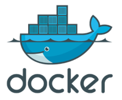

# UT2: Introducción a Docker

## 🗓 Recursos

  
<b>Terminología</b>

  
  - *Images* - Son las plantillas a través de las cuales se crean los contenedores.
  - *Containers* - Creados desde las imágenes y son los que contienen la aplicación o utilidad.  Creamos un container a través de  Created from `docker run` y con `docker ps` podemos ver la lista de containers en ejecución.
  - *Docker Daemon* - el servicio en segundo plano que se ejecuta en el host que administra la creación, ejecución y distribución de contenedores Docker. El demonio es el proceso que se ejecuta en el sistema operativo con el que hablan los clientes.
  - *Docker Client* - a herramienta de línea de comandos que permite al usuario interactuar con el daemon. En términos más generales, también puede haber otras formas de clientes, como que proporciona una GUI a los usuarios..
  - *Docker Hub* - Un [registry](https://hub.docker.com/explore/) of imágenes docker.  Puede pensar en el registro como un directorio de todas las imágenes de Docker disponibles. Si es necesario, uno puede alojar sus propios registros de Docker y puede usarlos para extraer imágenes.   

 

  
<b>Páginas de Ayuda</b>

  - **Páginas de ayuda**
    - [Página oficial](https://www.docker.com/)
    - [Docker Hub](https://hub.docker.com/)
    - [Pagina referencia comandos](https://docs.docker.com/engine/reference/run/)

  
<b>Instalación</b>

  - **Instalación**
    - [Instalación en Windows](https://docs.docker.com/docker-for-windows/install/)
    - [Instalación en Mac](https://docs.docker.com/docker-for-mac/install/)
    - [Instalación en Linux](https://docs.docker.com/engine/install/ubuntu/)

 

## 🏆 Objetivos

- Conocer las ventajas que nos proporciona el uso de la tecnología de contenedores.
- Conocer los conceptos principales sobre el despliegue de aplicaciones web utilizando contenedores.
- Conocer los conceptos fundamentales sobre Docker.
- Trabajar con imágenes Docker.
- Desplegar aplicaciones web sencillas en contenedores.
- Introducción al uso del almacenamiento en Docker.
- Introducción al uso de la redes en Docker.
- Ser capaz de usar contenedores de terceros y de construir mis propios contenedores.
- Creación de imágenes Docker.
- Desplegar escenarios multicontenedor usando Docker-compose.
- Estudiar el ciclo de vida del desarrollo, pruebas y despliegue de aplicaciones utilizando contenedores.
  

## 📚 Contenidos

1. [Introducción a Docker](doc/01.intro-docker.md)
2. [Networking y Almacenamiento en Docker](doc/02.networking-store.md)

## 📚 Casos prácticos

1. [Ejecutar SSH en contendor](doc/caso-practico/01.ssh-container.md)
2. [Instalar MariaDB en contendor](doc/caso-practico/02.db-container.md)