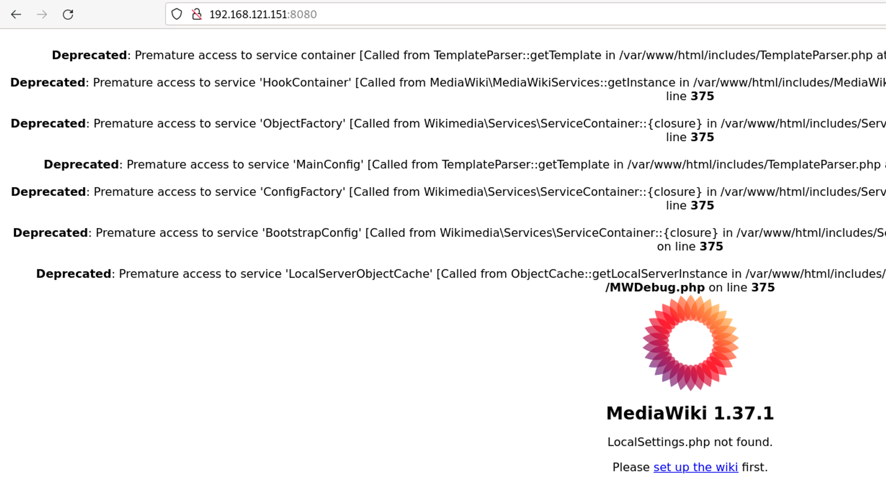
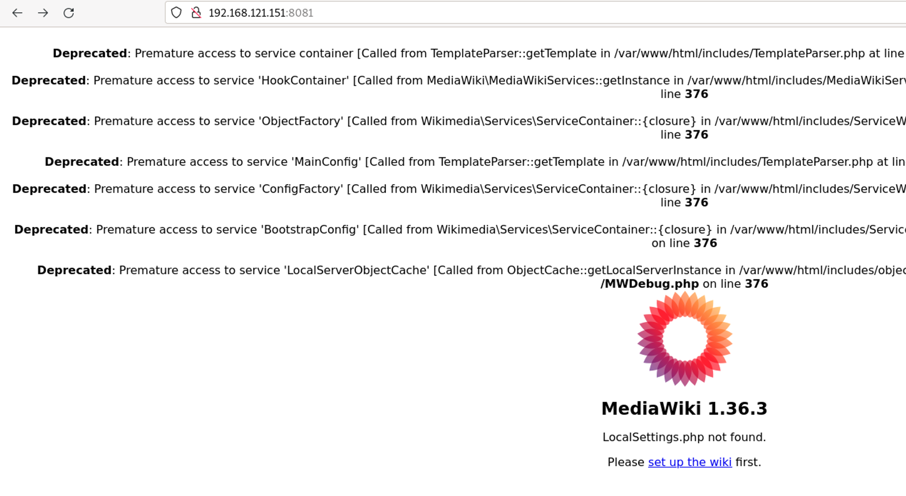

# Introducción a Docker


## ¿ Por qué Docker ?

**Video: [Docker - La explicación que querias](https://youtu.be/9eTVZwMZJsA)**

[](https://youtu.be/9eTVZwMZJsAl-Y "Docker - La explicación que querias")


# 📚 Instalación

La instalación se puede realizar en cualquier sistema operativo.<br>
Como este tipo de tecnología avanza muy rápido, lo mejor es seguir la guía oficial de instalación:

- [Instalación en Windows](https://docs.docker.com/docker-for-windows/install/)
- [Instalación en Mac](https://docs.docker.com/docker-for-mac/install/)
- [Instalación en Linux](https://docs.docker.com/engine/install/ubuntu/)


## Instalación en Ubuntu

## Pasos previos

> 💡 **Curl** (Client URL) es una herramienta de línea de comandos, que permite transferir datos hacia o desde un servidor sin interacción del usuario utilizando la biblioteca libcurl. cURL también se puede utilizar para solucionar problemas de conexión. 

Importamos la **clave GPG del repositorio** externo de Docker:

> 💡 **GPG** es un software de cifrado híbrido que usa una combinación de criptografía de claves simétricas y asimétricas para proporcionar un cifrado más fuerte que cualquiera de los dos por sí solo.

> **Repositorio externo linux** es un repositorio de software que no es parte de la distribución oficial de Debian, pero que contiene software que ha sido aprobado para su uso en Debian. Los repositorios externos se pueden usar con apt, aptitude y otros administradores de paquetes de Debian.


La instalación de Docker en Ubuntu se puede realizar de varias formas:

- [Docker Desktop para Linux (Paquete con todo incluido)](https://docs.docker.com/desktop/install/linux-install/)
- Instalación usando repositorio externo (APT)
- Inslacación manual.
- Instalación usando script de instalación
  
En este caso vamos a realizar la instalación usando el repositorio externo (APT).

### Instalación usando repositorio externo (APT)

[Seguir la guía oficial](https://docs.docker.com/engine/install/ubuntu/#install-using-the-repository)

> 💡 **Actualizar** Para actualizar Docker Engine, repetir el proceso de instalación apuntando a la nueva versión.


## Comprobación

Lo primero de todo es comprobar que el servicio esté corriendo correctamente:

```console
sdelquin@lemon:~$ sudo systemctl status docker
● docker.service - Docker Application Container Engine
     Loaded: loaded (/lib/systemd/system/docker.service; enabled; vendor preset: enabled)
     Active: active (running) since Fri 2022-09-16 12:45:28 WEST; 2min 25s ago
TriggeredBy: ● docker.socket
       Docs: https://docs.docker.com
   Main PID: 86331 (dockerd)
      Tasks: 8
     Memory: 35.0M
        CPU: 117ms
     CGroup: /system.slice/docker.service
             └─86331 /usr/bin/dockerd -H fd:// --containerd=/run/containerd/containerd.sock

sep 16 12:45:28 lemon dockerd[86331]: time="2022-09-16T12:45:28.032847201+01:00" level=info msg="scheme \"un>
sep 16 12:45:28 lemon dockerd[86331]: time="2022-09-16T12:45:28.032854909+01:00" level=info msg="ccResolverW>
sep 16 12:45:28 lemon dockerd[86331]: time="2022-09-16T12:45:28.032893575+01:00" level=info msg="ClientConn >
sep 16 12:45:28 lemon dockerd[86331]: time="2022-09-16T12:45:28.073261246+01:00" level=info msg="Loading con>
sep 16 12:45:28 lemon dockerd[86331]: time="2022-09-16T12:45:28.154568955+01:00" level=info msg="Default bri>
sep 16 12:45:28 lemon dockerd[86331]: time="2022-09-16T12:45:28.199050947+01:00" level=info msg="Loading con>
sep 16 12:45:28 lemon dockerd[86331]: time="2022-09-16T12:45:28.226591830+01:00" level=info msg="Docker daem>
sep 16 12:45:28 lemon dockerd[86331]: time="2022-09-16T12:45:28.226646621+01:00" level=info msg="Daemon has >
sep 16 12:45:28 lemon systemd[1]: Started Docker Application Container Engine.
sep 16 12:45:28 lemon dockerd[86331]: time="2022-09-16T12:45:28.235165174+01:00" level=info msg="API listen >
```

Igualmente podemos comprobar la versión instalada:

```console
jssdocente@vm:~$ docker --version
Docker version 20.10.18, build b40c2f6
```

## Pasos posteriores

Un usuario "ordinario" no podría trabajar con Docker ya que el servicio sólo está a disposición de usuarios "privilegiados" (`root`, `sudo`). En este sentido debemos incluir a nuestro usuario habitual en el grupo adecuado:

```console
jssdocente@vm:~$ sudo usermod -aG docker $USER
```

> Para que los cambios surtan efecto, salimos de la sesión y volvemos a entrar con nuestro usuario habitual.

## El 'Hello World' de Docker

Docker nos ofrece un contenedor "[Hello World](https://github.com/docker-library/hello-world/blob/master/hello.c)" para comprobar que todo se ha instalado correctamente y que los permisos son los adecuados:

```console
jssdocente@vm:~$ docker run hello-world
Unable to find image 'hello-world:latest' locally
latest: Pulling from library/hello-world
7050e35b49f5: Pull complete
Digest: sha256:62af9efd515a25f84961b70f973a798d2eca956b1b2b026d0a4a63a3b0b6a3f2
Status: Downloaded newer image for hello-world:latest

Hello from Docker!
This message shows that your installation appears to be working correctly.

To generate this message, Docker took the following steps:
 1. The Docker client contacted the Docker daemon.
 2. The Docker daemon pulled the "hello-world" image from the Docker Hub.
    (arm64v8)
 3. The Docker daemon created a new container from that image which runs the
    executable that produces the output you are currently reading.
 4. The Docker daemon streamed that output to the Docker client, which sent it
    to your terminal.

To try something more ambitious, you can run an Ubuntu container with:
 $ docker run -it ubuntu bash

Share images, automate workflows, and more with a free Docker ID:
 https://hub.docker.com/

For more examples and ideas, visit:
 https://docs.docker.com/get-started/
```

> 🌍 **Repositorio Docker** es un servicio que permite a los usuarios de Docker distribuir imágenes de Docker de forma privada o pública. Un registro es un servicio centralizado para almacenar y distribuir imágenes.

Pero, ¿qué es lo que está sucediendo al ejecutar esa orden?:

- Al ser la primera vez que ejecuto un contenedor basado en esa imagen, la imagen `hello-word` se descarga desde el repositorio que se encuentra en el registro que vayamos a utilizar, en nuestro caso DockerHub.
- Muestra el mensaje de bienvenida que es la consecuencia de ejecutar un comando al crear y arrancar un contenedor basado en esa imagen.

Si listamos los contenedores que se están ejecutando (`docker ps`):

```
**$ docker ps**
CONTAINER ID        IMAGE               COMMAND             CREATED             STATUS              PORTS               NAMES
```

Comprobamos que este contenedor no se está ejecutando. **Un contenedor ejecuta un proceso y cuando termina la ejecución, el contenedor se para.**

Para ver los contenedores que no se están ejecutando:

```
**$ docker ps -a**
CONTAINER ID        IMAGE               COMMAND             CREATED             STATUS                     PORTS               NAMES
372ca4634d53        hello-world         "/hello"            8 minutes ago       Exited (0) 8 minutes ago                       elastic_johnson
```

Para eliminar el contenedor podemos identificarlo con su `id`:

`$ docker rm 372ca4634d53`

o con su nombre:

`$ docker rm elastic_johnson`
 

 ## Conceptos básicos

 ### Imágenes

Una imagen es un paquete ejecutable que incluye todo lo necesario para ejecutar una aplicación (código, librerías, variables de entorno, herramientas del sistema, etc.). Las imágenes se definen mediante un fichero de texto llamado *Dockerfile*.

Las imágenes se pueden crear a partir de otras imágenes, añadiendo o quitando componentes, o bien se pueden descargar de un repositorio de imágenes. **Las imágenes se almacenan en un registro de imágenes**.

### Contenedores

Un contenedor es una instancia en ejecución de una imagen. **Un contenedor ejecuta un proceso y cuando termina la ejecución, el contenedor se para.**

### Registros

Un registro es un servicio centralizado para almacenar y distribuir imágenes. **Un registro puede ser público o privado**. Docker Hub es un registro público que cualquiera puede usar, y Docker es el registro por defecto para Docker.

### Dockerfile

Un `Dockerfile` es un fichero de texto que contiene las instrucciones necesarias para crear una `imagen`.

### Docker Compose

Docker Compose es una herramienta que permite definir y ejecutar aplicaciones Docker multicontenedor. Con Compose, se utiliza un fichero YAML para configurar los servicios de la aplicación. Luego, con un solo comando, se crea y arranca todos los servicios desde la configuración.

## Comandos básicos

### Imágenes

- Para listar las imágenes que tenemos en nuestro sistema:<br>
   `$ docker images`

- Para descargar una imagen desde un registro:<br>
   `$ docker pull <nombre_imagen>`

   > ▶️ Ejemplo: `$ docker pull ubuntu`


- Para eliminar una imagen:<br>
   `$ docker rmi <nombre_imagen>`
   > ▶️ Ejemplo: `$ docker rmi ubuntu`

### Contenedores

- Para listar los contenedores que tenemos en nuestro sistema:<br>
   `$ docker ps`

- Para listar todos los contenedores que tenemos en nuestro sistema:<br>
   `$ docker ps -a`

- Para crear un contenedor a partir de una imagen:<br>
   `$ docker run <nombre_imagen>`
   > ▶️ Ejemplo: `$ docker run ubuntu`

- Para crear un contenedor a partir de una imagen con un nombre específico:<br>
   `$ docker run --name <nombre_contenedor> <nombre_imagen>`
   > ▶️ Ejemplo: `$ docker run --name ubuntu1 ubuntu`
   
- Para crear un contenedor a partir de una imagen y que sea interactivo:<br>
   `$ docker run -it <nombre_imagen>`
   > ▶️ Ejemplo: `$ docker run -it ubuntu`

- Para crear un contenedor a partir de una imagen y que sea interactivo y que el puerto 80 del contenedor se mapee al puerto 8080 del host:<br>
   `$ docker run -it -p 8080:80 <nombre_imagen>`
   > ▶️ Ejemplo: `$ docker run -it -p 8080:80 ubuntu`

- Para crear un contenedor a partir de una imagen y que sea interactivo y que el directorio `/var/www/html` del contenedor se mapee al directorio `/home/jssdocente/html` del host:<br>
   `$ docker run -it -v /home/jssdocente/html:/var/www/html <nombre_imagen>`
   > ▶️ Ejemplo: `$ docker run -it -v /home/jssdocente/html:/var/www/html ubuntu`


## 🧹 Limpiando recursos

Hay un paquete muy interesante de cara a la "limpieza" de recursos Docker. Se llama [docker-clean](https://github.com/ZZROTDesign/docker-clean) y se puede instalar de la siguiente manera:

`$ sudo apt install -y docker-clean`

Uno de los comandos más cómodos de este paquete es: `docker-clean run` que se encarga de borrar:

- Todos los contenedores parados.
- Todas las imágenes sin etiquetar.
- Todos los volúmenes sin usar.
- Todas las redes virtuales.

<br><br>

# Ejemplos trabajo con Docker

<details>
  <summary><b><p style="display:inline;font-size:16px">Ejecución simple de contenedores</p></b></summary>
   
   <br>
   Con el comando `run`  vamos a crear un contenedor donde vamos a ejecutar un comando, en este caso vamos a crear el contenedor a partir de una imagen ubuntu. Como todavía no hemos descargado ninguna imagen del registro docker hub, es necesario que se descargue la imagen. Si la tenemos ya en nuestro ordenador no será necesario la descarga.

```bash
**$ docker run ubuntu echo 'Hello world'**

Unable to find image 'ubuntu:latest' locally
latest: Pulling from library/ubuntu
8387d9ff0016: Pull complete
...
Status: Downloaded newer image for ubuntu:latest
Hello world
```

Comprobamos que el contenedor ha ejecutado el comando que hemos indicado y se ha parado:

```bash
$ docker ps -a

CONTAINER ID        IMAGE              COMMAND                  CREATED s              STATUS                      PORTS               NAMES
3bbf39d0ec26        ubuntu              "echo 'Hello wo…"   31 seconds ago      Exited     (0) 29 seconds ago                       wizardly_edison
```

Con el comando `docker images`
 podemos visualizar las imágenes que ya tenemos descargadas en nuestro ordenador.

</details>

<details>
  <summary><b><p style="display:inline;font-size:16px">Ejecutando Ubuntu como un Docker Container</p></b></summary>

  <br>

Más que instalar Ubuntu en una máquina virtual, podemos ejecutar Ubuntu como un contenedor de Docker. Esto es posible porque Docker proporciona una imagen de Ubuntu en su repositorio de imágenes. Para ejecutar Ubuntu como un contenedor de Docker, primero debemos descargar la imagen de Ubuntu del repositorio de imágenes de Docker usando el comando `pull` :

### Paso 1: Obtener la imagen de Ubuntu

```bash
**$ docker pull ubuntu**
```

> 💡 Esto no es necesario, con la orden `docker run` se descarga la imagen si no la tenemos en nuestro ordenador.

Si estamos interesados en una versión específica de Ubuntu, podemos indicar la versión específica en el nombre de la imagen. Por ejemplo, para descargar la imagen de Ubuntu 18.04, podemos usar el siguiente comando:

```bash
**$ docker pull ubuntu:18.04**
```

### Paso 2: Ejecutar la imagen de Ubuntu

```bash
sudo docker run -ti --rm ubuntu:22.04 /bin/bash
```

- El comando anterior ejecutará la imagen de Ubuntu 22.04 como un contenedor de Docker. 
- El parámetro `-ti` se utiliza para iniciar el contenedor en modo interactivo. - El parámetro `--rm` se utiliza para eliminar el contenedor cuando se detiene. 
- El parámetro `/bin/bash` se utiliza para ejecutar el shell Bash dentro del contenedor.

> ▶️ La imagen de Docker no tiene ningún GUI instalado, por lo que no podremos ejecutar ninguna aplicación GUI dentro del contenedor.

El shell inicia como un usuario `root` y la temrinal es similar a lo que esperas de un sistema Ubuntu normal.<br>
Por defecto, el contenedor tiene un nombre de host aleatorio. Para cambiar el nombre de host, puede usar el parámetro `--hostname` :

```bash
**$ docker run -ti --rm --hostname dckubuntu ubuntu:22.04 /bin/bash**
```

### Paso 3: Ejecutar comandos dentro del contenedor

Una vez que el contenedor se inicia en modo interactivo, puede ejecutar cualquier comando dentro del contenedor. Por ejemplo, para ejecutar el comando `ls` dentro del contenedor, puede usar el siguiente comando:

```bash
**$ ls**
bin   dev  home  lib32  libx32      media  opt   root  sbin  srv  tmp  var
boot  etc  lib   lib64  lost+found  mnt    proc  run   snap  sys  usr
```

Para revisar la versión de Ubuntu, puede usar el siguiente comando:

```bash
**$ cat /etc/os-release**
NAME="Ubuntu"
VERSION="22.04 LTS (Jammy Jellyfish)"
ID=ubuntu
ID_LIKE=debian
PRETTY_NAME="Ubuntu 22.04 LTS"
VERSION_ID="22.04"
HOME_URL="https://www.ubuntu.com/"
SUPPORT_URL="https://help.ubuntu.com/"
BUG_REPORT_URL="https://bugs.launchpad.net/ubuntu/"
PRIVACY_POLICY_URL="https://www.ubuntu.com/legal/terms-and-policies/privacy-policy"
VERSION_CODENAME=jammy
UBUNTU_CODENAME=jammy
```

Y podemos instalar las aplicaciones que necesitemos usando los comandos habituales de Ubuntu:

```bash
**$ apt update**
**$ apt install tree**
```

### Paso 4: Salir del contenedor

Para salir del contenedor, simplemente escriba `exit` en la terminal.

```bash
**$ exit**
```

### Paso 5: Vida efímera del contenedor

Los contenedores de Docker son efímeros, lo que significa que se eliminan cuando se detienen. Para verificar esto, puede ejecutar el siguiente comando:

```bash
**$ docker ps -a**
```
> La opción `-a` muestra todos los contenedores, incluidos los que se han detenido.


### Volver a ejecutar el contenedor

Si desea volver a ejecutar el contenedor, puede usar el siguiente comando:

```bash
**$ docker start -ai <container_id>**
```

> La opción `-a` se utiliza para adjuntar la terminal del contenedor a la terminal del host. La opción `-i` se utiliza para iniciar el contenedor en modo interactivo.

Pero un contenedor se detiene inmediatamente después de que se complete el comando.<br>
Los contenedores son tan ligeros que son de usar y tirar, por lo que si necesitamos un contenedor con una configuración específica, lo mejor es crear una imagen personalizada.
*Esto lo veremos más adelante.*


</details>

<details>
  <summary><b><p style="display:inline;font-size:16px">Caso práctico. Desplegar aplicación MediaWiki</p></b></summary>
   
   <br>

   La mediawiki en una aplicación web escrita en PHP que nos permite gestionar una wiki. En este ejemplo vamos a hacer un ejemplo simple de despliegue en contenedor usando la imagen `[mediawiki](https://hub.docker.com/_/mediawiki)` que encontramos en DockerHub.

En este ejemplo nos vamos a fijar cómo por medio de la etiqueta del nombre de la imágen podemos tener distintas versiones de la aplicación.

En concretos, si estudiamos la [documentación](https://hub.docker.com/_/mediawiki) de la imagen `mediawiki`, podemos ver las etiquetas disponibles para la imagen que corresponden a versiones distintas de la aplicación.

**La etiqueta `latest`**

Si utilizamos el nombre de una imagen sin indicar la etiqueta, se toma por defecto la etiqueta `latest` que suele corresponder a la última versión de la aplicación. en el caso concreto de `mediawiki` observamos que la etiqueta `latest` corresponde a la última versión la `1.37.1`. Es más, podemos usar las siguientes etiquetas para indicar la misma versión: `1.37.1, 1.37, stable, latest`.

**Las imágenes bases y la arquitectura también son indicadas con las etiquetas**

Podemos seguir observando que algunas etiquetas, nos indican además de la versión, los servicios que tienen instalada la imagen, por ejemplo si usamos la etiqueta `1.37.1-fpm` estaremos creando un contenedor con la ultima versión de la aplicación pero que además tendrá un servidor de aplicaciones php-fpm para servir la aplicación.

Otro ejemplo: si usamos la etiqueta `1.37.1-fpm-alpine`, además de la última versión y que tiene instalado php-fpm, nos indica que la imagen base que se ha usado para crear la imagen es una distribución `alpine` que se caracteriza por ser una distribución muy liviana.

**Instalación de distintas versiones de la mediawiki**

Vamos a crear distintos contenedores usando etiquetas distintas al indicar el nombre de la imagen, posteriormente accedermos a la aplicación y podremos ver la versión instalada:

En primer lugar vamos a instalar la última versión:

```bash
# Instalamos la última versión
docker run -d -p 8080:80 --name mediawiki1 mediawiki
```

Para acceder a la aplicación, abrimos un navegador y accedemos a la dirección `http://localhost:8080` y nos aparecerá la siguiente pantalla:

Si accedemos a la IP de nuestro ordenador, al puerto 8080, podemos observar que hemos instalado la última versión.:
   


A continuación vamos a instalar otra versión de la mediawiki, la 1.36.3, creamos otro contenedor con otro nombre y mapeamos otro puerto:

```bash
# A través de la etiqueta 1.36.3 indicamos la versión que queremos instalar
docker run -d -p 8081:80 --name mediawiki2 mediawiki:1.36.3
```

Si accedemos a la IP de nuestro ordenador, al puerto 8081, podemos observar que hemos instalado la versión 1.36.3:




</details>


