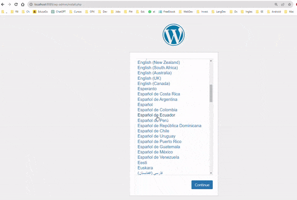

# Docker Compose: Despliegue de aplicaciones multicontenedor

## Introducción

Docker Compose es una herramienta que nos permite definir y ejecutar aplicaciones Docker multicontenedor.<br>
Con Compose, utilizamos un archivo YAML para configurar los servicios de nuestra aplicación. Luego, con un solo comando, creamos e iniciamos todos los servicios desde nuestra configuración.

Es normal que una aplicación esté compuesta por varios contenedores. Por ejemplo, una aplicación web en PHP podría utilizar tres contenedores: 
- uno para el servidor web, 
- otro para la base de datos 
- y otro para el servidor de correo. 
  
Cada contenedor tiene una función específica y se comunican entre sí para formar la aplicación completa.

Ventajas de utilizar Docker Compose:

- Hacer todo de manera **declarativa** para que no tenga que repetir todo el proceso cada vez que construyo el escenario.
- Poner en funcionamiento todos los contenedores que necesita mi aplicación de una sola vez y debidamente configurados.
- Garantizar que los contenedores **se arrancan en el orden adecuado**. Por ejemplo: mi aplicación no podrá funcionar debidamente hasta que no esté el servidor de bases de datos funcionando en marcha.
- Asegurarnos de que hay **comunicación** entre los contenedores que pertenecen a la aplicación.


## Instalación

Docker-compose viene instalado por defecto en las versiones de Docker para Windows y Mac. En Linux, es necesario instalarlo.

### Instalación en Linux

Para instalar Docker Compose en Linux, se puede seguir la [guía oficial](https://docs.docker.com/compose/install/).

### Comprobación de la instalación

Para comprobar que la instalación se ha realizado correctamente, se puede ejecutar el comando `docker-compose --version`.

```bash
$ docker-compose --version
docker-compose version 1.29.2, build 5becea4c
```

## Comandos básicos

- **docker-compose up**

  El comando `docker-compose up` se utiliza para crear e iniciar los contenedores definidos en el archivo `docker-compose.yml`.

  > 💡 Importante<br>
  > El comando `docker-compose up` debe ejecutarse en el mismo directorio donde se encuentra el archivo `docker-compose.yml`.

  ```bash
  $ docker-compose up
  ```

  Si se desea ejecutar el comando en segundo plano, se puede utilizar la opción `-d`.

  ```bash
  $ docker-compose up -d
  ```


- **docker-compose down**

  El comando `docker-compose down` se utiliza para parar y eliminar los contenedores definidos en el archivo `docker-compose.yml`.

  > 💡 Importante<br>
  > Si se desea eliminar todo lo que se ha creado con el comando `docker-compose up`, se debe utilizar la opción `-v`.

  ```bash
  # Parar y eliminar los contenedores, además realiza una limpieza de los volúmenes y redes creadas
  $ docker-compose down -v
  ```

## El fichero docker-compose.yml

El fichero `docker-compose.yml` es el fichero de configuración de Docker Compose. En él se definen los servicios que forman la aplicación.

### Sintaxis

Docker-compose evoluciona por lo que es importante revisar la documentación en la web más reciente.
La versión actual de la sintaxis es la 3.8. La documentación se puede encontrar en la [página oficial](https://docs.docker.com/compose/compose-file/).

La sintaxis del fichero `docker-compose.yml` se pueden encontrar los siguientes elementos:

- **version**

  La versión de la sintaxis del fichero `docker-compose.yml`. La versión por defecto es la 1.

  ```yaml
  version: '3.8'
  ```

- **services**
  
  Los servicios que forman la aplicación. Cada servicio se define con un nombre y una serie de propiedades.

  ```yaml
  services:
    web:
      image: nginx:1.21
      ports:
        - 8080:80
  ```

  Se puede indicar que un servicio dependa de otro servicio. De esta forma, se garantiza que el servicio dependiente se inicia una vez que el servicio del que depende se ha iniciado.

  ```yaml
  services:
    web:
      image: nginx:1.21
      ports:
        - 8080:80
      depends_on:
        - db
    db:
      image: mysql:8.0
      environment:
        MYSQL_ROOT_PASSWORD: root
  ```
  Con la opción `depends_on` se indica que el servicio `web` depende del servicio `db`.


 - **container_name**

  El nombre del contenedor que se crea a partir del servicio. Por defecto, el nombre del contenedor es el nombre del servicio. Si se desea indicar un nombre personalizado, se indica en la sección `container_name`.

  ```yaml
  services:
    web:
      image: nginx:1.21
      ports:
        - 8080:80
      container_name: my-web
  ```

  <br>

 - **image**

  La imagen que se utiliza para crear el servicio.<br>
  Se indica el nombre de la imagen y la versión.

  ```yaml
  services:
    web:
      image: nginx:1.21
      ports:
        - 8080:80
  ```

  - **ports**
  
  Para indicar que se debe mapear un puerto, se indica en la sección `ports`.<br>
  En esta sección se indica el puerto del host y el puerto del contenedor que se deben mapear.<br>

  ```yaml
  services:
    web:
      image: nginx:1.21
      ports:
        - 8080:80
  ```

  En este caso, se indica que el puerto 8080 del host se mapea al puerto 80 del contenedor.

  Para indicar más de un mapeo de puertos, se puede indicar más de un puerto.

  ```yaml
  services:
    web:
      image: nginx:1.21
      ports:
        - 8080:80
        - 8443:443
  ```

  > 💡 **Importante**<br>
  >  En caso de que se quiera utilizar una imagen que se necesita crear en ese momento, se debe indicar la opción `build` en lugar de la opción `image`.
  

  <br>

  - **build**

  Para indicar que se debe construir la imagen del servicio, se indica en la sección `build`.<br>
  Para construir la imagen, se debe indicar la ruta donde se encuentra el fichero `Dockerfile`.

  ```yaml
  services:
    web:
      build: ./web
      ports:
        - 8080:80
  ```

  En este caso, se indica que la imagen del servicio se construye a partir del fichero `Dockerfile` que se encuentra en el mismo directorio donde se encuentra el fichero `docker-compose.yml`.

  

  > 🪧 **Aviso**<br>
  >  La build se ejecutará cada vez que se ejecute el comando `docker-compose up`. Para evitar que se ejecute cada vez, se puede utilizar la opción `--no-build`.  

  <br>

- **networks**


  Al indicar varios servicios en el fichero `docker-compose.yml`, se crea una red por defecto para conectar los servicios. Esta red se llama `default`.

  ```yaml
  services:
    web:
      image: nginx:1.21
      ports:
        - 8080:80
    db:
      image: mysql:8.0
      environment:
        MYSQL_ROOT_PASSWORD: root
  ```
  Si queremos indicar una red personalizada, se indica en la sección `networks`, y se indica en los servicios que se conecten a esa red.

  ```yaml
  networks:
    my-net:
      driver: bridge

  services:
    web:
      image: nginx:1.21
      ports:
        - 8080:80
      networks:
        - my-net
    db:
      image: mysql:8.0
      environment:
        MYSQL_ROOT_PASSWORD: root
      networks:
        - my-net
  ```

- **volumes**
  
  Para indicar un volumen personalizado, se indica en la sección `volumes`, y se indica en los servicios que se conecten a ese volumen.

  ```yaml
  volumes:
    ngix-html-vol:
      driver: local
    msq-data-vol:
      driver: local

  services:
    web:
      image: nginx:1.21
      ports:
        - 8080:80
      volumes:
        - ngix-html-vol:/usr/share/nginx/html
    db:
      image: mysql:8.0
      environment:
        MYSQL_ROOT_PASSWORD: root
      volumes:
        - msq-data-vol:/var/lib/mysql
  ```

  Se han definido dos volúmenes personalizados: `ngix-html-vol` y `msq-data-vol`. El primero se conecta al servicio `web` y el segundo al servicio `db`.
  Los volúmenes no se eliminan cuando se ejecuta el comando `docker-compose down`. Para eliminarlos, se debe utilizar la opción `-v`.

- **environment**

  Para indicar variables de entorno, se indica en la sección `environment`.

  ```yaml
  services:
    web:
      image: nginx:1.21
      ports:
        - 8080:80
      environment:
        - MYSQL_ROOT_PASSWORD=root
        - MYSQL_DATABASE=wordpress
        - MYSQL_USER=wordpress
        - MYSQL_PASSWORD=wordpress
  ```

  > 💡 **Importante**<br>
  >  Podemos indicar tantas variables de entorno como necesitemos.

  También se pueden indicar las variables de entorno en un fichero `.env`. En este caso, se indica el nombre del fichero en la sección `env_file`.

  ```yaml
  services:
    web:
      image: nginx:1.21
      ports:
        - 8080:80
      env_file:
        - .env
  ```

  El fichero `.env` se crea en el mismo directorio donde se encuentra el fichero `docker-compose.yml`.

  ```bash
  $ cat .env
  MYSQL_ROOT_PASSWORD=root
  MYSQL_DATABASE=wordpress
  MYSQL_USER=wordpress
  MYSQL_PASSWORD=wordpress
  ```

  > 💡 **Importante**<br>
  >  El fichero `.env` no debe subirse al repositorio. Se debe añadir al fichero `.gitignore`.


- **configs**
  
  Para indicar que se debe crear un fichero de configuración, se indica en la sección `configs`.<br>
  Para crear el fichero de configuración, se debe indicar la ruta donde se encuentra el fichero de configuración.

  ```yaml
  services:
    web:
      image: nginx:1.21
      ports:
        - 8080:80
      configs:
        - source: nginx.conf
          target: /etc/nginx/nginx.conf
  ```

  En este caso, se indica que el fichero de configuración se crea a partir del fichero `nginx.conf` que se encuentra en el mismo directorio donde se encuentra el fichero `docker-compose.yml`.

  <br>

- **secrets**
  
  Para indicar que se debe crear un secreto, se indica en la sección `secrets`.<br>
  Para crear el secreto, se debe indicar la ruta donde se encuentra el fichero de configuración.

  > 🤚 **Notar**<br>
  >  Un secreto es un fichero que contiene información sensible, como por ejemplo, contraseñas.<br>
  >  Estos ficheros no se deben subir al repositorio. Se deben añadir al fichero `.gitignore`.

  ```yaml
  services:
    web:
      image: nginx:1.21
      ports:
        - 8080:80
      secrets:
        - source: my_secret.txt
          target: /run/secrets/my_secret.txt
  ```

  En este caso, se indica que el secreto se crea a partir del fichero `my_secret.txt` que se encuentra en el mismo directorio donde se encuentra el fichero `docker-compose.yml`.

  <br>

- **restart**
  
  Para indicar que se debe reiniciar el servicio, se indica en la sección `restart`.<br>
  Se puede indicar que el servicio se reinicie siempre, nunca o en caso de error.<br>
  Reiniciar el servicio en caso de error es la opción por defecto.<br>

  ```yaml

  ```yaml
  services:
    web:
      image: nginx:1.21
      ports:
        - 8080:80
      restart: always
  ```

  En este caso, se indica que el servicio se reinicia siempre.

  <br>

- **command**

  Para indicar que se debe ejecutar un comando, se indica en la sección `command`.<br>
  En esta sección se indica el comando que se debe ejecutar al iniciar el servicio.<br>
  
  Se puede indicar que el comando se ejecute en modo `detached` o en modo `attached`. El modo `detached` es la opción por defecto.<br>

  ```yaml
  services:
    web:
      image: nginx:1.21
      ports:
        - 8080:80
      command: nginx -g 'daemon off;'
  ```
  <br>

- **depends_on**
  
  Para indicar que un servicio depende de otro servicio, se indica en la sección `depends_on`.<br>
  De esta forma, se garantiza que el servicio dependiente se inicia una vez que el servicio del que depende se ha iniciado.

  > 🤚 **Importante**<br>
  En versiones anteriores, se indicaba la opción `links` para indicar que un servicio depende de otro servicio. Esta opción está obsoleta y se recomienda utilizar la opción `depends_on`.

  ```yaml
  services:
    web:
      image: nginx:1.21
      ports:
        - 8080:80
      depends_on:
        - db
    db:
      image: mysql:8.0
      environment:
        MYSQL_ROOT_PASSWORD: root
  ```

  En este caso, se indica que el servicio `web` depende del servicio `db`. El servicio `db` se iniciará antes que el servicio `web`. Hasta que el servicio `db` no esté iniciado, el servicio `web` no se iniciará. En caso de error del servicio `db`, el servicio `web` no se iniciará.

  <br>


## Ejemplos de uso

### Ejemplo 1: Aplicación WordPress con MariaDB

En este ejemplo, se va a crear una aplicación WordPress con una base de datos MariaDB.

Vamos a crear 2 versiones de este ejemplo:
1. Utilizando variables de entorno
2. Utilizando un fichero `.env`

Creamos un directorio para el ejemplo.

```bash
$ mkdir wordpress
$ cd wordpress
```

#### ▶️ Utilizando variables de entorno

Para este ejemplo creamos un directorio `con-enviroments` y dentro de este directorio creamos un fichero `docker-compose.yml`.

Para ello vamos a crear un fichero `docker-compose.yml` con la siguiente información:

- Se definen dos servicios: `wordpress` y `db`.
- El servicio `wordpress` utiliza la imagen `wordpress:6.4.2`. [Wordpress docker-hub](https://hub.docker.com/_/wordpress)
- El servicio `db` utiliza la imagen `mariadb:10.5`.
- El servicio `wordpress` depende del servicio `db`.
- Se mapea el puerto 8089 del host al puerto 80 del contenedor `wordpress`.

A nivel de variables de entorno, se definen las siguientes variables:
- `WORDPRESS_DB_HOST`: indica el nombre del servicio (nombre del servidor db BD, que coincide con el nombre del servicio en docker) de la base de datos.
- `WORDPRESS_DB_NAME`: indica el nombre de la base de datos.
- `WORDPRESS_DB_USER`: indica el usuario de la base de datos.
- `WORDPRESS_DB_PASSWORD`: indica la contraseña del usuario de la base de datos.
- `MYSQL_DATABASE`: indica el nombre de la base de datos.
- `MYSQL_USER`: indica el usuario de la base de datos.
- `MYSQL_PASSWORD`: indica la contraseña del usuario de la base de datos.
- `MYSQL_ROOT_PASSWORD`: indica la contraseña del usuario root de la base de datos.

También se definen 2 volúmenes, estos volúmenes almacenan los datos de la aplicación y de la base de datos:

- `wordpress_data`: se conecta al servicio `wordpress` y se conecta al directorio `/var/www/html/wp-content` del contenedor.
- `mariadb_data`: se conecta al servicio `db` y se conecta al directorio `/var/lib/mysql` del contenedor.

```yaml
version: '3.8'
services:
  wordpress:
    container_name: servidor_wp
    image: wordpress:6.4.2
    restart: always
    environment:
      WORDPRESS_DB_HOST: db
      WORDPRESS_DB_USER: user_wp
      WORDPRESS_DB_PASSWORD: asdasd
      WORDPRESS_DB_NAME: bd_wp
    ports:
      - 8089:80
    volumes:
      - wordpress_data:/var/www/html/wp-content
    depends_on:
      - db

  db:
    container_name: servidor_mysql
    image: mariadb:10.5 
    restart: always
    environment:
      MYSQL_DATABASE: bd_wp
      MYSQL_USER: user_wp
      MYSQL_PASSWORD: asdasd
      MYSQL_ROOT_PASSWORD: p@ssw0rd
    volumes:
      - mariadb_data:/var/lib/mysql
      
volumes:
    wordpress_data:
    mariadb_data:
```

Para crear y ejecutar los contenedores, se ejecuta el comando `docker-compose up`.

```bash
$ docker-compose up
```

Una vez que se han creado los contenedores, se puede acceder a la aplicación WordPress desde un navegador web, utilizando la dirección `http://localhost:8089`.



> 💡 **Importante**<br>
> Antes de probar la variación con fichero .env, es necesario parar y eliminar los contenedores creados en este ejemplo. Para ello, se puede utilizar el comando `docker-compose down -v`.


#### ▶️ Utilizando un fichero `.env`

Para este ejemplo creamos un directorio `con-.env-file` y dentro de este directorio creamos un fichero `docker-compose.yml`.

En este ejemplo, vamos a reutilizar el fichero `docker-compose.yml` del ejemplo anterior, pero en lugar de definir las variables de entorno en el propio fichero `docker-compose.yml`, vamos a utilizar un fichero `.env`.

Este fichero `.env` se crea en el mismo directorio donde se encuentra el fichero `docker-compose.yml`.

```bash
$ cat .env
MYSQL_DATABASE=bd_wp
MYSQL_USER=user_wp
MYSQL_PASSWORD=asdasd
MYSQL_ROOT_PASSWORD=p@ssw0rd
```

Y en el fichero `docker-compose.yml`, ahora las variables de entorno se informan utilizando la forma ${VARIABLE}, donde VARIABLE es el nombre de la variable de entorno que se encuentra en el fichero `.env`.

```yaml
version: '3.8'
services:
  wordpress:
    container_name: servidor_wp
    image: wordpress:6.4.2
    restart: always
    environment:
      WORDPRESS_DB_HOST: db
      WORDPRESS_DB_NAME: ${MYSQL_DATABASE}
      WORDPRESS_DB_USER: ${MYSQL_USER}
      WORDPRESS_DB_PASSWORD: ${MYSQL_PASSWORD}
    ports:
      - 8089:80
    volumes:
      - wordpress_data:/var/www/html/wp-content
    depends_on:
      - db

  db:
    container_name: servidor_mysql
    image: mariadb:10.5
    restart: always
    environment:
      MYSQL_DATABASE: ${MYSQL_DATABASE}
      MYSQL_USER: ${MYSQL_USER}
      MYSQL_PASSWORD: ${MYSQL_PASSWORD}
      MYSQL_ROOT_PASSWORD: ${MYSQL_ROOT_PASSWORD}
    volumes:
      - mariadb_data:/var/lib/mysql

volumes:
    wordpress_data:
    mariadb_data:
```

La ventaja de utilizar un fichero `.env` es que se pueden definir todas las variables de entorno en un único fichero y no es necesario modificar el fichero `docker-compose.yml` para cambiar las variables de entorno, además que no es necesario repetir el valor en cada servicio.


Para finalizar, parar y eliminar los contenedores creados en este ejemplo, se puede utilizar el comando `docker-compose down -v`.

```bash
$ docker-compose down -v
```


