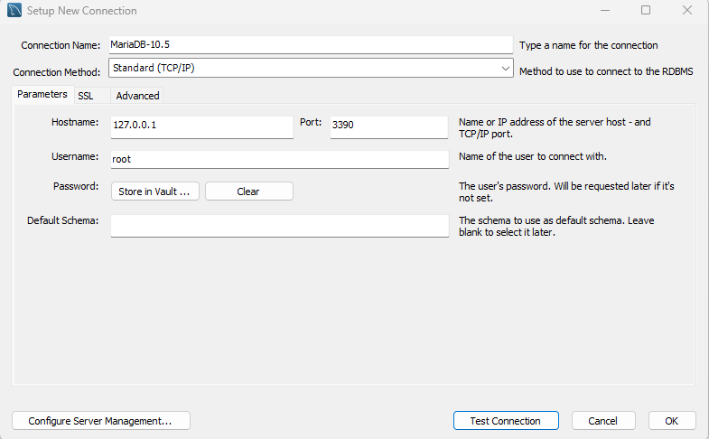

## CASO PRÁCTICO. Instalar BD en contenedor

En este caso práctico vamos a instalar una base de datos en un contenedor de Docker.

- Vamos a utilizar la imagen oficial de MariaDb.<br>
- La imagen oficial de Mariadb se puede encontrar en el siguiente enlace: [https://hub.docker.com/_/mariadb](https://hub.docker.com/_/mariadb)<br>
- La versión que vamos a utilizar es la 10.5.9<br>


### Requisitos

- Tener instalado Docker en nuestro ordenador.

### Guía paso a paso

En este guía vamos a crear 2 contenedores con la base de datos MariaDB.
- El primer contenedor lo vamos a crear con la versión 10.5.9
- El segundo contenedor lo vamos a crear con la versión 10.6.16

#### MariaDB 10.5.9

1. Creamos un directorio para almacenar los datos de la base de datos.

   ```bash
   # Creamos un directorio bd, y un subdirectorio para la mariadb y otro para la versión 10.5
   $ mkdir -p ~/tmp/docker/volumes/bd/mariadb/10.5
   ```

2. Creamos un contenedor con la imagen de MariaDB y montamos el directorio `~/tmp/docker/volumes/bd/mariadb/10.5` en el directorio `/var/lib/mariadb` del contenedor.

   ```bash
   # Creamos un contenedor con la imagen mariadb:10.5.9
   # Variables de entorno:
   #   - MYSQL_ROOT_PASSWORD: Contraseña del usuario root
   # Opciones:
   #   -p 3390:3306: Mapeo del puerto 3390 del host al puerto 3306 del contenedor
   #   (usamos el puerto 3390 para no tener problemas con una posible instalación local de MySQL)
   $ docker run -d --name mariadb105 -p 3390:3306 -v ~/tmp/docker/volumes/bd/mariadb/10.5:/var/lib/mysql -e MYSQL_ROOT_PASSWORD=secret mariadb:10.5.9

   # Comprobamos que el contenedor se ha creado correctamente
   $ docker ps
   CONTAINER ID   IMAGE           COMMAND                  CREATED         STATUS         PORTS                                            NAMES
   4b8b8b8b8b8b   mariadb:10.5.9  "docker-entrypoint.s…"   3 seconds ago   Up 2 seconds                                                    mariadb10.5
   ```

3. Conectar a la base de datos desde un cliente MySQL. (MySQL Workbench)

   > 💡 Notar:
   >  Para instalar MySQL Workbench seguir las instrucciones del [siguiente enlace](https://www.mysql.com/products/workbench/)

   Para conectar a la base de datos desde MySQL Workbench, necesitamos los siguientes datos:

   - Host: localhost
   - Port: 3390
   - Username: root
   - Password: secret
   - Default Schema: (Dejar en blanco)

   
   
   <br>

4. Crear una BD e importar un fichero SQL.

   - Creamos una base de datos llamada `courses` y la seleccionamos.
   - Importamos el siguiente scrpt SQL.

   ```sql
   CREATE DATABASE IF NOT EXISTS courses;
   USE courses;

   -- Create the 'students' table
   CREATE TABLE IF NOT EXISTS students (
      student_id INT AUTO_INCREMENT PRIMARY KEY,
      first_name VARCHAR(50),
      last_name VARCHAR(50),
      email VARCHAR(100)
   );

   -- Create the 'courses_taken' table with a foreign key reference to 'students'
   CREATE TABLE IF NOT EXISTS courses (
      enrollment_id INT AUTO_INCREMENT PRIMARY KEY,
      course_name VARCHAR(100),
      grade VARCHAR(5),
      student_id INT,
      FOREIGN KEY (student_id) REFERENCES students(student_id)
   );

   -- Insert 15 records into the 'students' table
   INSERT INTO students (first_name, last_name, email) VALUES
      ('John', 'Doe', 'john.doe@email.com'),
      ('Jane', 'Smith', 'jane.smith@email.com'),
      ('Frank', 'Jones', 'jane.smith@email.com'),
      ('Mary', 'Johnson', 'jane.smith@email.com'),
      ('John', 'Smith', 'jane.smith@email.com'),
      ('Jane', 'Doe', 'jane.smith@email.com'),
      ('Frank', 'Smith', 'jane.smith@email.com'),
      ('Mary', 'Doe', 'jane.smith@email.com'),
      ('John', 'Jones', 'jane.smith@email.com'),
      ('Jane', 'Johnson', 'jane.smith@email.com'),
      ('Frank', 'Doe', 'jane.smith@email.com'),
      ('Mary', 'Smith', 'jane.smith@email.com'),
      ('John', 'Johnson', 'jane.smith@email.com'),
      ('Jane', 'Jones', 'jane.smith@email.com'),
      ('Frank', 'Johnson', 'jane.smith@email.com');

   -- Insert 15 records into the 'courses_taken' table
   INSERT INTO courses (course_name, grade, student_id) VALUES
      ('Math 101', 'A', 1),
      ('English 201', 'B', 1),
      ('Science 301', 'C', 1),
      ('History 101', 'D', 2),
      ('Math 101', 'A', 2),
      ('English 201', 'B', 2),
      ('Science 301', 'C', 3),
      ('History 101', 'D', 3),
      ('Math 101', 'A', 3),
      ('English 201', 'B', 4),
      ('Science 301', 'C', 4),
      ('History 101', 'D', 4),
      ('Math 101', 'A', 5),
      ('English 201', 'B', 5),
      ('Science 301', 'C', 5);
   ```

5. Comprobar que estamos accediendo desde la BD del contendor

   ```bash
   # Para el contenedor
   $ docker stop mariadb105
   ```

   > 🤚 Ahora vamos a comprobar que no podemos acceder a la base de datos desde MySQL Workbench.


6. Iniciar el contenedor

   ```bash
   # Iniciamos el contenedor
   $ docker start mariadb105
   ```

   > 🐾 Ahora vamos a comprobar que podemos acceder a la base de datos desde MySQL Workbench.

7. Eliminar el contenedor

   ```bash
   # Paramos el contenedor
   $ docker stop mariadb105

   # Eliminamos el contenedor
   $ docker rm mariadb105
   ```

   > 💡 **Ventajas contenedor**  
   >   - No hemos tenido que instalar la base de datos en nuestro sistema.
   >   - No se ha creado ningún fichero en nuestro sistema, ni ninguna dependencia.
   >   - Y al eliminar el contenedor, no hemos tenido que preocuparnos de eliminar la base de datos de nuestro sistema, ni todas sus dependencias.

   <br>

8. Recrear el contenedor

   Como los datos de la base de datos están almacenados en el directorio `~/tmp/docker/volumes/bd/mariadb/10.5` del host, al recrear el contenedor, los datos se mantienen.</br>
   Por lo tanto, no es necesario volver a crear la base de datos ni importar el fichero SQL.


   ```bash
   # Recreamos el contenedor
   $ docker run -d --name mariadb105 -p 3390:3306 -v ~/tmp/docker/volumes/bd/mariadb/10.5:/var/lib/mysql -e MYSQL_ROOT_PASSWORD=secret mariadb:10.5.9
   ```

   > 🐾 Ahora vamos a comprobar que podemos acceder a la base de datos desde MySQL Workbench y que la BD sigue estando disponible.


#### MariaDB 10.6.16

1. Creamos un directorio para almacenar los datos de la base de datos.

   ```bash
   # Creamos un directorio bd, y un subdirectorio para la mariadb y otro para la versión 10.5
   $ mkdir -p ~/tmp/docker/volumes/bd/mariadb/10.6
   ```

2. Creamos un contenedor con la imagen de MariaDB y montamos el directorio `~/tmp/docker/volumes/bd/mariadb/10.6` en el directorio `/var/lib/mariadb` del contenedor.

   > 🌍 **Puerto 3391**
   >    - Como ya tenemos un contenedor con la versión 10.5, no podemos usar el puerto 3390, ya que está ocupado.
   >    - Por lo tanto, vamos a usar el puerto 3391.

   - Indicar el puerto 3391 en la opción `-p` del comando `docker run`.
   - Indicar la versión mariadb:10.6.16.
   - Contenedor con el nombre mariadb106.

   ```bash
   # Creamos un contenedor con la imagen mariadb:10.5.9
   # Variables de entorno:
   #   - MYSQL_ROOT_PASSWORD: Contraseña del usuario root
   # Opciones:
   #   -p 3391:3306: Mapeo del puerto 3391 del host al puerto 3306 del contenedor
   #   (usamos el puerto 3391 para no tener problemas con una posible instalación local de MySQL)
   $ docker run -d --name mariadb106 -p 3391:3306 -v ~/tmp/docker/volumes/bd/mariadb/10.6:/var/lib/mysql -e MYSQL_ROOT_PASSWORD=secret mariadb:10.6.16

   # Comprobamos que el contenedor se ha creado correctamente
   $ docker ps
   CONTAINER ID   IMAGE           COMMAND                  CREATED         STATUS         PORTS                                            NAMES
   4b8b8b8b8b8b   mariadb:10.6.16  "docker-entrypoint.s…"   3 seconds ago   Up 2 seconds                                                    mariadb106
   ```

3. Conectar a la base de datos desde un cliente MySQL. (MySQL Workbench)

   Como lo hemos hecho anteriormente, pero ahora indicando el puerto 3391.
   
   <br>

4. Crear una BD e importar un fichero SQL.

   Importamos el siguiente scrpt SQL.

   ```sql
   DROP DATABASE IF EXISTS demo;

   CREATE DATABASE demo;

   USE demo;

   CREATE TABLE `supers` (
   `id` int(11) unsigned NOT NULL AUTO_INCREMENT,
   `name` varchar(100) NOT NULL DEFAULT '',
   `type` char(1) NOT NULL DEFAULT '',
   `rescues` int(11) NOT NULL,
   `mentor` int(11) DEFAULT NULL,
   `startDate` datetime NOT NULL,
   `endDate` datetime NOT NULL,
   PRIMARY KEY (`id`),
   ) ENGINE=InnoDB DEFAULT CHARSET=utf8;

   CREATE TABLE `supersteams` (
   `superid` int(11) unsigned NOT NULL,
   `teamid` int(11) unsigned NOT NULL
   ) ENGINE=InnoDB DEFAULT CHARSET=utf8;

   CREATE TABLE `teams` (
   `id` int(11) unsigned NOT NULL AUTO_INCREMENT,
   `name` varchar(50) NOT NULL DEFAULT '',
   PRIMARY KEY (`id`)
   ) ENGINE=InnoDB DEFAULT CHARSET=utf8;

   /* Add supers */
   INSERT INTO `supers` (`name`, `type`, `rescues`, `mentor`, `startDate`, `endDate`)
   VALUES
      ('Batman','H',192,6,'1997-01-01 00:00:00','2021-02-17 00:00:00'),
      ('Superman','H',257,NULL,'1998-01-01 00:00:00','2021-02-17 00:00:00'),
      ('Wonder Woman','H',212,NULL,'1985-01-01 00:00:00','2021-02-17 00:00:00'),
      ('Robin/Nightwing','H',127,1,'2008-01-01 00:00:00','2021-02-17 00:00:00'),
      ('Gar Logan','H',59,NULL,'2017-01-01 00:00:00','2021-02-17 00:00:00'),
      ("Ra's Ah Ghul",'V',3,NULL,'1990-06-01 00:00:00','2021-02-17 00:00:00'),
      ('The Punisher','V',37,NULL,'2003-01-01 00:00:00','2021-02-17 00:00:00'),
      ('The Flash','H',297,NULL,'2001-01-01 00:00:00','2021-02-17 00:00:00'),
      ('Kid Flash','H',61,NULL,'2018-01-01 00:00:00','2021-02-17 00:00:00'),
      ('Catwoman','V',43,NULL,'1998-01-01 00:00:00','2021-02-17 00:00:00');

   /* Add teams */
   INSERT INTO `teams` (`name`)
   VALUES
      ('Justice Society of America'),
      ('Justice League of America'),
      ('Teen Titans');

   /* Add supers to teams */
   INSERT INTO `supersteams` (`superid`, `teamid`)
   VALUES
      (1,2),
      (2,2),
      (3,2),
      (4,2),
      (4,3),
      (5,3),
      (8,1),
      (8,2),
      (9,3);
   ```

   Con estos datos importados, podemos usar las siguientes consultas:

   ```sql
   /* Aggregate functions */
   SELECT SUM(rescues) FROM demo.supers;

   /* Rollup / Super-aggregates */
   SELECT 
      t.name, AVG(rescues) as avg_rescues, SUM(rescues) as total_rescues
   FROM 
      demo.supers AS s INNER JOIN
      demo.supersteams AS st ON s.id = st.superid LEFT JOIN
      demo.teams AS t ON st.teamid = t.id
   GROUP BY 
      t.name

   SELECT 
    id, name, type, startDate, endDate
   FROM
      demo.supers
   WHERE 
      name = 'Catwoman' 
   ORDER BY 
      startDate
   ```


Con esto termina el caso práctico. Se ha podido comprobar lo siguiente:

- Instalar 2 versiones de la base de datos MariaDB en el mismo ordenador, sin que haya conflictos.
- Inyectar los datos en local (datos preexistentes) en el contenedor, y poder utilizarlos desde el contenedor.
- Parar, eliminar y recrear el contenedor, sin perder los datos de la base de datos.
- Eliminar los contenedores, sin dejar rastro en el sistema.


