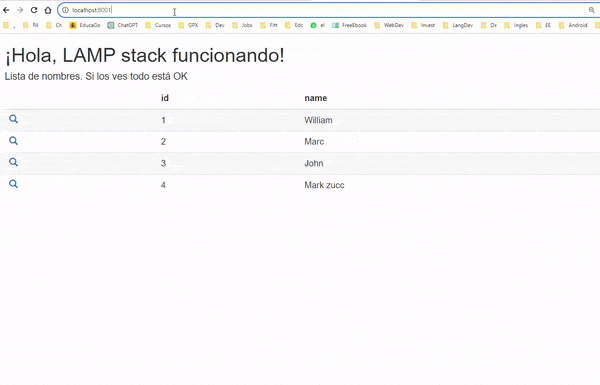

# CASO PRÁCTICO. LAMP con Docker

## Objetivo

Aprender a crear y arrancar un entorno LAMP con Docker, en el que se incluya una base de datos MySQL y un servidor web Apache.

## Requisitos

- Tener instalado Docker en nuestro ordenador.

## Introducción

▶️ **¿Qué es LAMP?**

LAMP es un acrónimo que se refiere a un conjunto de software de código abierto que se instala de forma conjunta para habilitar un servidor web. La sigla LAMP se refiere a los siguientes componentes:

- Linux, el sistema operativo.
- Apache, el servidor web.
- MySQL, el sistema de gestión de bases de datos.
- PHP, Perl o Python, los lenguajes de programación.

También existe su versión para Windows, WAMP, y para Mac, MAMP.


▶️ **¿Que es stack en informática?**

Un stack es un conjunto de software que funciona de forma conjunta para habilitar un servidor web. Por ejemplo, LAMP es un stack que incluye Linux, Apache, MySQL y PHP.


😎 **Resumen de lo que vamos a realizar**

Como descripción básica, nos damos cuenta que en primera instancia tenemos 3 contenedores que conforman un sistema distribuido, todos ellos interconectados entre sí. Cada contenedor tiene servicios distintos que hará que la pila LAMP se constituye por medio de una red local.

- Servidor web:

   * El contenedor tiene por nombre www.
   * Se expone el puerto 80.

- Servidor de base de datos:

  * El contenedor tiene por nombre db.
  * Se expone el puerto 3306.

- Servidor del sistema gestor de base de datos gráfico:

  * El contenedor tiene por nombre phpmyadmin.
  * Se expone el puerto 8000.


## Guía paso a paso

### 1. Clonar repositorio fuente

Los archivos necesarios para crear el entorno LAMP con Docker se encuentran en este [repositorio](git clone https://github.com/jssdocente/docker-lamp.git).

Descargar el repositorio en nuestro ordenador, en una carpeta que llamaremos `docker-lamp`.

```bash
git clone git clone https://github.com/jssdocente/docker-lamp.git
```

### 2. Servidor web

El servidor web dentro del Stack LAMP es Apache, por lo que necesitamos crear una imagen de Docker que incluya Apache y PHP.<br>
En este caso, vamos a crear la imagen personalizada a partir de la imagen oficial de PHP 8.0.0 con Apache, e incluyendo el driver de MySQL para PHP.

```dockerfile
FROM php:8.0.0-apache
ARG DEBIAN_FRONTEND=noninteractive
RUN docker-php-ext-install mysqli
# Include alternative DB driver
# RUN docker-php-ext-install pdo
# RUN docker-php-ext-install pdo_mysql
RUN apt-get update \
    && apt-get install -y sendmail libpng-dev \
    && apt-get install -y libzip-dev \
    && apt-get install -y zlib1g-dev \
    && apt-get install -y libonig-dev \
    && rm -rf /var/lib/apt/lists/* \
    && docker-php-ext-install zip

RUN docker-php-ext-install mbstring
RUN docker-php-ext-install zip
RUN docker-php-ext-install gd

RUN a2enmod rewrite
```
Puntos a tener en cuenta:

- Se basa en la imagen oficial de PHP 8.0.0 con Apache. (`FROM php:8.0.0-apache`)
- Se instala el driver de MySQL para PHP. (`RUN docker-php-ext-install mysqli`)
- Se instalan librerias como `libpng-dev`, `libzip-dev`, `zlib1g-dev`, `libonig-dev` y `libzip-dev` para que funcione correctamente el driver de MySQL.
- Se habilita el módulo `rewrite` de Apache. (`RUN a2enmod rewrite`)
- Se instalan las librerias `mbstring`, `zip` y `gd`.


Con este archivo Docker crearemos la imagen del servidor web, que permitirá ejecutar código PHP y conectarse a la base de datos.


### 3. Docker Compose

El archivo `docker-compose.yml` es el encargado de crear los contenedores y la red local que los conecta.<br>

```yml
version: "3.8"
services:
    www:
        build: .
        image: daw/lamp-apache-php8:1.0
        ports: 
            - "8001:80"
        volumes:
            - ./www:/var/www/html
        depends_on:
            - db
        networks:
            - lamp-network
    db:
        image: mysql:8.0
        container_name: mysql-lamp-8.0
        ports: 
            - "3390:3306"
        command: --default-authentication-plugin=mysql_native_password
        environment:
            MYSQL_DATABASE: dbname
            MYSQL_PASSWORD: test
            MYSQL_ROOT_PASSWORD: test 
        volumes:
            - ./dump:/docker-entrypoint-initdb.d
            - ./conf:/etc/mysql/conf.d
            - db_data:/var/lib/mysql
        networks:
            - lamp-network

    phpmyadmin:
        image: phpmyadmin/phpmyadmin
        depends_on: 
            - db
        networks:
            - lamp-network
        ports:
            - 8000:80
        
        environment:
            MYSQL_USER: root
            MYSQL_PASSWORD: test
            MYSQL_ROOT_PASSWORD: test 
volumes:
    db_data: 
       driver: local

networks:
    lamp-network:
        driver: bridge
```

#### Explicación de los diferentes servicios:

Se ha creado la red `lamp-network` para que los contenedores puedan comunicarse entre sí. Todos los contendores que se conecten a esta red vía el docker-compose.

- **www**:

   * Se crea a partir de la imagen `daw/lamp-apache-php8:1.0` que hemos creado en el paso anterior. Esta imagen se crea a partir del archivo `Dockerfile` que hemos visto en el paso anterior.
   * Se expone el puerto 8001 del contenedor, para que podamos acceder a la aplicación web desde el navegador. (Este puerto se puede cambiar por el que queramos).
   * Se monta el directorio `./www` del host en el directorio `/var/www/html` del contenedor, para que los archivos de la aplicación web estén disponibles en el contenedor.
   * Se conecta a la red `lamp-network`.
   * Depende del servicio `db`, por lo que se creará después de que se haya creado el servicio `db`.

- **db**:

  * Se usa MySQL versión 8.0, a través de la imagen `mysql:8.0`.
  * Se indica a través de variables de entorno, el nombre de la base de datos, el usuario y la contraseña.
  * Se crea un volumen `db_data` para que los datos de la base de datos persistan.
  * Se asocia el el directorio `./dump` del host con scripts de inicialización que se ejecutarán al crear la base de datos.
  * Se asocia el directorio `./conf` del host con el directorio `/etc/mysql/conf.d` del contenedor, para que se puedan usar archivos de configuración personalizados.

- **phpmyadmin**:
  
   * Se usa la imagen `phpmyadmin/phpmyadmin`, que es la imagen oficial de phpMyAdmin.
   * Se expone el puerto 8000 del contenedor, para que podamos acceder a phpMyAdmin desde el navegador. (Este puerto se puede cambiar por el que queramos).
   * Se conecta a la red `lamp-network`.
   * En las variables de entorno se indica el usuario y la contraseña de la base de datos, que indicamos previamente en el servicio `db`.


### 4. Levantar el entorno

Para levantar el entorno, ejecutamos el siguiente comando:

```bash
docker-compose up
```   

> ↘️ **Notar**<br>
> La primera vez tardará un poco, ya que además de descargar las imágenes de docker, debe crear la imagen `daw/lamp-apache-php8:1.0` a partir del archivo `Dockerfile`.


### 5. Comprobar el funcionamiento

Para comprobar que el entorno funciona correctamente:

- Servidor-web-apache: abrimos un navegador y accedemos a la URL `http://localhost:8001`.<br>
- PHPAdmin: abrimos un navegador y accedemos a la URL `http://localhost:8000`.<br>




### 6. Parar el entorno

Para parar el entorno, ejecutamos el siguiente comando:

```bash
docker-compose down
```


### Conclusión

Hemos visto como crear un entorno LAMP con Docker, en el que se incluye un servidor web Apache, una base de datos MySQL y phpMyAdmin.

Y con esto ya podemos afirmar que en **producción también funciona**. 😎


