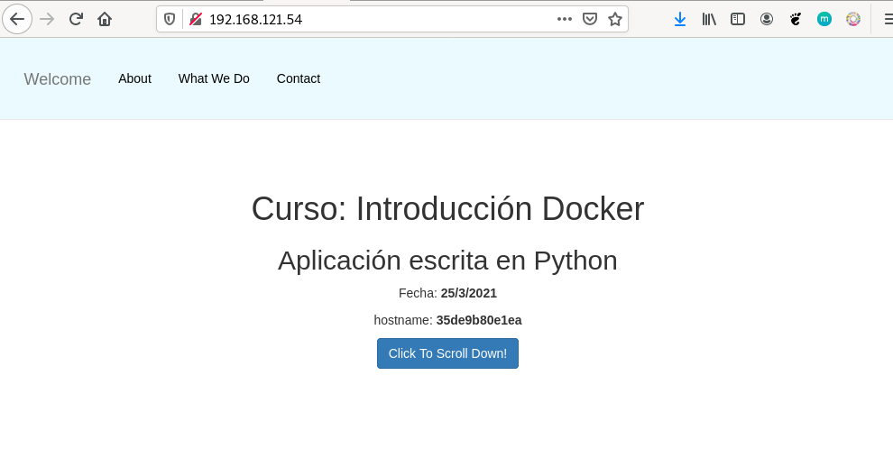
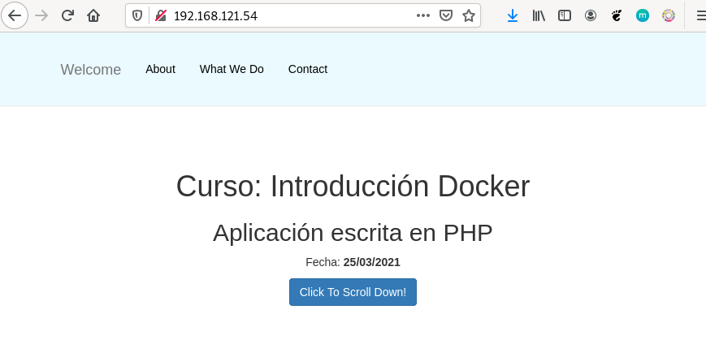
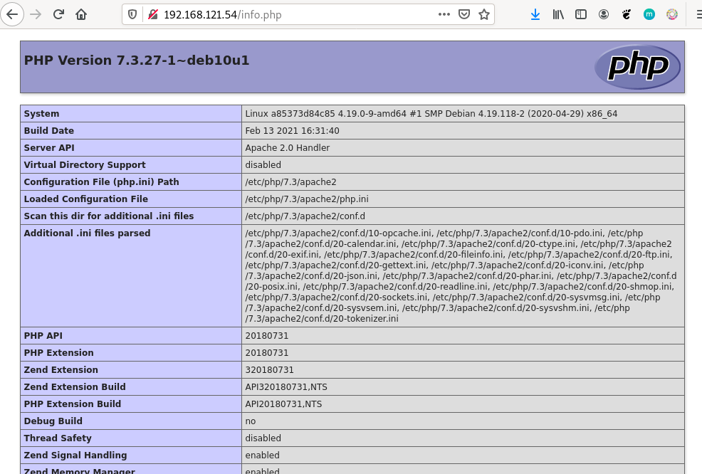
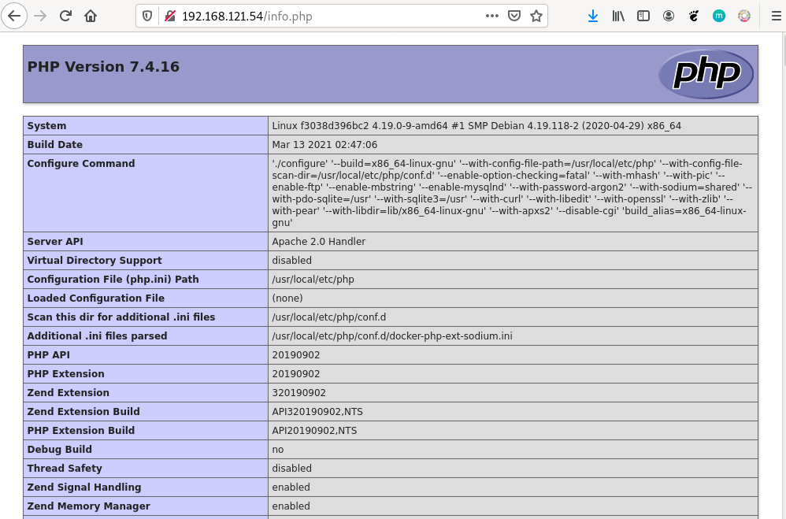

# CASO PRÁCTICO. Construción de imagenes con DockerFile

## Objetivo

Aprender a crear imágenes con Docker, a través de DockerFile

## Requisitos

- Tener instalado Docker en nuestro ordenador.
- Leer documentación DockerFile [aquí](../021.creacion-imagenes.md)

## ▶️ Caso práctico 1. Construcción de imagen con una Aplicación Python

En este ejemplo vamos a construir una imagen para servir una aplicación escrita en Python utilizando el framework `flask`. La aplicación será servida en el puerto `3000/tcp`. 

En el contexto vamos a tener el fichero Dockerfile y un directorio, llamado app con nuestra aplicación.
Descargar los recursos para este ejemplo desde [aquí](res/docker-file.caso-practico1.resources.rar)

En este caso vamos a usar una imagen base de un sistema operativo sin ningún servicio. El fichero Dockerfile será el siguiente:

```dockerfile	
FROM debian:buster-slim
# Instalamos python3 y pip3, y limpiamos la cache
RUN apt-get update && apt-get install -y python3-pip  && apt-get clean && rm -rf /var/lib/apt/lists/*
# Copiamos la carpeta app/ (la aplicación) al directorio /usr/share
COPY app /usr/share/app
# Establecemos el directorio de trabajo donde hemos copiado la aplicación
WORKDIR /usr/share/app
# Instalamos las dependencias de la aplicación
RUN pip3 install --no-cache-dir -r requirements.txt
# Exponemos el puerto 3000
EXPOSE 3000
# Ejecutamos la aplicación. Ya que el directorio de trabajo es /usr/share/app, no es necesario poner la ruta completa
CMD [ "python3", "app.py"]
```

**Algunas consideraciones:**

- Sólo tenemos que instalar pip, que utilizaremos posteriormente para instalar los paquetes Python.
- Copiamos nuestra aplicación en cualquier directorio. (En este caso /usr/share/app)
- Con `WORKDIR` nos posicionamos en el directorio indicado. Todas las instrucciones posteriores se realizarán sobre ese directorio.
- Instalamos los paquetes python con pip, que están listados en el fichero requirements.txt.
- El proceso que se va a ejecutar por defecto al iniciar el contenedor será python3 app.py que arranca un servidor web en el puerto 3000/tcp ofreciendo la aplicación.


**Construcción de la imagen**

Para construir la imagen, nos situamos en el directorio donde tenemos el fichero Dockerfile y ejecutamos:

```bash
docker build -t iessdf/imagen-web-python:v1 .
```

Comprobar que la imagen se ha creado:

```bash
docker images

REPOSITORY                 TAG                 IMAGE ID            CREATED             SIZE
iessdf/imagen-web-python   v1                  5f6b6b6b6b6b        2 minutes ago       126MB
```

Y crear el contendores a partir de la imagen:

```bash
docker run -d --name web-python -p 80:3000 iessdf/imagen-web-python:v1
```

Y acceder con el navegador a la dirección http://localhost





## ▶️ Caso práctico 2. Construcción de imagen con una Aplicación PHP (Version 1)

En este ejemplo vamos a crear una imágen con una página desarrollada con `PHP`. 

En el contexto vamos a tener el fichero Dockerfile y un directorio, llamado app con nuestra aplicación.
Descargar los recursos para este ejemplo desde [aquí](res/docker-file.caso-practico2.resources.rar), en el directorio `build` donde tenemos el fichero Dockerfile (rar contiene carpeta `app`).

En este caso vamos a usar una imagen base con el ejemplo anterior. El fichero Dockerfile será el siguiente:

```dockerfile
FROM debian:buster-slim
# Instalamos apache2 y php7.3, y limpiamos la cache
RUN apt-get update && apt-get install -y apache2 libapache2-mod-php7.3 php7.3 && apt-get clean && rm -rf /var/lib/apt/lists/*
# Copiamos la carpeta app/ (la aplicación) al directorio /var/www/html (directorio por defecto de apache2)
ADD app /var/www/html/
# Borramos el fichero index.html que viene por defecto en apache
RUN rm /var/www/html/index.html
# Exponemos el puerto 80 (por defecto de apache)
EXPOSE 80
# Ejecutamos apache2 en primer plano
CMD ["/usr/sbin/apache2ctl", "-D", "FOREGROUND"]
```

**Algunas consideraciones:**

- Al usar una imagen base debian tenemos que instalar los paquetes necesarios para tener el servidor web, php y las librerias necesarias.
- Como el ejemplo anterior, copiamos los archivos de la aplicación (dentro del directorio app) en el directorio por defecto de apache2. (/var/www/html)
- Exponemos el puerto 80 (por defecto de apache)
- Ejectuamos apache en primer plano. (Si no, el contenedor se pararía inmediatamente)


**Construcción de la imagen**

Construimos la imagen, con el nombre `iessdf/imagen-web-php:v1`

```bash
docker build -t iessdf/imagen-web-php:v1 .
```

Compobar que la imagen se ha creado:

```bash
docker images

REPOSITORY                 TAG                 IMAGE ID            CREATED             SIZE
iessdf/imagen-web-php      v1                  5f6b6b6b6b6b        2 minutes ago       126MB
```


Y crear el contenedor a partir de la imagen, con el nombre `web-php`:

> 🪧 Puerto ya utilizado.<br>
> Recordar que el otro caso práctico, el contenedor está escuchando en el puerto 80. Por lo tanto, tenemos que parar el contenedor anterior para poder ejecutar este.


```bash
docker run -d --name web-php -p 80:80 iessdf/imagen-web-php:v1
```


Y acceder con el navegador a la dirección http://localhost




La aplicación tiene un fichero info.php que me da información sobre PHP, en este caso observamos que estamos usando la versión 7.3:




## ▶️ Caso práctico 3. Construcción desde uma imagen con PHP Instalado (Version 2)

> ✏️ *(En este caso práctico vamos a usar el mismo código fuente que en el caso práctico 2), si ya están descargados no hace falta volver a descargarlos.*

En esta version en lugar de tener que instalar apache2 y php, vamos a usar una imagen base que ya tenga instalado apache2 y php.<br>
Normalmente, es recomendable usar una imagen base que ya tenga instalado los paquetes que necesitamos, ya que nos ahorramos tiempo, espacio en disco y estará más optimizada.

> 📝 Nota: Antes de configurar desde una imagen base, es mucho mejor investigar si existe una imagen que ya tenga lo que nosotros necesitamos.<br>
> Después simplemente tenemos que configurarla para que se ajuste a nuestras necesidades.


En el DockerFile, simplemente tenemos que cambiar la imagen base:

```dockerfile
FROM php:7.4-apache
ADD app /var/www/html/
EXPOSE 80
# No es necesario indicar el comando por defecto, ya que la imagen base ya lo tiene configurado.
```

Y al igual que en la versión 1, construimos la imagen, esta vez con la versión (v2) `iessdf/imagen-web-php:v2`

```bash
docker build -t iessdf/imagen-web-php:v2 .
```

Y crear el contenedor a partir de la imagen, con el nombre `web-php`:


```bash
docker run -d --name web-php2 -p 80:80 iessdf/imagen-web-php:v2
```

Y acceder con el navegador a la dirección http://localhost


