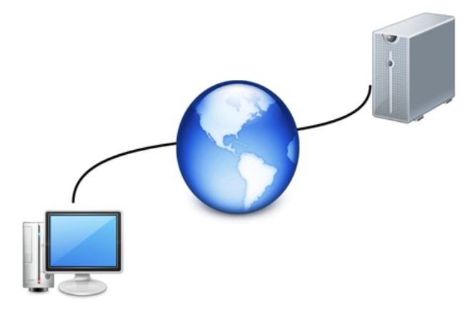
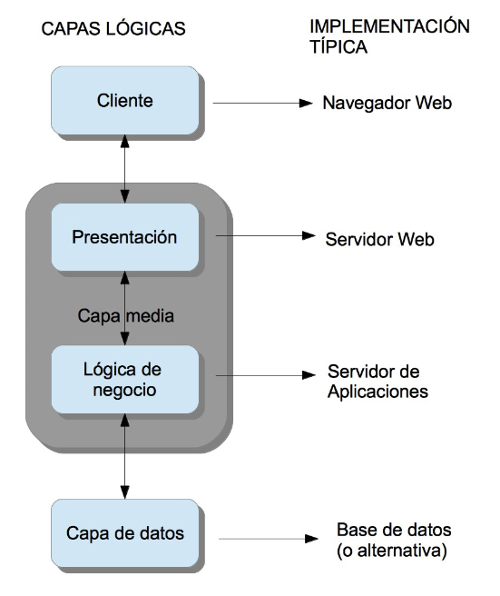
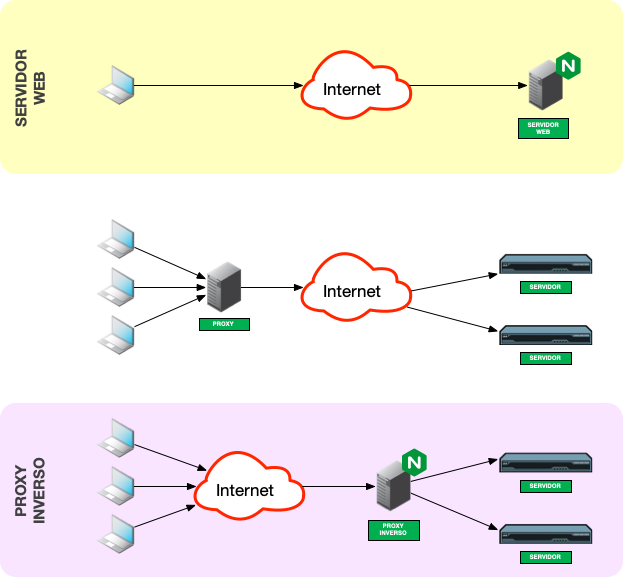
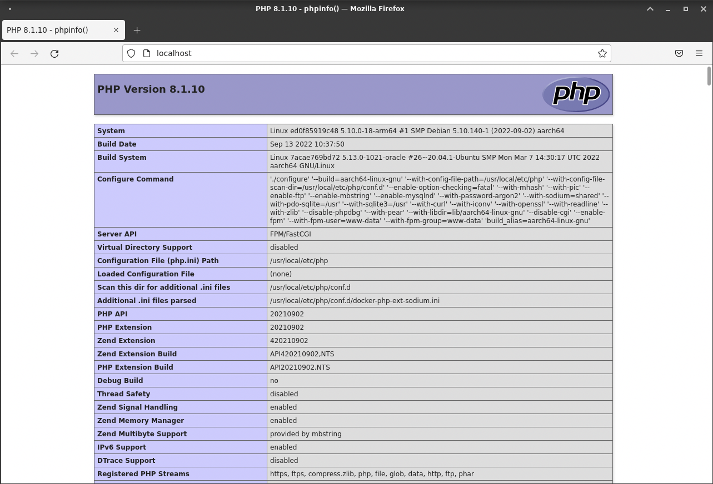

# UT3: Implantación de arquitecturas web

[1. La arquitectura web y algunos modelos](#la-arquitectura-web-y-algunos-modelos)  
[2. Servidores web](#servidores-web)  
[3. Tecnologías asociadas a las Aplicaciones Web](#3-tecnologías-asociadas-a-las-aplicaciones-web)
[4. Tipos de Aplicaciones Web](#4-tipos-de-aplicaciones-web)  
[5. Introducción Ngix Web Server](#5-introducción-ngix-web-server)  
[6. Instalación y configuración básica de un servidor web](#instalación-y-configuración-básica-de-un-servidor-web)  
[7. Servidores de aplicaciones](#servidores-de-aplicaciones)

## 1. La arquitectura web y algunos modelos

Una aplicación web necesita de una estructura que permita su acceso desde diferentes lugares (máquinas). Esta estructura es lo que se denomina **Arquitectura Web** (realmente este nombre se da también al diseño de toda la estructura).



La gran mayoría de las arquitecturas web en la actualidad se basan en un modelo **cliente/servidor**: una comunicación asimétrica en la que uno de los extremos ofrece uno o más servicios y el otro hace uso de él. Éste es el modelo sobre el que centraremos el curso, pero no es el único que existe.

El término **servicio** es muy amplio y muchas veces confuso. Por ejemplo se puede considerar una web a la que acudimos a comprar productos un servicio en si misma, pero a la vez dicho servicio está compuesto de servicios de seguridad, de sesión, de transacciones, etcétera.

La estructura de una Arquitectura Web actual sigue el siguiente **modelo**:

| Capa                          | Cometido                                                                                                                                                                                                                                                                                                                                                                                                                                |
| ----------------------------- | --------------------------------------------------------------------------------------------------------------------------------------------------------------------------------------------------------------------------------------------------------------------------------------------------------------------------------------------------------------------------------------------------------------------------------------- |
| **Capa cliente**              | Es generalmente el navegador Web ejecutándose en el ordenador del usuario final. Existen otras opciones más básicas pero en la actualidad la potencia y diversidad de los navegadores existentes (así como su gratuidad) han relegado las demás opciones a la práctica desaparición.                                                                                                                                                    |
| **Capa de presentación**      | Se encarga de componer las páginas integrando la parte dinámica en la estática. Además también procesa las páginas que envía el cliente (por ejemplo datos en formularios)                                                                                                                                                                                                                                                              |
| **Capa de lógica de negocio** | Lleva a cabo operaciones más complejas. Se corresponde con la implantación de un servidor de aplicaciones. Realiza muchos tipos de operaciones entre los que destacan: a) Realizar todas las operaciones y validaciones. b) Gestionar el flujo de trabajo (workflow) incluyendo el control y gestión de las sesiones y los datos que se necesitan. c) Gestionar todas las operaciones de accesos a datos desde la capa de presentación. |
| **Capa de datos**             | Se compone de un sistema de almacenamiento y acceso a datos que se utilizan para confeccionar la página Web. Generalmente es un gestor de bases de datos relacionales (SGDB) pero pueden ser ficheros de texto plano                                                                                                                                                                                                                    |



Algunos ejemplos de tecnologías asociadas a las capas en la arquitectura web:

| Capa              | Lenguajes                           | Manejadores                   |
| ----------------- | ----------------------------------- | ----------------------------- |
| Cliente           | http/https                          | Chrome, Firefox, Edge         |
| Presentación      | html                                | Nginx, Apache                 |
| Lógica de negocio | php, python, ruby, java, javascript | php-fpm, gunicorn, proxy_pass |
| Capa de datos     | sql                                 | PostgreSQL, MySQL             |

En el caso de estar usando **páginas web estáticas** (no cambian en función de diversas variables) no existiría la capa de datos ya que estos van incorporados en los propios archivos de marcas que serán los que conforman las páginas web.

### Un modelo simple para el despliegue de aplicaciones web

En la actualidad la mayor parte de la información y lógica de un negocio debe ser accesible desde diferentes lugares. Aquí entran en juego las aplicaciones web.

Se puede imaginar inmediatamente que la **seguridad** es un aspecto clave en este tipo de aplicaciones, pero no el único. Muchas veces la **velocidad** y **estabilidad** de la comunicación y del servicio en sí pueden ser tanto o más críticas.

Cuando se va a desarrollar e implantar una aplicación web se deben tener en cuenta varios factores. Lo primero es hacerse una **idea general de la aplicación** y de las **diferentes soluciones** que podemos utilizar. Se deben tener en cuenta las tres capas. Un error muy común es el uso permanente de un único conjunto de tecnologías. Por supuesto conocer una tecnología es un punto a favor, pero muchas veces vamos a llevar a cabo una solución manifiestamente peor únicamente por no haber considerado usar otras tecnologías y afrontar su aprendizaje.

El siguiente aspecto a considerar sería el **coste**. Cuánto nos va a costar y qué presupuesto tenemos. Como derivado de ello debemos estimar una **duración** del proyecto.

Estos factores hay que considerarlos **antes de firmar** ningún contrato e incluso antes de dar un presupuesto aunque sea orientativo.

Por ejemplo una compañía de venta de vehículos industriales quiere una aplicación web para publicar sus datos de ventas y que los comerciales puedan acceder a ella remotamente. Necesitaremos una base de datos en la que se almacenen los diferentes vehículos y sus ventas. También hará falta una lógica que mantenga todo el sistema actualizado y permita modificaciones. Además necesitaremos una capa de cliente con autenticación para que los diferentes vendedores puedan acceder al sistema, consultar y actualizar los datos.

Después de la evaluación se puede decidir no afrontar el proyecto por muchos motivos. Además de los costes ya mencionados podría darse el caso de que no tengamos los conocimientos o la infraestructura para llevar a cabo el proyecto.

### ¿Qué es una aplicación web?

Una **aplicación web** es una aplicación que se va a ejecutar a través de internet.

Constará, al menos, de dos partes:

| Lado     | Rol      | Instrumento   |
| -------- | -------- | ------------- |
| Cliente  | Frontend | Navegador web |
| Servidor | Backend  | Servidor web  |

Las aplicaciones web se engloban en el concepto superior de _aplicaciones distribuidas_. El servidor pone a disposición del cliente diferentes recursos. Ejemplos de aplicaciones web son el correo electrónico web, las tiendas online, las redes sociales, etc.

### Fases de un proyecto de aplicación web

Se pueden considerar cuatro fases en el proyecto:

| Fase                       | Descripción                                                                                                                                                                                                                                                                                                                                                                                                                                                                                                                                                                                                               |
| -------------------------- | ------------------------------------------------------------------------------------------------------------------------------------------------------------------------------------------------------------------------------------------------------------------------------------------------------------------------------------------------------------------------------------------------------------------------------------------------------------------------------------------------------------------------------------------------------------------------------------------------------------------------- |
| **Concepto**               | Durante esta fase se debe obtener una **idea clara y concreta de qué quiere el cliente**. Además hay que obtener una idea general de cómo se llevará a cabo y de si es viable o no. Hay que determinar las **limitaciones reales** con que nos podemos encontrar. Por ejemplo la conexión a internet existente en la zona puede no ser suficiente para obtener los resultados previstos. Otro ejemplo de problema puede ser que la tecnología necesaria sea demasiado cara. Es vital que al terminar esta fase se tenga una documentación que defina claramente los límites y objetivos del proyecto.                     |
| **Diseño**                 | Esta fase se centra en responder a **cómo haremos la aplicación**. Hay que concretar las **tecnologías** (tanto software como hardware) que usaremos y cómo se van a comunicar entre ellas. También hay que determinar los distintos **módulos** que usaremos y sus interfaces. Es muy importante realizar un **plan de proyecto realista** en el que se dividan las tareas y responsabilidades y se calculen los tiempos para cada elemento así como su secuencia y dependencias. También hay que obtener una **especificación funcional** en la que se detallen tanto el funcionamiento como el flujo de la aplicación. |
| **Desarrollo**             | En esta fase se debe desarrollar el proyecto en sí. Es muy importante llevar a cabo **pruebas** tanto unitarias como de integración así como gestionar una **documentación** del desarrollo y un **control de versiones**.                                                                                                                                                                                                                                                                                                                                                                                                |
| **Pruebas e implantación** | Cuando el proyecto está totalmente terminado es necesario **probarlo intensivamente** antes de ponerlo en producción. Es necesario tener en cuenta tanto nuestra aplicación como su comunicación con otros sistemas informáticos. Cuanto más se parezca el sistema de pruebas al real mejor. El último paso es la **instalación y puesta en marcha** del sistema. Es un momento crítico.                                                                                                                                                                                                                                  |

Una fase común a todos los proyectos informáticos y que no se incluye aquí es el **mantenimiento**. Este concepto incluye dos partes:

- El mantenimiento del servicio y corrección de errores: consiste en asegurarse de que todo sigue funcionando correctamente y en solucionar los posibles errores y "caídas" del servicio
- Las posibles mejoras funcionales: consiste en ampliar el proyecto incorporando nuevas funcionalidades.

Ambos casos suelen considerarse contratos aparte y por ello no se incluyen en el ciclo ordinario de desarrollo.

El orden correcto para el desarrollo es empezar de abajo a arriba (**enfoque bottom-up**). Es decir, primero la capa de datos, luego la de negocio y por último la presentación al cliente. Muchas veces se tiene la tentación de hacerlo al revés. Esto es debido a que no se han identificado bien las necesidades y objetivos de proyecto o no se ha realizado un correcto diseño. Es un error que nos conducirá a muchas más modificaciones y errores en nuestra aplicación.


## 2. Servidores web

Un **servidor web** es un programa o conjunto de ellos que proporciona un servicio a través de una red. La comunicación con un servidor web suele hacerse mediante el protocolo _http (hypertext transfer protocol)_ que está englobado en la **capa de aplicación** del [modelo OSI](https://es.wikipedia.org/wiki/Modelo_OSI).

Una brevísima descripción de las distintas capas del **modelo OSI**:

| Número | Nombre          | Responsabilidad                                                                                   |
| ------ | --------------- | ------------------------------------------------------------------------------------------------- |
| Capa 7 | **Aplicación**  | Responsable de los servicios de red para las aplicaciones                                         |
| Capa 6 | Presentación    | Transforma el formato de los datos y proporciona una interfaz estándar para la capa de aplicación |
| Capa 5 | Sesión          | Establece, administra y finaliza las conexiones entre las aplicaciones locales y las remotas      |
| Capa 4 | Transporte      | Proporciona transporte confiable y control del flujo a través de la red                           |
| Capa 3 | Red             | Responsable del direccionamiento lógico y el dominio del enrutamiento                             |
| Capa 2 | Enlace de datos | Proporciona direccionamiento físico y procedimientos de acceso a medios                           |
| Capa 1 | Física          | Define todas las especificaciones eléctricas y físicas de los dispositivos                        |

Muchas veces el concepto "servidor web" también se usa como referencia al **hardware** que lo aloja, pero esto técnicamente es inexacto ya que el mismo hardware puede albergar muchas otras funcionalidades o puede darse el caso de que un mismo hardware contenga varios servidores web (a veces simulados).

El objetivo de un servidor web es **proporcionar los medios para permitir la comunicación entre dos o más programas o artefactos de software** sin importar la tecnología usada para operar en cada uno de ellos.

En la actualidad el [servidor web más extendido](https://w3techs.com/technologies/overview/web_server) es **Nginx**. Por ello nos centraremos en él durante este curso. Existen otros servidores web. Una forma fácil de consultar la lista y ver una [comparativa muy general](https://en.wikipedia.org/wiki/Comparison_of_web_server_software) es visitando la Wikipedia.

Los servidores web se engloban en un conjunto de sistemas más generales fundamentados en el **modelo distribuido**. En este modelo el sistema no es unitario, sino que está repartido entre diferentes máquinas o conjuntos de hardware. Esta arquitectura tiene que afrontar algunos problemas que se deben tener en cuenta:

1. La latencia y poca fiabilidad del transporte (por ejemplo la red).
2. La falta de memoria compartida entre las partes.
3. Los problemas derivados de fallos parciales.
4. La gestión del acceso concurrente a recursos remotos.
5. Problemas derivados de actualizaciones de alguna/s de las partes.

### Servicios web

Un **servicio web** es un concepto abstracto que debe implementarse mediante un **agente**: en definitiva un artefacto software que envía, recibe y procesa mensajes (mientras que el servicio es el concepto de qué hace). El agente solo debe ajustarse a la definición de una interfaz (dos realmente, una hacia dentro - pila OSI - y otra hacia fuera) y puede modificarse o incluso rehacerse en otro lenguaje de programación sin ningún problema. El diseño se realiza siguiendo normas de modularidad para permitir estas modificaciones.

Es de vital importancia que el servicio web esté bien definido para posibilitar la comunicación entre ambos extremos. Por ello hay muchos estándares sobre servicios web que permiten la comunicación de un cliente genérico (por ejemplo un navegador web) con diversos servicios.

Generalmente la definición de un servicio se realiza mediante una [API](https://es.wikipedia.org/wiki/Interfaz_de_programaci%C3%B3n_de_aplicaciones) (Application Programming Interface) que especifica cómo comunicarse con dicho servicio.

El proceso para usar un servicio es el siguiente:

1. El cliente y el servidor deben ser conscientes de la existencia del otro. En el caso más habitual es el cliente el que informa al servidor de su intención de usar el servicio pero también puede ser el servidor el que inicie el contacto. Si es el cliente el que comienza, puede hacerlo o bien conociendo previamente cómo localizar el servidor o usando alguna herramienta para descubrir servicios (Web Service Discovery).
2. Ambas partes deben ponerse de acuerdo sobre los parámetros que regirán la comunicación. Esto no significa que discutan, solo que las normas y protocolos deben ser las mismas en ambas partes.
3. Los agentes de ambos lados empiezan a intercambiar mensajes. El servidor web necesita componer las páginas en caso de que lleven elementos multimedia e incluso necesitará realizar otras acciones si la página se crea dinámicamente.

### Alternativas

Antes de decidirnos a instalar nuestro propio servidor web, debemos tener en cuenta que no siempre es la mejor opción. Lo primero que debemos saber es qué quiere el cliente. Dependiendo del tamaño del servicio que vayamos a proporcionar y de la importancia de poder controlar todos los aspectos del servidor, podemos decidir usar otras aproximaciones.

Por otro lado la máquina que necesitamos podría requerir mucha RAM y capacidad de almacenamiento además de soportar grandes cargas de trabajo. La conexión a internet también deberá ser potente y necesitaremos contratar una dirección IP estática.

#### Hosting

Lo primero que se debe tener en cuenta es si nos interesa tener **nuestro propio servidor** o contratar un **servicio de hosting**. Realmente el término "Web Hosting" incluye el tener un servidor propio, pero en la actualidad se utiliza para denominar el alquilar espacio y recursos en un servidor de otra compañía. Generalmente esta compañía está dedicada a ello específicamente. Las ventajas de este caso son las obvias: no tenemos que preocuparnos de adquirir ni mantener ni el hardware ni el software necesario. Además la fiabilidad del servicio de una empresa especializada suele ser muy alta.

Los términos que se suelen manejar en este contexto son:

- **On-premise** para infraestructuras montadas en la propia organización.
- **Cloud** para infraestructuras alojadas en empresas de terceros.

#### Wordpress

Existen casos en los que incluso hay tecnologías más específicas que puede satisfacer nuestras necesidades. Es más habitual la existencia de sitios web en los que la apariencia no cambia pero el contenido es actualizado constantemente. Para estos casos se puede usar un **gestor de contenidos** (CMS). Con ellos se permite al usuario actualizar la información del sitio sin necesidad de que tenga conocimientos web concretos. Existen muchos gestores web, algunos comerciales y otros gratuitos y de código abierto. En este último apartado destaca por encima de todos [Wordpress](https://es.wordpress.org/), que empezó siendo una plataforma para alojar blogs pero hoy en día ya es un servicio de propósito general (webs, blogs, aplicaciones, etc.).

### ¿Qué necesito para montar un servidor web?

Lo primero que necesitas es una **máquina** (on-premise o cloud) con una potencia suficiente para atender las peticiones que se vayan a procesar. Los servidores web tipo Nginx son capaces de manejar una gran cantidad de peticiones por segundo (hasta cientos de miles).

Este punto de dimensionar los recursos necesarios es crítico y difícil de gestionar porque no sabemos cuál será la demanda y muchas veces es complejo estimar la carga de trabajo que se soportará. Es muy recomendable que sea una máquina dedicada o que cumpla otras funciones relacionadas con intercambio de información en internet.

También es vital que el **sistema operativo** que elijamos sea estable. No tiene ningún sentido elegir un sistema operativo que deje de estar funcional rápidamente. Es conveniente que lleve cierta seguridad y control de permisos integrado. Los sistemas operativos más habituales para este tipo de tareas son **Linux** (en sus distintas distribuciones) ya que proporcionan robustez, disponibilidad y alto nivel de personalización.

> Se estima que alrededor de un [80% de los servidores que hay funcionando en Internet corren sobre Linux/Unix](https://w3techs.com/technologies/overview/operating_system).

Obviamente se debe disponer de una **conexión a internet** con suficiente ancho de banda de subida y bajada. Lo siguiente que tendrás que conseguir es una **dirección IP estática**. Por supuesto debe ser una dirección de internet a no ser que tu objetivo sea montar una intranet. Nuestra máquina debe ser accesible desde redes remotas.

Los nombres y direcciones de internet que conocemos se basan en un sistema llamado **DNS** que convierte esas direcciones legibles para nosotros en direcciones IP y viceversa. Si nuestra dirección IP cambia frecuentemente cuando alguien accede a nuestra página esta le aparecería como no disponible a pesar de que todo el resto del sistema estuviera trabajando.

Existe la posibilidad de funcionar con una **dirección IP dinámica** mediante sistemas como DDNS (Dynamic DNS) que mantienen siempre actualizada nuestra dirección. Un servicio gratuito de DDNS es [Duck DNS](https://www.duckdns.org/).

### Servidores web más populares

Algunos de los servidores web más utilizados son los siguientes:

- **Servidor HTTP Apache**
    
    Es un servidor web gratuito y de código abierto que se utiliza en muchos sistemas operativos, como Windows, Linux y Mac OS X. **[Apache](https://www.hostinger.es/tutoriales/que-es-apache/)** es el software de servidor web más antiguo y uno de los más utilizados por los propietarios de páginas web, desarrolladores y proveedores de hosting, con una **[cuota de mercado](https://w3techs.com/technologies/details/ws-apache)** de más del **31%**.
    
- **NGINX**
    
    Es un famoso software de servidor web de código abierto que inicialmente sólo funcionaba para el servicio web HTTP. Ahora también se utiliza como proxy inverso, balanceador de carga HTTP y proxy de correo electrónico.
    
    NGINX es conocido por su velocidad y su capacidad para manejar múltiples conexiones, por lo que muchos sitios web de alto tráfico utilizan sus servicios.
    
- **IIS:** (**Internet Information Services) de Microsoft**
    
    **[IIS](https://www.iis.net/)** es un software de servidor web cerrado desarrollado por Microsoft y ampliamente utilizado en los sistemas operativos Windows.
    
- **Lighttpd**
    
    Es un software de servidor web gratuito y de código abierto que es conocido por su velocidad y por requerir menos potencia de la CPU. **[Lighttpd](https://www.lighttpd.net/)** también es popular por tener una pequeña huella de memoria.
    
    En el ámbito del hosting, los distintos hosts soportan diferentes tipos de servidores web. Por ejemplo, **[Hostinger soporta](https://www.hostinger.es/tecnologia)** tanto Apache como NGINX, los dos servidores web líderes en el mercado.


## 3. Tecnologías asociadas a las Aplicaciones Web

- **Tecnologías en el lado del servidor:**

    - **CGI (Common Gateway Interface):** la "Interface Común de Entrada" es uno de los estándares más antiguos relacionado con las aplicaciones web. Está pensado para permitir que un cliente web pueda acceder a un programa que se ejecuta en un servidor web, donde este generará contenido dinámico**. Este estándar** es utilizado para acceder a información almacenada en bases de datos, para implementar motores de búsqueda, gestionar datos de formularios, generar emails de forma automática, foros, comercio electrónico, juegos en línea, . Las rutinas de CGI  son habitualmente escritas en lenguajes interpretados como Perl o por lenguajes compilados como C.
    - **ASP (Active Server Pages):** se ejecutan del lado del servidor, de este modo se forman los resultados que luego se mostrarán en el navegador de cada equipo cliente en virtud de la petición que se ha realizado. Un buen ejemplo de ello son los buscadores, donde un usuario realiza una petición de información y el servidor IIS nos entrega un resultado a medida de nuestra petición. Existen versiones de  para Unix y Linux, a pesar de que fue una tecnología desarrollada por Microsoft para la creación dinámica de páginas web ofrecida junto a su servidor . Hoy en día ASP ha evolucionado hasta **[ASP.NET](https://educacionadistancia.juntadeandalucia.es/formacionprofesional/pluginfile.php/56055/mod_scorm/content/0/#t400435e4-6cc1-a372-f808-37a0ae5f511e)**, y se ha convertido en un framework de desarrollo web libre.
    - **PHP (Hypertext Preprocessor):** este lenguaje es, al igual que ASP, ejecutado en el lado del servidor. PHP  es similar a ASP y puede ser usado en circunstancias similares. Es muy eficiente, permitiendo el acceso a bases de datos empleando servidores como **[MySQL](https://es.wikipedia.org/wiki/MySQL)** y, por lo tanto, suele utilizarse para crear páginas dinámicas complejas.
    - **Java:** en el ecosistema de Java existe un conjunto de tecnologías pensadas para desarrollo de aplicaciones web que se ejecutan en el lado del servidor, generalmente enmarcadas en lo que se conoce como Java EE (Java Enterprise Edition). Las tecnologías más conocidas en el entorno web de Java son JSP (JavaServer Pages), JSF (JavaServer Faces) y los **servlets**. JSP es en conceptualmente similar a PHP y ASP, pero con el trasfondo de java.
    - **JavaScript**: dentro de la idea de "full stack development", en la que se persigue que un mismo desarrollador o desarrolladora pueda implementar tanto la parte que se ejecuta en el servidor (back-end) como la página que se visualiza en el cliente (front-end), han surgido cada vez más tecnologías que permiten desarrollar en JavaScript aplicaciones web que se ejecutan en el servidor (la misma usada en el navegador web), como es el caso de Express.js y Hapi.js (ambos funcionan sobre Node.js), y Meteor.js. Pero esta idea no es nueva, ya en 1995 el servidor web Netscape Enterprise Server ya contemplaba el uso de javascript en el servidor (server-side javascript).

- **Lenguajes y Tecnologías en el lado del cliente:**
  
    - **Lenguajes**
        - **HTML (HiperText Markup Language)**: como es de suponer, ya sabrás que HTML es el lenguaje de marcas que se utiliza maquetar el contenido de una página web. Hoy día HTML va por la versión 5 ().
        - **CSS (Cascading Style Sheets):** las CSS "Hojas de Estilo en Cascada" se usan para formatear las páginas web; se trata de separar el contenido de un documento de su presentación. Cualquier cambio en el estilo marcado para un elemento en el CSS afectará a todas las páginas vinculadas a esa página.
        - **Java**: es un lenguaje que también podemos encontrarlo en el lado del cliente, ejecutándose de forma incrustada en un navegador web. A las aplicaciones Java que se pueden embeber en una página web se las conoce como "applets". (muy en desuso)
        - **JavaScript:** posiblemente el uso más extendido de este lenguaje es hacer las páginas web más interactivas. Es un lenguaje que como ya se introdujo antes, puede interpretarse y ejecutarse en un navegador web. Es útil para realizar tareas tales como mover imágenes por la pantalla, crear menús de navegación interactivos, juegos, . En las páginas web suele preferirse JavaScript porque es aceptado por muchos más navegadores que  (creado por Microsoft).
- 
    - **Tecnologías**
        - **Client Side Rendering (CSR):** El renderizado se produce en el cliente. En la primera carga de la página, el servidor devuelve todo el código en Javascript. El resto de peticiones con el servidor son para intercambiar datos.
        - **Server Side Rendering (SSR):** Es la técnica habitual que que se ha utilizado desde el inicio de la Web. Aunque pueda parecer que está pensado con las últimas tecnologías. 
        Cuándo el navegador solicita una página web, está es creada desde el servidor compilando todo el código y los datos y devuelve una página HTML completa. Los datos son actualizados dinámicamente en cada solicitud del navegador, es por eso que en este tipo de sitios web debemos recargar constantemente para obtener la última versión.
        - **Static Site Generation (SSG):**
            
            Los sitios web estáticos no son más que sitios web que funcionan con HTML, CSS y JavaScript y no requieren de código de servidor para funcionar. Se denominan **estáticos** porque todos los datos están incrustados directamente en el código. Si bien utilizando solamente con archivos HTML podemos crear sitios estáticos pero al tener un nuestro proyecto más grande como un blog no resulta cómodo, es por eso que existen herramientas que nos permiten compilar a HTML y separar lógica en componente que podemos reutilizar.
            
            Para actualizar nuevos datos de nuestra página web, requerirá de una nueva compilación de todo el proyecto aún si es mínimo el cambio.


## 4. Tipos de Aplicaciones Web

Aunque se denomina aplicación web, no toda web es una aplicación. En los últimos años el desarrollo web ha evolucionado mucho.

### **¿Qué es una aplicación web?**

Una **aplicación web o web app** es una versión de una página web que ha sido optimizada, normalmente por un equipo de desarrollo, para poder ser utilizada desde un teléfono móvil. Gracias a esto se adapta a cualquier dispositivo.

Estas son **4 características de una aplicación web** que te ayudarán a diferenciarlas de otros tipos de apps:

- Requieren un único desarrollo para cualquier dispositivo. Un mismo desarrollo en HTML5 es suficiente para cualquier sistema operativo.
- No es necesario descargarlas. La aplicación se aloja en un servidor y se accede a ella a partir de un navegador. Esto significa que es necesario estar conectado para acceder a ella.
- Son accesibles desde cualquier navegador. Si tienes un navegador instalado en el dispositivo (Firefox, Safari, Chrome…) podrás acceder a la aplicación web.
- Aparecen como resultado en los buscadores tradicionales. Al no necesitar descarga no las encontrarás en las *app stores*, pero sí aparecerán como resultado en motores como Google.
- Actualmente las WebApp pueden aparecer en los móviles como una App normal en el escritorio del dispositivo.

Aunque las **aplicaciones nativas** permiten desarrollos más complejos, también son más costosos y no siempre necesarios. **La decisión dependerá del uso que se vaya a hacer de la aplicación**.

### **Tipos de aplicaciones web**

En esta ocasión queremos hacer **una clasificación de los tipos de web apps**. Esta clasificación se hará dependiendo de la función de cómo se presentan las web apps con el contenido que deben mostrar.

En la actualidad, definir los **distintos tipos de aplicaciones web** puede ser algo complicado, ya que cada vez están más integradas y las líneas son más difusas, pero podemos diferenciarlas en **4 grandes grupos.**

- **1. Aplicaciones Web Estáticas.** Las web app estáticas son las que muestran un único contenido y no se interactúa con ella nada o prácticamente nada. Por ejemplo, un curriculum o una web empresarial con los teléfonos y la dirección serían algunos de los casos.
    
    Si optamos por **crear una app web estática**, lo primero que debemos saber es que este tipo de web app muestran poca información y no suele cambiar mucho.
    
    Por regla general suelen estar **desarrolladas en HTML y CSS,** aunque también se pueden mostrar en alguna parte de la aplicación web objetos en movimiento como por ejemplo banners, GIF animados o vídeos. También se puede hablar de **desarrollo de aplicaciones web con jQuery y Ajax**.
    
    *Un portfolio, un curriculum digital o una página de presentación de empresa serían ejemplos de aplicaciones web estáticas.*
    
    Modificar los contenidos de las apps estáticas no es sencillo. Para hacerlo es necesario **editar el HTML y actualizarlo en el servidor**. Estos cambios serán, normalmente, responsabilidad del *webmaster* o de la empresa de desarrollo que programó el diseño de la web app.
    
- **2. Aplicaciones Web Dinámicas.** En las web apps dinámicas el usuario puede interactuar mucho más que con los sitios estáticos. Por ejemplo, puede registrarse para acceder a su cuenta, puede modificar parámetros o incluso publicar información. El ejemplo más claro de aplicación web dinámica sería un foro.
Las **aplicaciones web dinámicas** son mucho más complejas a nivel técnico. Utilizan **bases de datos para cargar a información** y estos contenidos se actualizan cada vez que el usuario accede a la web app.
    
    Existen muchos **lenguajes de programación para el desarrollo de aplicaciones web dinámicas**. Los lenguajes **PHP,**  **Java, C#**, … son los más comunes porque permiten una buena estructuración del contenido.
    
    *Las aplicaciones web dinámicas suelen contar con un panel de administrador (CMS) para realizar cambios.*


## 5. Introducción Ngix Web Server


### 8 razones para usar Nginx

1. **Rendimiento**: Nginx está diseñado para ser rápido y eficiente. Es capaz de manejar miles de conexiones simultáneas con un uso mínimo de recursos.
2. **Escalabilidad**: Nginx es fácilmente escalable. Puede manejar fácilmente un aumento en el tráfico simplemente agregando más hardware.
3. **Fiabilidad**: Nginx es muy estable. Es muy raro que se bloquee o se caiga.
4. **Facil de instalar, configurar y mantener**: Nginx es fácil de instalar y configurar. La configuración se realiza mediante archivos de texto plano que son fáciles de leer y comprender. El mantenimiento es fácil porque Nginx es muy estable y no requiere reinicios frecuentes.
5. **Fácil de usar**: Nginx es fácil de usar. La configuración se realiza mediante archivos de texto plano que son fáciles de leer y comprender.
6. **Balanceador de carga y proxy inverso**: Nginx se puede utilizar como balanceador de carga y proxy inverso. Esto significa que puede distribuir el tráfico entre varios servidores web y servidores de aplicaciones.
7. **Bajo uso de recursos**: Nginx requiere muy pocos recursos para ejecutarse. Esto significa que puede ejecutarlo en hardware más barato y con menos recursos.
8. **Soporte para múltiples plataformas**: Nginx se ejecuta en Linux, BSD, Mac OS X, Solaris, AIX y otros sistemas operativos.


### Principales características de Nginx

- **Más que solo un servidor web**: Nginx se puede utilizar como servidor web, servidor proxy, balanceador de carga, servidor de correo electrónico y servidor de caché.
  - Un proxy-inverso es un tipo de servidor proxy que recupera recursos en nombre de un cliente desde uno o más servidores. Estos recursos se devuelven al cliente como si se hubieran originado en el propio servidor.
- **Diseño modular**: Nginx está diseñado con un diseño modular. Esto significa que puede ampliar fácilmente la funcionalidad de Nginx agregando nuevos módulos.
  - SSL y compresión son módulos que se pueden agregar a Nginx.
  - Al ser código abierto, se puede reconstrutir desde cero con los módulos que necesitemos, esto permite que sea muy ligero y rápido. 
  > 🤚 El único inconveniente, es que si se decida incorporar un nuevo módulo más adelante, se requere volver a compilarlo, pero esto no es un problema en la mayoría de los casos, ya que Ngix permite se actualizado sin necesidad de parar el servicio.

- **Asincrono**: Nginx utiliza un modelo de procesamiento asíncrono y no bloqueante. Esto significa que puede manejar miles de conexiones simultáneas con un uso mínimo de recursos. Diferente a Apache y IIS que utilizan modelos de hilos (Thread) en paralelo, que requieren más recursos. Ngix se basa en un único hilo utilizando eventos, con lo que la eficiencia es mucho mayor.

- **Soporte para múltiples protocolos**: Nginx admite HTTP, HTTPS, SMTP, POP3 y IMAP.
- **HTTP Video Streaming**: Nginx admite la transmisión de video HTTP. Esto significa que puede usar Nginx para transmitir videos en línea.
- **Monitorización y Logging extendido**: Conocer el motivo de un error es fundamental para poder solucionarlo. Nginx permite monitorizar y loguear todo lo que ocurre en el servidor, y además permite configurar alertas para que nos avise cuando ocurra un error o un evento importante.


## 6. 🐳 Instalación y configuración básica de un servidor web

<br>


**Nginx** se define como un **servidor web** / **proxy inverso** ligero y de alto rendimiento.



Vamos a optar por instalar **Nginx** sobre un sistema operativo **Linux**, una de las opciones más extendidas en la actualidad (con la posibilidad de obtener todo el software de manera gratuita). Nginx destaca sobre otros servidores web porque:

- Tiene un diseño modular y altamente configurable.
- Ofrece un alto rendimiento.
- Es de [código abierto](https://hg.nginx.org/nginx/file/tip) por lo que existen muchas extensiones y herramientas de terceros.
- Forma parte de muchos "stacks" tecnológicos modernos.
- Existen versiones para muchos sistemas operativos incluyendo Windows, Linux y MacOS.

En el tema anterior, vimos como Docker nos hace la vida mucho más fácil a la hora de instalar y configurar un servidor web, sin "ensuciar" el SO host, y pudiendo tener varias versiones de un mismo servidor web instalado sobre la máquina.

En este tema, vamos a aprender cómo se instala de forma nativa (directamente sobre Linux), pero lo haremos sobre una imagen base de Docker (ubuntu o debian), y también lo haremos utilizando una imagen de Docker que ya tenga instalado Nginx. (opción recomendada en producción)

### Instalación nativa

Vamos a utilizar la versión base de Debian 11 (Bullseye) para instalar Nginx. 

```bash
# Damos el nombre nxnative al contenedor, ponemos como hostname (nombre servidor) srvnx, y ejecutamos en modo interactivo
# Vinculamos el puerto 80 del contenedor con el puerto 80 del host
docker run -it --rm --name nxnative -p 80:80 --hostname srvnx debian:bullseye-slim bash
```

Una vez dentro del contenedor, actualizamos el sistema y lo dejamos preparado para instalar Nginx:

> 📝 **Guía-instalación**: <br>
> La guía de instalación de Nginx para Debian 11 (Bullseye) la podemos encontrar en la [página oficial](https://nginx.org/en/linux_packages.html#Debian) o para Ubuntu en la [página oficial](https://nginx.org/en/linux_packages.html#Ubuntu)


```bash
apt update && apt upgrade -y
# instalamos los paquetes necesarios para añadir repositorios externos
apt install -y curl gnupg2 ca-certificates lsb-release debian-archive-keyring
# Importamos la clave GPG del repositorio externo desde donde descargarnos la última versión de Nginx
curl -fsSL https://nginx.org/keys/nginx_signing.key | gpg --dearmor -o /etc/apt/trusted.gpg.d/nginx.gpg
# Añadimos el repositorio externo en cuestión y confirmamos que el repositorio está disponible tras actualizar las fuentes
echo "deb http://nginx.org/packages/debian $(lsb_release -sc) nginx" | tee /etc/apt/sources.list.d/nginx.list > /dev/null
# Actualizamos el sistema y lo dejamos preparado para instalar Nginx
apt update
# Instalamos Nginx
apt install -y nginx
```

Una vez instalado, podemos comprobar la versión de Nginx instalada:

```bash
# -v para ver la versión, -V para ver la versión y los módulos instalados
nginx -V 
```

Y podemos comprobar que el servicio está corriendo:

```bash
service nginx status
# Si no está corriendo, lo podemos levantar con:
service nginx start
```

> 💡 **Apagar y reconectar al servidor**:<br>
> Si salimos del contenedor (este se para), no hace falta que volvamos a crearlo de nuevo, simplemente lo arrancamos con `docker start nxnative && docker exec -it nxnative bash` y ya estamos dentro del contenedor. También es necesario volver a iniciar el servicio de Nginx con `service nginx start`, ya que al parar el contenedor, se para el servicio.


Ahora podemos acceder a http://localhost desde el navegador del host, y veremos la página de bienvenida de Nginx:


### Creación de un DockerFile para recrear la imagen

Vamos a crear un DockerFile para poder recrear la imagen de Nginx que hemos creado anteriormente, y así no tener que volver a instalarlo cada vez que queramos crear un contenedor con Nginx.

> 📝 **DockerFile**:<br>
> Simplemente es ejecutar todos los pasos que hemos realizado anteriormente, pero en un fichero de texto, para que Docker lo ejecute de forma automática, como si fuera una `receta`.

```dockerfile
# Imagen base
FROM debian:bullseye-slim
RUN apt update && apt upgrade -y \
    && apt install -y curl gnupg2 ca-certificates lsb-release debian-archive-keyring \
    && curl -fsSL https://nginx.org/keys/nginx_signing.key | gpg --dearmor -o /etc/apt/trusted.gpg.d/nginx.gpg \
    && echo "deb http://nginx.org/packages/debian $(lsb_release -sc) nginx" | tee /etc/apt/sources.list.d/nginx.list > /dev/null \
    && apt update \
    && apt install -y nginx

# Exponemos el puerto 80
EXPOSE 80

# Ejecutamos nginx en primer plano, para evitar que el contenedor se pare
CMD ["/usr/sbin/nginx", "-g", "daemon off;"]
```

Guardamos el fichero como `dockerfile` (sin extensión) y lo construimos:

```bash
# Crea la imagen a partir del DockerFile, y le da el nombre iessdf/nginx
docker build -t iessdf/nginx .
```

Una podemos crear un contenedor a partir de la imagen que acabamos de crear. Podemos hacerlo de 2 formas:

1. Ejecutar en segundo plano, y conectarnos a posteriori:

    ```bash
    docker run -d --name nxnative -p 80:80 --hostname srvnx iessdf/nginx
    docker exec -it nxnative bash
    ```
2. Ejecutar de forma interactiva y conectar a la vez que se crea el contenedor:

    ```bash
    docker run -it --name nxnative -p 80:80 --hostname srvnx iessdf/nginx bash
    ```

Si más adelante necesitamos iniciar el contenedor, y volver a entrar:

```bash
docker start nxnative && docker exec -it nxnative bash
```


Ahora al igual que antes, podemos acceder a http://localhost y si todo funciona bien, podemos ver la página de bienvenida de Nginx.


## Servidores de aplicaciones

Un servidor de aplicaciones es un paquete software que proporciona servicios a las aplicaciones tales como seguridad, servicios de datos, soporte para transacciones, balanceo de carga y gestión de sistemas distribuidos.

El funcionamiento de un servidor de aplicaciones necesita de un servidor web. Muchas veces vienen en el mismo paquete, pero realmente son dos partes diferenciadas.

Cuando un cliente hace una petición al servidor web, este trata de gestionarla, pero hay muchos elementos con los que no sabe qué hacer. Aquí entra en juego el servidor de aplicaciones, que descarga al servidor web de la gestión de determinados tipos de archivos.

A continuación veremos el despliegue de una aplicación PHP como ejemplo de servidor de aplicaciones.

### PHP nativo

[PHP](https://www.php.net/) es un lenguaje de "scripting" muy enfocado a la programación web (aunque no únicamente) y permite desarrollar aplicaciones integradas en el propio código HTML.

El servidor de aplicación (o manejador de procesos) que se utiliza para PHP es [PHP-FPM](https://www.php.net/manual/es/install.fpm.php). Se encarga de manejar los procesos [FastCGI](https://es.wikipedia.org/wiki/FastCGI), un protocolo para interconectar programas interactivos con un servidor web.

Para **instalar PHP-FPM** seguiremos los pasos indicados a continuación.

En primer lugar debemos instalar algunos **prerrequisitos**:

```bash
:~$ apt update
# Instalamos los paquetes necesarios para añadir repositorios externos:
:~$ apt install -y lsb-release ca-certificates apt-transport-https software-properties-common gnupg2
# Importamos la clave GPG del repositorio externo desde donde descargarnos la última versión de PHP-FPM:
:~$ curl -fsSL  https://packages.sury.org/php/apt.gpg | gpg --dearmor -o /etc/apt/trusted.gpg.d/sury.gpg
# Añadimos el repositorio externo en cuestión:
:~$ echo "deb https://packages.sury.org/php/ $(lsb_release -sc) main" | tee /etc/apt/sources.list.d/sury-php.list
# Confirmamos que el repositorio está disponible tras actualizar las fuentes:
:~$ apt update
```

Es posible encontrarnos con varias versiones del paquete. Veamos primero cómo enfocar la búsqueda a los nombres de paquete que nos interesan:

```bash
:~$ apt-cache search --names-only 'php*-fpm'
php7.4-fpm - server-side, HTML-embedded scripting language (FPM-CGI binary)
php-fpm - server-side, HTML-embedded scripting language (FPM-CGI binary) (default)
php5.6-fpm - server-side, HTML-embedded scripting language (FPM-CGI binary)
php7.0-fpm - server-side, HTML-embedded scripting language (FPM-CGI binary)
php7.1-fpm - server-side, HTML-embedded scripting language (FPM-CGI binary)
php7.2-fpm - server-side, HTML-embedded scripting language (FPM-CGI binary)
php7.3-fpm - server-side, HTML-embedded scripting language (FPM-CGI binary)
php8.0-fpm - server-side, HTML-embedded scripting language (FPM-CGI binary)
php8.1-fpm - server-side, HTML-embedded scripting language (FPM-CGI binary)
php8.2-fpm - server-side, HTML-embedded scripting language (FPM-CGI binary)
php8.3-fpm - server-side, HTML-embedded scripting language (FPM-CGI binary)
```

Revisando la salida, nos damos cuenta que la versión más reciente es la `v8.3`. Instalamos dicha versión:

```bash
:~$ apt install -y php8.3-fpm
```

Dado que PHP-FPM se instala en el sistema como un **servicio**, podemos comprobar su estado utilizando `service`:

```bash
:~$ service php8.3-fpm status
# Después de instalarlo, el servicio está parado:
php8.3-fpm is not running ...failed!

# Lo iniciamos y comprobamos que está en ejecución:
:~$ service php8.3-fpm start
:~$ service php8.3-fpm status
php8.3-fpm is running ...done.
```

Con esta instalación, también hemos instalado el propio **intéprete PHP** para ejecutar programas:

```bash
:~$ php --version
PHP 8.3.0-dev (cli) (built: Sep 21 2021 10:22:20) ( NTS )
Copyright (c)
...
```

#### Habilitando PHP en Nginx

Nginx es un servidor web que sirve ficheros pero "no sabe" manejar código escrito en PHP (u otros lenguajes). Es por ello que necesitamos un procesador (servidor de aplicación) como PHP-FPM.

Lo primero que hay que hacer es permitir que el usuario `nginx` tenga acceso al [socket unix](https://es.wikipedia.org/wiki/Socket_Unix) que abre PHP-FPM. Para ello debemos editar la configuración de PHP-FPM:

> 💡 Instalar `nano`:<br>
>  Nano no está instalado por defecto en Debian 11, por lo que debemos instalarlo usarlo `apt install -y nano`..

```bash
:~$ nano /etc/php/8.3/fpm/pool.d/www.conf
```
Buscar las líneas en el fichero de configuración y cambiarlas por:
```ini
23| user = nginx
24| group = nginx
...
51| listen.owner = nginx
52| listen.group = nginx
```

Guardamos y **recargamos la configuración** de PHP-FPM:

```bash
:~$ service php8.3-fpm restart
```

Para **habilitar la comunicación entre Nginx y PHP-FPM** vamos a editar el siguiente fichero de configuración:

```bash
:~$ nano /etc/nginx/conf.d/default.conf
```

Buscar el bloque `location ~ \.php` y dejarlo así:

```nginx
location ~ \.php$ {
    root           /usr/share/nginx/html;
    fastcgi_pass   unix:/var/run/php/php8.4-fpm.sock;
    fastcgi_index  index.php;
    index          index.php;
    include        fastcgi_params;
    fastcgi_param  SCRIPT_FILENAME   $document_root$fastcgi_script_name;
}
```

Podemos comprobar que la **sintaxis del fichero de configuración** es correcta utilizando Nginx:

```bash
:~$ nginx -t
nginx: the configuration file /etc/nginx/nginx.conf syntax is ok
nginx: configuration file /etc/nginx/nginx.conf test is successful
```

Y reiniciamos el **servicio nginx** también:

```bash
:~$ service nginx restart
```

Una vez finalizado todo, y si todo está ok, podemos acceder a http://localhost/info.php y veremos la información de PHP:


> 💡 **¿Por qué no funciona?**:<br>
> Monitorizar un sistema es fundamental para comprobar si está funcionando y ver los errores.<br>
> En este caso, podemos ver los logs de Nginx en `/var/log/nginx/error.log` y los logs de PHP-FPM en `/var/log/php8.3-fpm.log`.<br>
> En el caso de PHP-FPM, podemos ver que el usuario `nginx` no tiene permisos para acceder al socket de PHP-FPM. Para solucionarlo, debemos editar el fichero `/etc/php/8.3/fpm/pool.d/www.conf` y cambiar el usuario y grupo de `nginx` a `www-data`.<br>
> Comandos para monitorizar el sistema:<br>
> - `tail -f /var/log/nginx/error.log` para ver los logs de Nginx en tiempo real.<br>


#### Primera aplicación web en PHP

Creamos un fichero PHP que contendrá un sencillo código mostrando la información de la instalación:

```bash
# Generar un fichero muy simple index.php con el contenido "<?php phpinfo(); ?>", y lo guarda en /usr/share/nginx/html/index.php. 
:~$ echo "<?php phpinfo(); ?>" | tee /usr/share/nginx/html/index.php
```

Abrimos un navegador en la ruta especificada `localhost/index.php` y veremos la información de PHP:


### PHP dockerizado

Como vamos a poder comprobar, todo lo complejo y tedioso que ha sido instalar PHP-FPM en el sistema de forma manual, se simplifica enormemente con una imagen de Docker que ya tenga instalado PHP-FPM.

Para este escenario es necesario "componer" dos servicios, ya que mientras antes ambos servicios estaban instalados en el mismo ordenador, ahora vamos a tenerlos en dos contenedores diferentes:

- Nginx (`web`)
- PHP-FPM (`php-fpm`)

La estructura del "proyecto" quedaría así:

```bash
:~/dev/app$ tree
.
├── default.conf
├── docker-compose.yml
└── src
    └── index.php

1 directory, 4 res/files
```

La composición de servicios en Docker se lleva a cabo mediante la herramienta [docker compose](https://docs.docker.com/compose/) usando un fichero de configuración en formato [yaml](https://es.wikipedia.org/wiki/YAML):

```yaml
version: "3.8"

services:
  web:
    image: nginx
    volumes:
      - ./src:/etc/nginx/html # "root" por defecto en Nginx
      - ./default.conf:/etc/nginx/conf.d/default.conf
    ports:
      - 80:80

  php-fpm:
    image: php:8-fpm   # imagen oficial PHP que incorporar soporte para FPM
    volumes:
      - ./src:/etc/nginx/html
```

Fichero de configuración del sitio web por defecto:

**`default.conf`**

```nginx
server {
  server_name _;
  index index.php index.html;

  location ~ \.php$ {
    fastcgi_pass php-fpm:9000;
    include fastcgi_params;  # fichero incluido en la instalación
    fastcgi_param SCRIPT_FILENAME $document_root$fastcgi_script_name;
  }
}
```

Y finalmente, nuestro programa PHP de prueba que mostrará por pantalla la configuración misma de PHP:

**`src/index.php`**

```nginx
<?php
  echo phpinfo();
?>
```

Con todo esto ya podemos levantar los servicios:

```bash
:~/dev/app$ docker compose up
[+] Running 3/0
 ⠿ Network app_default      Created                                                                                 0.0s
 ⠿ Container app-php-fpm-1  Created                                                                                 0.0s
 ⠿ Container app-web-1      Created                                                                                 0.0s
Attaching to app-php-fpm-1, app-web-1
app-php-fpm-1  | [21-Sep-2022 10:22:20] NOTICE: fpm is running, pid 1
app-php-fpm-1  | [21-Sep-2022 10:22:20] NOTICE: ready to handle connections
app-web-1      | /docker-entrypoint.sh: /docker-entrypoint.d/ is not empty, will attempt to perform configuration
app-web-1      | /docker-entrypoint.sh: Looking for shell scripts in /docker-entrypoint.d/
app-web-1      | /docker-entrypoint.sh: Launching /docker-entrypoint.d/10-listen-on-ipv6-by-default.sh
app-web-1      | 10-listen-on-ipv6-by-default.sh: info: Getting the checksum of /etc/nginx/conf.d/default.conf
app-web-1      | 10-listen-on-ipv6-by-default.sh: info: /etc/nginx/conf.d/default.conf differs from the packaged version
app-web-1      | /docker-entrypoint.sh: Launching /docker-entrypoint.d/20-envsubst-on-templates.sh
app-web-1      | /docker-entrypoint.sh: Launching /docker-entrypoint.d/30-tune-worker-processes.sh
app-web-1      | /docker-entrypoint.sh: Configuration complete; ready for start up
app-web-1      | 2022/09/21 10:22:20 [notice] 1#1: using the "epoll" event method
app-web-1      | 2022/09/21 10:22:20 [notice] 1#1: nginx/1.23.1
app-web-1      | 2022/09/21 10:22:20 [notice] 1#1: built by gcc 10.2.1 20210110 (Debian 10.2.1-6)
app-web-1      | 2022/09/21 10:22:20 [notice] 1#1: OS: Linux 5.10.0-18-arm64
app-web-1      | 2022/09/21 10:22:20 [notice] 1#1: getrlimit(RLIMIT_NOFILE): 1048576:1048576
app-web-1      | 2022/09/21 10:22:20 [notice] 1#1: start worker processes
app-web-1      | 2022/09/21 10:22:20 [notice] 1#1: start worker process 29
app-web-1      | 2022/09/21 10:22:20 [notice] 1#1: start worker process 30
```

> ⚠️ &nbsp;Si el comando anterior da un error de tipo "bind: address already in use" es posible que tengas Nginx nativo funcionando. Puedes pararlo con: `sudo systemctl stop nginx`.

Si dejamos este proceso corriendo y abrimos un navegador en http://localhost veremos la página de bienvenida de Nginx.


