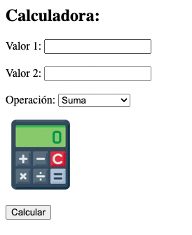

# TE3.1: Implantación página web PHP con Nginx + PHP-FPM, y depuración con XDebug

### TAREA EVALUABLE

1. Implantar una aplicación PHP que funcione como una calculadora usando Nginx + PHP-FPM.
2. Realizar el despliegue en la máquina local con la url http://localhost para instalación con 2 contenedores **entorno dockerizado** (docker-compose con imagen incluya PHP-FPM).
3. Configurar la depuración de PHP con XDdebug.

### 📝 Entregable

Informe explicando los pasos según se indica en el [punto](#explicación-de-la-tarea) seguidos para resolver la tarea.
El informe se entregará en un fichero `README.md` en el repositorio oficial del alumno, en la carpeta `UT3/TE3.1/`.<br>

Se entregará un PDF (en moodle) con el siguiente formato:

1. Titulo de la tarea, donde se indique el nombre de la tarea y el nombre de la asignatura, y el nombre del alumno, asi como el enlace (formato commit) al fichero (README.md) de vuestro repositorio.

### ⚠️ Recursos

- [Documentación de la UT3](../README.md)
- [Caso práctico: Depurar PHP con XDebug](../casopractico/readme.md)

## Aplicación PHP

1. Utilizar una interfaz similar a la siguiente:



2. Incluir [esta imagen de la calculadora](./images/calculadora.png).
3. Incluir un fichero `.css` con unos estilos básicos.


## Entorno dockerizado

1. Crear un fichero `docker-compose.yml` con los siguientes servicios:
   - Servicio web con Nginx
   - Servicio PHP-FPM

2. Crear un fichero `dockerfile` para crear la imagen de PHP-FPM, que incluya la configuración de XDebug que incluya la app PHP (calculadora), con todos los ficheros necesarios para que funcione la aplicación. <br>
  Genera la imagen a través del fichero `dockerfile` y que esta imagen se genere al levantar el escenario con docker-compose. (`docker-compose up`)

3. Configurar el servicio web con Nginx para que funcione con PHP-FPM (default.conf).<br>
   - Mapear los puertos necesarios.
   - Mapear la carpeta `app` del local al contenedor, a la carpeta `/usr/share/nginx/html` del contenedor, según está definido en el fichero `default.conf`.

4. Levantar el escenario construyendo la imagen de PHP-FPM (XDebug) (`docker-compose up --build`).


### Estructura de directorios

```
UT3\TE3.1
├── app
|   ├── images
│   │   └── calculadora.png
│   ├── index.php
│   └── styles.css
├── docker
│   ├── php
│   │   ├── config
│   │   │   └── xdebug.ini
│   │   │   └── error_reporting.ini
│   │   └── dockerfile
│   └── nginx
│       ├── config
│       │   └── default.conf
├── docker-compose.yml

```

**Nombres de las imágen:** `iessdf/calculadora-php-nativa`


## Explicación de la tarea

- Explica cada uno de los pasos realizados para la realización de la tarea.
- Los pasos deben estar numerados, y con explicación de qué se hace en ese paso, y si es requerido incluir imagen para su comprensión (INCLUIRLA).
- Para el docker-compose, explicar con comentarios dentro del fichero docker-compose.yml cada uno de los pasos realizados, como se muestra en el siguiente ejemplo:
  
  Ejemplo
  ```yml
  version: '3.7'
  name: te3.1-calculadora
  services:
    # Servicio web, pongo el nombre `web`
    web:
      # Imagen que voy a utilizar. Utilizo la versión 1.25.+ de nginx, con sistema operativo alpine
      image: nginx:1.25
      # Nombre del contenedor que se va a crear
      container_name: web
      # puerto que se mapena. 80 del contenedor a 80 de la máquina local
      ports:
        - 80:80
      # Volumen que se va a utilizar. Se mapea la carpeta app del directorio actual a la carpeta /usr/share/nginx/html del contenedor
      volumes:
        - ./app:/usr/share/nginx/html
      ...
  ```

  ### 💡 Paso final

  Como pasos finales incluir los siguientes puntos que demuestren el funcionaiento de la tarea:

  1. Incluir un gif animado con la ejecución de la calculadora dentro del navegador, donde se vea la URL (localhost) y el funcionamiento de la calculadora. *Hacer el navegador pequeño para que se vea la URL y la calculadora*
   
  2. Incluir un git animado, donde se muestre la depuración de PHP, como se para en un punto de interrupción y puedo depurar paso a paso, pasando de una linea a otra. *Hacer el navegador pequeño para que se muestre la llamada y la depuración*


   