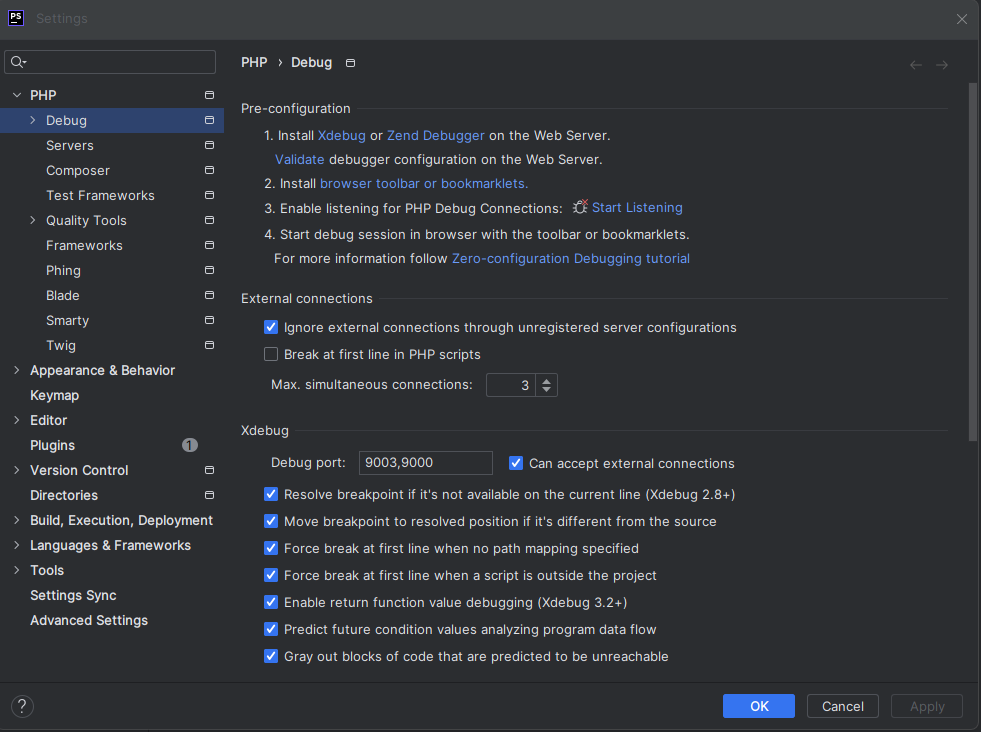

<!-- omit in toc -->
# Cómo desarrollar PHP dentro de un contenedor Docker usando Visual Studio Code

<!-- omit in toc -->
### Indice

- [Depurar con PHP](#depurar-con-php)
  - [Docker](#docker)
  - [Imagen de PHP-FPM](#imagen-de-php-fpm)
  - [Imagen de Nginx](#imagen-de-nginx)
  - [Docker Compose](#docker-compose)
  - [Configuración de XDebug](#configuración-de-xdebug)
  - [Levantar los contenedores](#levantar-los-contenedores)
- [Configurar VS Code](#configurar-vs-code)
- [Configurar PHPStorm](#configurar-phpstorm)
- [Solución de problemas](#solución-de-problemas)
- [Conclusión](#conclusión)
- [Referencias](#referencias)

VS Code permite trabajar de forma remota con el entorno de desarrollo con todas las funciones. Aunque trabaje de forma remota, no necesita sacrificar todas las excelentes funciones disponibles cuando trabaja localmente: Intellisense completo, navegación, refactorización, depuración y pruebas.

Hay 3 opciones sobre cómo desarrollar de forma remota con VS Code, cada una habilitada por una extensión separada:

- WSL
- Máquina remota o máquina virtual a través de SSH
- Docker

En este caso práctico, nos centraremos en el desarrollo dentro de un contenedor. Este enfoque permitirá tener un entorno de desarrollo separado del local. Cuando necesites cambiar a un proyecto diferente, con diferentes dependencias, herramientas o sistemas, puedes simplemente cambiar a un contenedor diferente.


<!-- omit in toc -->
## Requisitos

- Docker
- Visual Studio Code
- Extensio PHP Debug para VS Code
- Extensión de Docker para VS Code

Sabrás que tienes la extensión cuando veas el ícono verde en la esquina inferior izquierda de VS Code.


## Depurar con PHP

Muchos desarrolladores, aún con amplia experiencia en PHP, se limitan a hacer depuración con las típicas funciones `echo` y `var_dump`.

Si bien este método te puede sacar de apuros llega un momento que se queda corto. Los que más echan en falta los debuggers complejos son los desarrolladores que vienen de otros lenguajes de programación, donde esas herramientas son más tracionalmente usadas. Si te acostumbras a usarlas, seguro que te pasará lo mismo.

**Xdebug**

Es una extensión de PHP para hacer debug con herramientas de depuración tradicionales, desde el editor, tal como se hace en lenguajes de programación clásicos.

Podemos encontrar esta extensión en su sitio web: http://xdebug.org/ pero lamentablemente si entras verás que en Xdebug no son especialistas en la comunicación y aunque se trate de una gran herramienta uno se siente perdido para saber por dónde comenzar a usarla.

Es posible depurar PHP con XDebug tanto en un entorno local como en un contenedor. En este caso práctico, veremos cómo hacerlo en un contenedor.

> **Nota**:
> Tanto VSCode como PHPStorm permite la depuración de PHP con XDebug


### Docker

En este caso vamos a necesitar al menos 2 contenedores, uno para el servidor web (Ngix) y otro para PHP-FPM (FastCGI Process Manager). En este ejemplo, vamos a obviar la BD, pero si la necesitas, deberás añadir un tercer contenedor con el motor de base de datos que necesites.

Para este caso práctico, vamos a usar un contenedor con PHP 8.3 y Nginx (1.25).

### Imagen de PHP-FPM

Nos basaremos en la imagen oficial de PHP-FPM (Puedes encontrar más información en [Docker Hub](https://hub.docker.com/_/php)), pero esta imagen no incluye XDebug. Por lo tanto, necesitaremos crear una imagen personalizada que incluya XDebug, por lo que vamos necesitar crear un archivo `Dockerfile` para crear la imagen.

```Dockerfile
FROM php:8.3.0-fpm

# Install xdebug
# --> PECL is a repository for PHP Extensions and as PECL is not installed by default, we need to install it first
# --> xdebug is a PHP extension which provides debugging and profiling capabilities
# --> Activate el módulo xdebug, a través de la función docker-php-ext-enable
RUN pecl install xdebug-3.3.0 \
    && docker-php-ext-enable xdebug

EXPOSE 9000
```
Con PECL, instalamos XDebug y lo activamos con `docker-php-ext-enable`.


### Imagen de Nginx

Para el servidor web, usaremos la imagen oficial de [Nginx](https://hub.docker.com/_/nginx), la versión 1.25.

Nginx por defecto, no sabe tratar los archivos PHP, por lo que necesitamos un servidor PHP-FPM para procesarlos. Para ello, necesitamos configurar Nginx para que redirija las peticiones PHP a PHP-FPM. Esta configuración se hace en el archivo `default.conf` que se encuentra en la carpeta `/etc/nginx/conf.d/` de la imagen de Nginx.

La configuración requerida está contenida para el proyecto, en el fichero `default.conf` que se encuentra en la carpeta `./docker/nginx/config` de este repositorio.

```default.conf
server {
    listen       80;
    listen  [::]:80;
    server_name  localhost;
    
    root   /usr/share/nginx/html;

    access_log  /var/log/nginx/host.access.log  main;

    location / {
        #root   /usr/share/nginx/html;
        # root /var/www/html;
        index  index.html index.htm;
    }

    #error_page  404              /404.html;

    # redirect server error pages to the static page /50x.html
    #
    error_page   500 502 503 504  /50x.html;
    location = /50x.html {
        root   /usr/share/nginx/html;
    }

    location ~ \.php$ {
      # root /usr/share/nginx/html;
      fastcgi_pass php-fpm:9000;
      fastcgi_index  index.php;
      include fastcgi_params;  # fichero incluido en la instalación
      fastcgi_param SCRIPT_FILENAME $document_root$fastcgi_script_name;
    }
}
```

> 🔥 **Importante**<br>
> - Como se puede ver, la configuración de Nginx redirige las peticiones PHP a PHP-FPM, que se encuentra en el contenedor `php-fpm` en el puerto 9000.<br>
> - La ubicación de los archivos PHP es `/usr/share/nginx/html`.


### Docker Compose

Para orquestar los contenedores, usaremos Docker Compose. El archivo `docker-compose.yml` se encuentra en la raíz del proyecto.

```yml
version: '3'
name: php-nginx-xdebug
services:
  webserver:
    image: nginx:1.25
    ports:
      - 8002:80
    volumes:
      - ./src:/usr/share/nginx/html
      - ./docker/nginx/config/default.conf:/etc/nginx/conf.d/default.conf

  php-fpm:
    build: ./.docker/php/
    volumes:
      - ./src:/usr/share/nginx/html
      - ./docker/php/config/xdebug.ini:/usr/local/etc/php/conf.d/docker-php-ext-xdebug.ini
      - ./docker/php/config/error_reporting.ini:/usr/local/etc/php/conf.d/error_reporting.ini
```

> 🔥 **Importante**<br>
> - El contenedor `webserver` se basa en la imagen de Nginx y se mapea al puerto 8002 del host.<br>
> - El contenedor `php-fpm` se basa en la imagen personalizada de PHP-FPM que creamos (build ./docker/php) y se mapea al puerto 9000 del host.<br>
> - El volumen `./src` se mapea a `/usr/share/nginx/html` en ambos contenedores. Esto permite que los archivos del proyecto estén disponibles en ambos contenedores.<br>


### Configuración de XDebug

Para que XDebug funcione correctamente, necesitamos configurar el archivo `xdebug.ini` que se encuentra en la carpeta `./.docker/php/config` de este repositorio.

```ini
zend_extension=xdebug

[xdebug]
xdebug.mode=develop,debug
xdebug.client_host=host.docker.internal
xdebug.start_with_request=yes
```

También necesitamos configurar el archivo `error_reporting.ini` que se encuentra en la carpeta `./.docker/php/config` de este repositorio.

```ini
error_reporting = E_ALL
display_errors = On
display_startup_errors = On
log_errors = On
```

> 🔥 **Importante**<br>
> - `xdebug.client_host` se establece en `host.docker.internal` para que XDebug pueda conectarse a VS Code en el host.<br>
> - `error_reporting` se establece en `E_ALL` para que se muestren todos los errores.<br>
> - `display_errors`, `display_startup_errors` y `log_errors` se establecen en `On` para que se muestren y registren los errores.<br>

Y con esto ya tenemos todo listo para comenzar a trabajar con PHP en un contenedor Docker.


### Levantar los contenedores

Para levantar los contenedores, ejecutamos el siguiente comando en la raíz del proyecto:

```bash
# Levantar los contenedores y construir la imagen del contenedor php-fpm
docker-compose up --build
```
Pues ahora solo queda revisar si todo está funcionando correctamente. Para ello, abrimos un navegador y vamos a la dirección `http://localhost:8002` y deberíamos ver la página de bienvenida de Nginx.


## Configurar VS Code

Para depurar PHP con XDebug en un contenedor Docker, necesitamos configurar VS Code para que se conecte al contenedor. Para ello, necesitamos instalar la extensión `PHP Debug` en VS Code.

Una vez instalada la extensión, necesitamos configurar el archivo `launch.json` que se encuentra en la carpeta `.vscode` de este repositorio.

```json
{
    "version": "0.2.0",
    "configurations": [
        {
            "name": "PHP-Debug",
            "type": "php",
            "request": "launch",
            "port": 9003,
            "pathMappings": {
                "/usr/share/nginx/html": "${workspaceFolder}/src"
            }
        }
    ]
}
```

> 🔥 **Nota**<br>
> Si VS Code no muestra la opción de depuración, necesitas abrir VS Code en la carpeta del proyecto.

Y ahora solo nedesitamos poner algún punto de interrupción para que el código se pare, hacer clic en el botón de depuración en VS Code y seleccionar la opción `PHP-Debug`


## Configurar PHPStorm

Para depurar PHP con XDebug en un contenedor Docker, necesitamos configurar PHPStorm para que se conecte al contenedor. Para ello, necesitamos instalar la extensión `PHP Debug` en PHPStorm.

La configuración que se muestra en la imagen está ubicada en `Settings` y dentro de la configuración en `PHP` > `Debug` > `Xdebug`. Usa la configuración por defecto, e indica el puerto que se usará para la depuración. (9000)



Así que la único que necesitamos es iniciar para comenzar a escuchar para PHP Debug conexiones, a través del pequeño icono (como de insecto) que se encuentra en la parte superior derecha de la ventana de PHPStorm.


y con esto ya estamos listos para comenzar a depurar PHP en un contenedor Docker.

Ahora simplemente ponemos un punto de interrupción en el código, y realizamos una petición al servidor web, y PHPStorm se detendrá en el punto de interrupción.

## Solución de problemas

Si el IDE (VSCode o PHPStorm) no se detiene en los breakpoints, varios son los posibles problemas, por ello lo mejor es consultar el log de diagnóstico de XDebug.

Simplemente agregar `xdebug_info()` en el código PHP y ejecutarlo. Esto mostrará un montón de información sobre la configuración de XDebug y si se está conectando a VS Code o PHPStorm.

Revisa la configuración por si hubiera algún error, y si todo parece correcto, es posible que el problema sea la configuración de red. Asegúrate de que el contenedor pueda conectarse a la IP del host y que el firewall no esté bloqueando el puerto.

Puntos a revisar:

1. "Step Debugger" es listado como "enabled" en la salida de `xdebug_info()`. Si no es así, XDebug no está habilitado, y la configuración que hemos creado no está siendo cargada.
2. Si el debugger está habilitado, lo siguiente a revisar es logs mensajes en "Diganostic Log". Revisar cualduier mensaje de error que pueda estar siendo mostrado.
   Para aprender más sobre un mensaje, click sobre el icnos de información a la derecha del mensaje.


Tambien dentro de la configuración de `xdebug.ini` incluye las siguientes líneas (si no están ya incluidas):

```ini
xdebug.start_with_request=yes
xdebug.log=/tmp/xdebug.log
xdebug.log_level=8
```

El `log_level` es el nivel de detalle que se mostrará en el log. 0 es el nivel más bajo, y 8 es el más alto. Si no estás seguro de qué nivel usar, comienza con 8 y luego reduce el nivel si es necesario.


## Conclusión

Con este enfoque, puedes desarrollar PHP en un contenedor Docker con todas las funciones de depuración que esperarías de un entorno local. Esto te permite tener un entorno de desarrollo separado del local, lo que es útil cuando necesitas cambiar a un proyecto diferente con diferentes dependencias, herramientas o sistemas.

Espero que este caso práctico te haya sido de utilidad.


## Referencias


- [Setup Step Debugging in PHP with Xdebug and Docker](https://matthewsetter.com/setup-step-debugging-php-xdebug3-docker/z)

