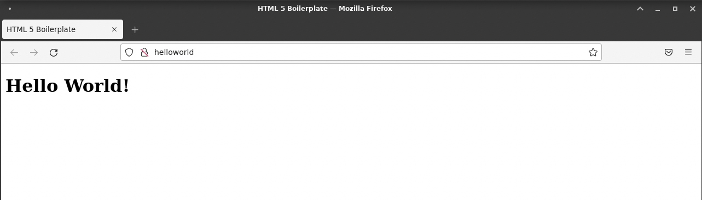
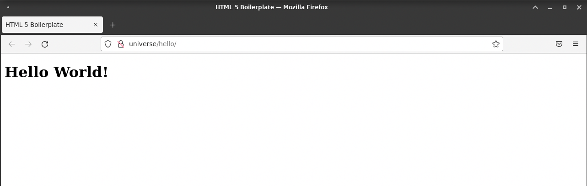
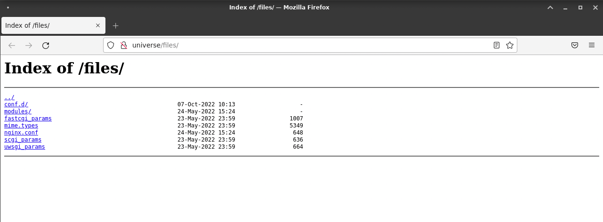
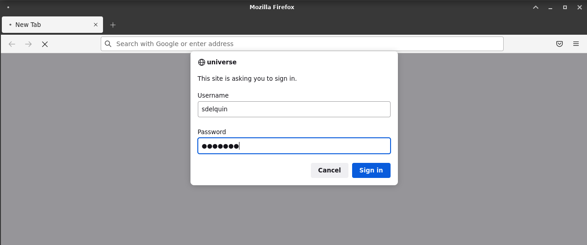
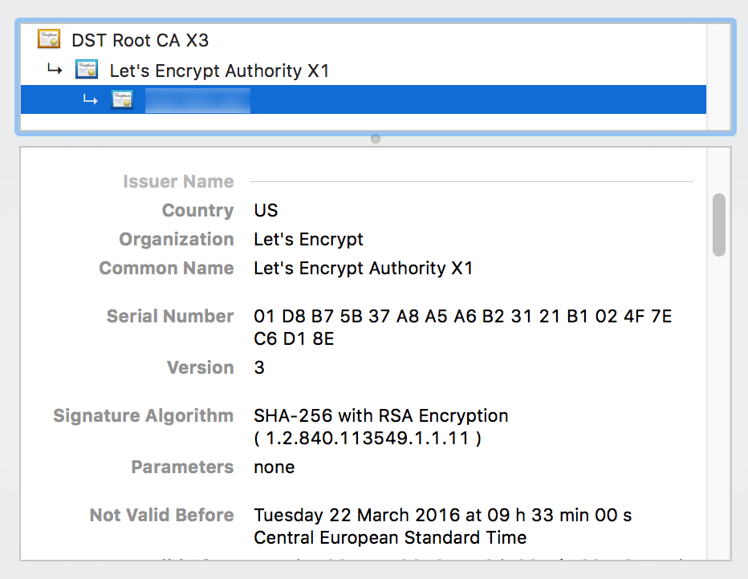

<!-- omit in toc -->
# UT4: Administración de servidores web

Ya hemos visto la instalación de Nginx. En esta unidad de trabajo nos vamos a dedicar a explorar todas sus opciones de configuración y administración.

<!-- omit in toc -->
## Recursos del tema

- Guías
  - [Guía rápida servidor-web Nginx](./Nginx.md)
  - [Guía y documentación muy buena en español](https://sio2sio2.github.io/doc-linux/07.serre/02.web/02.nginx/index.html)
- DNS
  - [Resolución de nombres DNS en linux](https://yuminlee2.medium.com/linux-networking-dns-7ff534113f7d)
- Nginx tester
  - [Test de configuración de Nginx "DigitalOcean"](https://www.digitalocean.com/community/tools/nginx)
  - [Test de Directiva "Location"](https://nginx.viraptor.info/)
- Nginx utilidades
  - [Principales errores y soluciones](https://www.nginx.com/resources/wiki/start/topics/tutorials/config_pitfalls/)
  - [¿Cómo seleccionada Nginx qué configuración aplica a una petición?](https://www.digitalocean.com/community/tutorials/understanding-nginx-server-and-location-block-selection-algorithms-es)

<!-- omit in toc -->
## Índice

- [1. Configuración del servidor web](#1-configuración-del-servidor-web)
  - [Principales ubicaciones](#principales-ubicaciones)
  - [¿ Qué encontramos en el directorio principal `/etc/nginx` ?](#-qué-encontramos-en-el-directorio-principal-etcnginx-)
  - [Configuración principal](#configuración-principal)
  - [¿ Qué son las directivas ?](#-qué-son-las-directivas-)
- [2. Entendiendo la configuración por defecto](#2-entendiendo-la-configuración-por-defecto)
  - [Contexto `events`](#contexto-events)
  - [Contexto `http`](#contexto-http)
  - [Contexto `server`](#contexto-server)
- [3. Hosts virtuales](#3-hosts-virtuales)
  - [Sitio por defecto](#sitio-por-defecto)
  - [Creación de un host virtual](#creación-de-un-host-virtual)
  - [Opciones para no cambiar el fichero hosts](#opciones-para-no-cambiar-el-fichero-hosts)
- [4. Directivas](#4-directivas)
  - [Ubicaciones](#ubicaciones)
  - [Puerto de escucha](#puerto-de-escucha)
  - [Alias](#alias)
  - [Listado de directorios](#listado-de-directorios)
  - [Try\_files](#try_files)
  - [Control de acceso](#control-de-acceso)
  - [Ficheros de log](#ficheros-de-log)
    - [Formato de los logs](#formato-de-los-logs)
    - [Ubicación de los logs y nombres de ficheros](#ubicación-de-los-logs-y-nombres-de-ficheros)
  - [Ficheros de índice](#ficheros-de-índice)
  - [Valores de retorno](#valores-de-retorno)
  - [Redirecciones](#redirecciones)
  - [Expresiones regulares](#expresiones-regulares)
  - [Orden de búsqueda](#orden-de-búsqueda)
- [5. Módulos](#5-módulos)
- [6. Sitios seguros](#6-sitios-seguros)
  - [Certificados SSL](#certificados-ssl)
  - [Let's Encrypt](#lets-encrypt)
  - [Certbot](#certbot)
  - [Probando el acceso seguro](#probando-el-acceso-seguro)
  - [Redirección www](#redirección-www)


## 1. Configuración del servidor web

### Principales ubicaciones

2 son los principales ficheros de configuración de Nginx:

- `/etc/nginx/nginx.conf`: Configuración principal del servidor web.
- `/etc/nginx/conf.d/*.conf`: Configuración de los sitios web que se van a servir.

Y donde se encuentran los logs:

- `/var/log/nginx/error.log`: Logs de error.
- `/var/log/nginx/access.log`: Logs de acceso.

Y desde donde se sirven los ficheros:

- `/usr/share/nginx/html`: Carpeta raíz del servidor web.


### ¿ Qué encontramos en el directorio principal `/etc/nginx` ?

1. **`nginx.conf`**: Es el archivo de configuración principal de Nginx. Este archivo contiene la configuración global de Nginx, incluyendo los módulos que se van a cargar, los logs, el número de procesos que se van a ejecutar, etc.
2. **`conf.d`**: Es un directorio que contiene los archivos de configuración de los sitios web que se van a servir. Cada archivo de configuración contiene la configuración de un sitio web.
3. **`modules`**: Es un directorio que contiene módulos dinámicos que pueden ser cargados en la configuración de Nginx. Estos módulos pueden ser cargados usando la directiva `load_module`
4. **`fastcgi_params, scgi_params`**:  Archivos de configuración para pasar parámetros adicionales al proceso FastCGI o SCGI.


> 🫥 La utilización de los directorios **`sites-available`** y **`sites-enabled`** para activar o desactivar sitios está decrepita y no se utiliza. Esta forma de trabajar se importó de Apache.<br>
> En nginx simplemente debemos renombrar el fichero con extensión `.conf` a cualquier otra `.conf.noactive` (por ejemplo) para que no se incluya dentro del `include /etc/nginx/conf.d/*.conf`

> 🔥 En nginx el término `host-virtual` o `server configuration` se refiere a la configuración de un sitio web, se usan indistintamente ya que se refiere al mismo concepto.


### Configuración principal

En Nginx, la configuración del servicio está en el archivo `/etc/nginx/nginx.conf` con el siguiente contenido:

> 💡 Otras ubicaciones de configuración:
>  `/usr/local/etc/nginx` o `/usr/local/nginx/conf`, son otras ubicaciones de configuración.
> El comando `ps -ax -o command | grep nginx` nos muestra la ruta de configuración que está utilizando el proceso.<br>
> Otra opción es utilizar el comando `nginx -V` que muestra de forma detallada toda la configuración que aplica
> ```bash
> ~$ sudo nginx -V
> nginx version: nginx/1.22.0
> built by gcc 10.2.1 20210110 (Debian 10.2.1-6)
> built with OpenSSL 1.1.1k  25 Mar 2021 (running with OpenSSL 1.1.1n  15 Mar 2022)
> TLS SNI support enabled
> configure arguments: --prefix=/etc/nginx --conf-path=/etc/nginx/nginx.conf --error-log-path=/var/log/nginx/error.log --http-log-path=/var/log/niginx/access.log --pid-path=/var/run/nginx.pid...
```

Configuración por defecto de Nginx (según el SO y la versión puede variar):

```nginx
user  nginx;
worker_processes  auto;

error_log  /var/log/nginx/error.log notice;
pid        /var/run/nginx.pid;


events {
    worker_connections  1024;
}


http {
    include       /etc/nginx/mime.types;
    default_type  application/octet-stream;

    log_format  main  '$remote_addr - $remote_user [$time_local] "$request" '
                      '$status $body_bytes_sent "$http_referer" '
                      '"$http_user_agent" "$http_x_forwarded_for"';

    access_log  /var/log/nginx/access.log  main;

    sendfile        on;
    #tcp_nopush     on;

    keepalive_timeout  65;

    #gzip  on;

    include /etc/nginx/conf.d/*.conf;
}
```

### ¿ Qué son las directivas ?

Las directivas son las instrucciones que se le dan a Nginx para que funcione de una determinada manera. Las directivas se pueden agrupar en bloques, que se delimitan con `{ }`.

Las directivas son de 2 tipos:
- **Directivas simples**: Son directivas que no tienen bloques asociados. Se escriben en una sola línea.
- **Directivas complejas**: Son directivas que tienen bloques asociados. Se escriben en varias líneas.

Como se muestra en el ejemplo anterior, una configuración está compuesta de bloques o contextos. El más externo es llamado el contexto principal, y contiene a los demás contextos.

> 🔥 **Directivas**<br>
> El listado de todas las directivas que se pueden utilizar en Nginx se encuentra en la [documentación oficial](https://nginx.org/en/docs/dirindex.html)

<!-- omit in toc -->
#### Contextos tipos

Cada modulo de Ngix tiene un muy concreto propósito y es controlado por las directivas que se encuentran en su contexto. La documentación claramente indica en qué contexto se puede utilizar cada directiva.<br>
`HTTP, events, server y location` son las directivas más comunes. 


## 2. Entendiendo la configuración por defecto

El completo fichero es el contexto principal. Existen algunas directivas simples como `user` o `worker_processes` que se encuentran en el contexto principal. Estas directivas indican el usuario que ejecuta el proceso y el número de procesos que se van a ejecutar.

### Contexto `events`

El contexto `events` contiene directivas que afectan a la conexión con los clientes. Este contexto solo puede ser *declarado una vez y dentro del contexto principal*.<br>
Estas directivas controlan la forma en que Nginx maneja las conexiones con los clientes. Por ejemplo, el número máximo de conexiones simultáneas que puede manejar Nginx, o el número de conexiones que pueden ser aceptadas y manejadas por cada proceso.

### Contexto `http`

Este contexto es el corazón de la configuración de Nginx. Contiene directivas que afectan a la conexión con los clientes, a la conexión con los servidores, a la caché, a los logs, etc. <br>

Se encuentra las directivas `include` que incluye otros ficheros de configuración. Estas directivas permiten dividir la configuración en varios ficheros, lo que facilita la administración de la configuración.

- `include /etc/nginx/mime.types;` incluye el fichero `/etc/nginx/mime.types` que contiene los tipos MIME que Nginx puede servir.
  ```nginx	
  types {
    text/html                             html htm shtml;
    text/css                              css;
    text/xml                              xml;
    image/gif                             gif;
    image/jpeg                            jpeg jpg;
    application/javascript                js;
    application/atom+xml                  atom;
    application/rss+xml                   rss;
    ...
    video/x-msvideo                       avi;
    video/mpeg                            mpeg mpg;
    audio/mpeg                            mp3;
    ...
  }
  ```
  > 💡 MIME Types:
  > - [MIME Types](https://developer.mozilla.org/es/docs/Web/HTTP/Basics_of_HTTP/MIME_types) describe el tipo de contenido y cómo se debe procesar. Si no se especifica el tipo MIME, el navegador no sabrá cómo procesar un determinado archivo y lo descargará o lo mostrará de forma incorrecta.

  - `default_type application/octet-stream;` indica el tipo MIME por defecto que se va a utilizar cuando no se pueda determinar el tipo MIME de un fichero. En este caso, se utiliza `application/octet-stream` que es un tipo MIME genérico que indica que el fichero es un binario.
  - `log_format main`: Esta directiva configura el módulo `http_log_module` para que registre los logs indicando un formato específico. El primer parámetro es el nombre del formato, en este caso `main`, el 2º parámetro es el formato de los logs, en el que se utilizan una serie de variables que contienen diferentes valores para cada petición. 
  - `access_log`: Esta directiva requiere un *path* donde se van guardar los logs y un tipo de formato. En este caso, se utiliza el formato `main` que se ha definido anteriormente.
  - `sendfile on;` Esta directiva activa el envío de ficheros estáticos. Cuando un cliente solicita un fichero estático, Nginx lo envía directamente al cliente sin pasar por el proceso de Nginx. Esto mejora el rendimiento de Nginx.
  - `keepalive_timeout 65;` Esta directiva indica el tiempo máximo que una conexión puede estar abierta. Si un cliente no envía una petición en ese tiempo, la conexión se cierra.
  - `gzip on;` Esta directiva activa la compresión de los ficheros que se envían al cliente. La compresión reduce el tamaño de los ficheros y mejora el rendimiento de Nginx.
  - `include /etc/nginx/conf.d/*.conf;` Esta directiva incluye todos los ficheros de configuración que se encuentran en el directorio `/etc/nginx/conf.d/`. En este directorio se pueden crear ficheros de configuración para cada sitio web que se va a servir. De esta forma, se puede dividir la configuración en varios ficheros, lo que facilita la administración de la configuración.

<!-- omit in toc -->
#### La carpeta `conf.d`

La carpeta `etc\nginx\conf.d` contiene 2 ficheros de configuración:

- `default.conf`: Este fichero contiene la configuración por defecto de Nginx. Esta configuración se aplica a todos los sitios web que se van a servir.
- `example_ssl.conf`: Este fichero contiene la configuración para servir sitios web seguros. Esta configuración se aplica a todos los sitios web que se van a servir de forma segura.<br>
  Este fichero está totalmente comentado, y no será usado hasta tener un requerimiento SSL.

La configuración por defecto dentro del fichero `\etc\nginx\conf.d\default.conf` de Nginx es la siguiente:

```nginx
server { 
    listen       80; 
    server_name  localhost; 

    #charset koi8-r; 
    #access_log  /var/log/nginx/log/host.access.log  main; 

  
    location / { 
        root   /etc/nginx/html; 
        index  index.html index.htm; 
    } 

    #error_page  404              /404.html; 
    
    # redirect server error pages to the static page /50x.html 
    # 
    error_page   500 502 503 504  /50x.html; 
    location = /50x.html { 
        root   /usr/share/nginx/html; 
    } 
    
    # proxy the PHP scripts to Apache listening on 127.0.0.1:80 
    # 
    #location ~ \.php$ { 
    #    proxy_pass   http://127.0.0.1; 
    #} 

    # pass the PHP scripts to FastCGI server listening on 127.0.0.1:9000     # 
    #location ~ \.php$ {
    #    root           html; 
    #    fastcgi_pass   127.0.0.1:9000; 
    #    fastcgi_index  index.php; 
    #    fastcgi_param  SCRIPT_FILENAME  /scripts$fastcgi_script_name; 
    #    include        fastcgi_params; 
    #} 
    # deny access to .htaccess files, if Apache's document root 
    # concurs with nginx's one 
    # 
    #location ~ /\.ht { 
    #    deny  all; 
    #} 
}
```

> 🤚 Importante
> Esta configuración se incluye dentro del contexto `http` del fichero `/etc/nginx/nginx.conf`, ya que esta anidado dentro de este contexto.


### Contexto `server`

Este contexto puede ser establecido en múltiples contextos para configurar varios módulos.

Tabla de módulos que pueden ser configurados en el contexto `server`:

| Módulo | Contexto | Descripción |
| ------ | -------- | ----------- |
| [ngx_http_core_module](http://nginx.org/en/docs/http/ngx_http_core_module.html) | `http` | Configura los parámetros básicos del servidor web. |
| [ngx_http_upstream_module](http://nginx.org/en/docs/http/ngx_http_upstream_module.html) | `upstream` | Configura los parámetros de los servidores proxy. |
| [ngx_mail_core_module](http://nginx.org/en/docs/mail/ngx_mail_core_module.html) | `mail` | Configura los parámetros básicos del servidor de correo. |
| [ngx_stream_core_module](http://nginx.org/en/docs/stream/ngx_stream_core_module.html) | `stream` | Configura los parámetros básicos del servidor de streaming. |
| [ngx_stream_upstream_module](http://nginx.org/en/docs/stream/ngx_stream_upstream_module.html) | `upstream` | Configura los parámetros de los servidores proxy. |


<!-- omit in toc -->
#### Carpeta raíz

Un concepto fundamental en los servidores web es el de `root` que indica la **carpeta raíz** desde la que se sirven los archivos.

El valor por defecto que tiene `root` en Nginx es `/etc/nginx/html` y eso viene dado por el parámetro `--prefix` (junto a `html`) durante la fase de compilación:

```bash
:~$ sudo nginx -V
nginx version: nginx/1.22.0
built by gcc 10.2.1 20210110 (Debian 10.2.1-6)
built with OpenSSL 1.1.1k  25 Mar 2021 (running with OpenSSL 1.1.1n  15 Mar 2022)
TLS SNI support enabled
configure arguments: (...) --prefix=/etc/nginx (...)
```

Sin embargo, este comportamiento se puede modificar si establecemos un valor distinto para `root` en el _virtual host_.

> 💡 La directiva `root` se puede encontrar a nivel de `server { }` o dentro de los distintos bloques que haya en el _virtual host_.


## 3. Hosts virtuales

Tener un único servidor web en una máquina no es lo más habitual. Lo normal es que tengamos varios sitios web en un mismo servidor, lo que permite ahorrar recursos y simplificar la administración.

NGINX permite configurar varios sitios web en un mismo servidor. Cada sitio web se configura en un bloque `server { }` independiente. Estos bloques se denominan _**virtual hosts**_. Cada uno de ellos nos permite montar un servicio diferente.

La definición de los _virtual host_ se lleva a cabo mediante un fichero `*.conf` presente en la ruta `/etc/nginx/conf.d/`

> Esta ruta viene definida mediante un `include` en el fichero de configuración `nginx.conf`

### Sitio por defecto

La propia instalación de Nginx ya configura un _virtual host_ **por defecto** (como vimos en el punto anterior). Destacamos algunas líneas de este fichero `/etc/nginx/conf.d/default.conf`:

```nginx
server {
    # Escucha en el puerto 80. No se especifica ninguna interfaz, por lo que escucha en todas las interfaces. Si se indica "default_server" es el servidor por defecto.
1   listen       80;
2   listen      [::]:80;  # IPv6 
    # Nombre del servidor (dominio)
3   server_name  localhost;
 
    # Ruta donde los logs se van a almacenar y qué configuración se va a utilizar
4   #access_log  /var/log/nginx/host.access.log  main;

    # En este bloque se define la ruta raíz del servidor web.
    location / {
      # Ficheros index que se van a buscar en la ruta raíz, cuando no se indica ninguno
5     root   /etc/nginx/html;  

      # Ruta donde se encuentra el contenido del servidor web
6     index  index.html index.htm;
    }

    error_page   500 502 503 504  /50x.html;  # Redirección de errores
7   location = /50x.html {
8     root   /usr/share/nginx/html;  # Ruta donde se encuentra la página de error
    }

    ... # Resto de configuración
}
```
Explicación de las líneas:

1. `listen 80`: Indica que el servidor web va a escuchar en el puerto 80. Si se indica `default_server` es el servidor por defecto (solo puede tener un servidor activada esta configuración)
2. `listen [::]:80`: Indica que el servidor web va a escuchar en el puerto 80 para conexiones IPv6.
3. `server_name localhost`: Indica el nombre del dominio a través del cual se va a acceder al servidor web. Como es la configuración por defecto, solo se accede a través de localhost.
4. `access_log /var/log/nginx/host.access.log main;`: Indica que los logs de acceso se van a almacenar en el fichero `/var/log/nginx/host.access.log` utilizando el formato `main`.
5. `root /etc/nginx/html;`: Indica que la ruta raíz del servidor web es `/etc/nginx/html`.
6. `index index.html index.htm;`: Indica la lista de recursos que se deben buscar cuando el cliente solicita el íindice de un directorio del sitio (es decir no ha solicitado un recurso concreto).
7. `error_page 500 502 503 504 /50x.html;`: Indica que cuando se produzca un error 500, 502, 503 o 504, se va a redirigir al cliente a la página `/50x.html`.
8. `location = /50x.html { root /usr/share/nginx/html; }`: Indica que la página `/50x.html` se encuentra en la ruta `/usr/share/nginx/html`. 


Por lo tanto, podemos concluir que colocando un fichero índice en la ruta raíz (de hecho siempre existe uno por defecto), deberíamos poder acceder a nuestro servidor web en el puerto 80 de la máquina.

Veamos el contenido del fichero de índice que está creado por defecto:

→ `/etc/nginx/html/index.html`

```html
<!DOCTYPE html>
<html>
  <head>
    <title>Welcome to nginx!</title>
    <style>
      html {
        color-scheme: light dark;
      }
      body {
        width: 35em;
        margin: 0 auto;
        font-family: Tahoma, Verdana, Arial, sans-serif;
      }
    </style>
  </head>
  <body>
    <h1>Welcome to nginx!</h1>
    <p>
      If you see this page, the nginx web server is successfully installed and
      working. Further configuration is required.
    </p>

    <p>
      For online documentation and support please refer to
      <a href="http://nginx.org/">nginx.org</a>.<br />
      Commercial support is available at
      <a href="http://nginx.com/">nginx.com</a>.
    </p>

    <p><em>Thank you for using nginx.</em></p>
  </body>
</html>
```

Es por esto que cuando accedemos a http://localhost obtenemos esta página:


> 💡 &nbsp;Tras cualquier modificación de la configuración de Nginx debemos recargar el servicio para que los cambios tengan efecto.

### Creación de un host virtual

Si por ejemplo queremos crear un _virtual host_ para un sitio web llamado `universe.local`, lo primero que tenemos que hacer es crear un fichero de configuración:

Contenido del fichero:

```nginx
server {
  listen 80;
	server_name universe.local www.universe.local;
	
  location / {
    root /etc/nginx/html/universe;
    
  }
}
```

Podemos comprobar que la sintaxis es correcta:

```bash
:~$ sudo nginx -t
nginx: the configuration file /etc/nginx/nginx.conf syntax is ok
nginx: configuration file /etc/nginx/nginx.conf test is successful
```

A continuación tenemos que crear un fichero de índice en la carpeta `universe` ubicada en `/etc/nginx/html`:

> Contenido:

```html
<!DOCTYPE html>
<html lang="en">
  <head>
    <meta charset="UTF-8" />
    <meta name="viewport" content="width=device-width, initial-scale=1.0" />
    <meta http-equiv="X-UA-Compatible" content="ie=edge" />
    <title>HTML 5 Boilerplate</title>
    <link rel="stylesheet" href="style.css" />
  </head>
  <body>
    <h1>Hello World!</h1>
    <script src="index.js"></script>
  </body>
</html>
```

Ahora recargamos la configuración en Nginx para que el nuevo _virtual host_ sea detectado:

```bash
:~$ service nginx reload
```

Lo único que faltaría es simular un nombre de dominio a través de la configuración local de nuestro ordenador:

```bash
:~$ nano /etc/hosts
```

Añadimos la línea:

```
127.0.0.1 www.helloworld.com helloworld.com
```

Esto hará que las peticiones a `hellworld.com` sean resueltas a la IP local `127.0.0.1`. Dado que el _virtual host_ está configurado para atender peticiones en ese dominio, todo debería funcionar correctamente:





### Opciones para no cambiar el fichero hosts

<!-- omit in toc -->
#### Usando Curl

Podemos usar la herramienta `curl` para simular una petición a un dominio concreto:

- Con el parámetro `-H` indicamos el nombre del dominio que queremos simular. El 2º parámetro es la URL a la que queremos acceder.
  
  ```bash
  :~$ curl -H "Host: www.helloworld.com" http://localhost
  ```
<!-- omit in toc -->
#### Usando Firefox

Otra opción es utilizar Firefox para simular una petición a un dominio concreto:

- Abrimos Firefox y en la barra de direcciones escribimos `about:config`.
- En el campo de búsqueda escribimos `network.dns.localDomains` y hacemos doble click sobre el resultado.
- En el campo de texto que aparece escribimos el nombre del dominio que queremos simular (ej. `helloworld.com`).
- Si queremos simular más de un dominio, podemos separarlos por comas (ej. `helloworld.com,example.com`).

<!-- omit in toc -->
#### Usando Chrome

Para esto tenemos que instalar una extensión llamada [Awesome Host Manager](https://chromewebstore.google.com/detail/awesome-host-manager/pikaoeecieigblebdddckmlegonlogha?hl=es)

- En las opciones de la extensión, agregamos las reglas DNS en grupos para mayor facilidad.
- Con el `check` podemos activarlas o desactivarlas.

> En estas opciones se redirige al localhost, los dominios www.app1.com, www.app2.com y www.helloworld.com

```text
127.0.0.1 www.app1.com app1.com
127.0.0.1 www.app2.com app2.com
127.0.0.1 www.helloworld.com helloworld.com
```


## 4. Directivas

Existen [multitud de directivas](https://nginx.org/en/docs/dirindex.html) para Nginx. En esta sección veremos las que se consideran más relevantes para la puesta en funcionamiento de un servicio web.

### Ubicaciones

Los _virtual hosts_ permiten definir ubicaciones (**locations**) en su interior que serán gestionadas de forma independiente en función de su configuración.

A su vez, cada _location_ puede incluir las directivas correspondientes.

Supongamos que nuestro "Hello World" lo queremos montar sobre la URL http://universe.local/helloworld. Procedemos de la siguiente manera:

```bash
:~$ nano /etc/nginx/conf.d/universe.local.conf
```

> 💡Es recomendable crear un fichero `*.conf` por cada nombre de dominio que vamos a utilizar, y que este fichero se llame igual al nombre

```nginx
server {
    server_name universe.local www.universe.local;
        
    location / {
        root /etc/nginx/html/universe  # Ruta donde se almacena el contenido para este dominio (virtual host)
        index index.html;
        try_files $uri $uri/ =404;  # Si no encuentra el recurso, redirige a la página de error 404
    }
}
```

Ahora hacemos una copia del fichero `index.html` como `helloworld.html`, y cambiamos el contenido para que muestre "Hello World desde fichero helloworld!".

Recordar siempre recargar el servicio Nginx cuando hagamos cambios en la configuración:

```bash
:~$ service nginx reload
```

Ahora si accedemos a http://universe.local/helloworld.html podremos visualizar la página correctamente:

```bash
:~$ curl universe.local/helloworld.html
```


Pero si accedemos a http://universe.local/helloworld (sin extensión) obtendremos un error 404, ya que la página no existe.


> 💡 &nbsp;Recordar que hay que incluir la entrada correspondiente en `/etc/hosts` para que el nombre de dominio se resuelva localmente, o utilizar los otros métodos indicados

<!-- omit in toc -->
#### Heredando el root

Supongamos un ejemplo como el siguiente:

```nginx
server {
  server_name app.es;
  root /etc/nginx/app;

  location /img {
    ...
  }

  location /src {
    ...
  }
}
```

Indicar que tanto `/img` como `/src` "heredan" la directiva `root` especificado a nivel de servidor, quedando de la siguiente forma:

- `img` → `/etc/nginx/app/img`
- `src` → `/etc/nginx/app/src`

### Puerto de escucha

El puerto por defecto (si no indicamos lo contrario) para cualquier _virtual host_ definido en Nginx es el **puerto 80**.

La directiva para especificar el puerto de escucha es `listen`:

```nginx
listen 80;
```

Pero nada impide que cambiemos este puerto a cualquier otro (ej. 8000, 8080, 8081, etc.). En el caso concreto de **https** tendremos que escuchar en el puerto **443** indicando Secure Sockets Layer (**ssl**):

```nginx
listen 443 ssl;
```

> 💡 Si quitamos `ssl` de la directiva tendríamos que usar http://hostname:443 para conectar (especifica que queremos conectar al puerto 443 usando http, en vez del puerto por defecto 80). Es extraño pero se podría hacer.

### Alias

Los "alias" son directivas que funcionan junto a los _location_ y permiten asociar a una URL secundaria un directorio diferente en el sistema de archvias, y así evitar que se añada la ruta de la url al _root_.

Siguiendo con nuestro vamos a configurar un _location_ (mediante alias) para acceder al recurso en la url http://universe.local/doc. Según configuración por defecto, el _root_ es `/etc/nginx/html` y el recurso que queremos mostrar está en `/var/data/doc`, por lo que la ruta completa sería `/etc/nginx/html/var/data/doc`, pero la ruta real es otra, ya que los documentos están en `/var/data/doc`.

Esto se consigue con la directiva `alias`:

```bash
:~$ sudo vi /etc/nginx/conf.d/universe.conf
```

```nginx
server {
    ...
    server_name universe.local www.universe.local;

    # ...

    location /doc {
        alias /var/data/doc;
    }
}
```

Recargamos la configuración y accedemos en el navegador:



> 💡 &nbsp;Un alias también se puede hacer "apuntar" a un fichero, no únicamente a un directorio/carpeta.

### Listado de directorios

La directiva `autoindex` nos permite listar el contenido del directorio indicado, pudiendo implementar una especie de FTP (lectura) a través del navegador.

Vamos a ejemplificar este escenario listando el contenido de la carpeta `/etc/nginx` cuando accedamos a http://universe.local/files.

Editamos el _virtual host_ con el que venimos trabajando:

```bash
:~$ sudo vi /etc/nginx/conf.d/universe.conf
```

```nginx
server {
    ...
    server_name universe;

    # ...

    location /files {
        alias /etc/nginx;
        autoindex on;
    }
}
```

Después de recargar, podemos acceder a la URL y ver que se muestra el listado de ficheros que hay en la ruta especificada:

```bash
:~$ curl universe.local/files
```



> 💡 El ejemplo anterior hubiera sido muy difícil de hacer con `root` ya que `/files` se añadiría a `/etc/nginx`.

### Try_files

La directiva `try_files` nos permite especificar una serie de rutas que Nginx intentará buscar en el servidor para encontrar el recurso que se está solicitando. Permite indicar separados por espacios una serie de rutas que se van a intentar buscar en el servidor, en el orden en el que se han especificado.<br>
_Solo se puede utilizar dentro de un bloque `location`._

Vamos a ejemplificar este escenario con el _virtual host_ que venimos utilizando. Supongamos que queremos que si no se encuentra el recurso solicitado, se redirija a una página de error 404.

> 💡 $uri es la variable que indica la url que se están actualmente solicitando

Entonces en el siguiente ejemplo:


```nginx
server {
    ...
    server_name universe;

    # ...

    location / {
        root /etc/nginx/html/universe;
        index index.html;
        try_files $uri $uri/ =404;
    }
}
```
Primero intentará buscar el recurso solicitado, si no lo encuentra, intentará buscar un directorio con el mismo nombre, y si no lo encuentra, redirigirá a la página de error 404.

Si encuentra un directorio con el mismo nombre que el recurso solicitado, intentará encontrar una configuración para ese directorio, y si la encuentra, la aplicará, en caso contrario, en caso de que no exista una directiva index para ese directorio, y no se permita el listado de directorios, se redirigirá a la página de error 404.

### Control de acceso

Los servidores web permiten la restricción del acceso a los recursos del mismos a través de 2 vías:

<!-- omit in toc -->
#### Según el origen de la petición

Se analiza cúal es la dirección origen de la conexión/petición y se permite o no el acceso en función de la misma, a través de las directivas `allow`, `deny` e `internal`. `allow` y `deny` se pueden utilizar en cualquier contexto, mientras que `internal` solo se puede utilizar en el contexto `location`.

**internal**:
Indica que el recurso solo puede ser accedido por peticiones internas (procedentes del propio servidor). Si se intenta acceder a este recurso desde fuera del servidor, se devolverá un error 404.

```nginx
error_page  403  /403.html

location = /403.html {
   internal;  # Solo se puede acceder a esta página si la petición es interna
}
```
Si se recibe una petición `http://universe.local/403.html` desde fuera del servidor, se devolverá un error 404 (página no encontrada), ya que la petición no es interna.


**allow y deny**:
Sirven respectivamente para permitir o denegar el acceso, y se evalúan en el orden en que aparecen.

```nginx
location /docs/ {
   deny  192.168.255.10;
   allow 192.168.255.0/24;
   deny all;
   autoindex on;
}
```

En este ejemplo, se deniega el acceso a la carpeta `/docs/` a una IP concreta, se permite el acceso a un rango de IPs, y se deniega el acceso al resto.

> 🔥 **Advertencia**<br>
> Cuando exista un proxy intermedio, la dirección IP que se recibe en el servidor web no es la del cliente, sino la del proxy. En estos casos, se puede utilizar la directiva `set_real_ip_from` para indicar la dirección IP del proxy, y la directiva `real_ip_header` para indicar la cabecera que contiene la dirección IP del cliente.

<!-- omit in toc -->
#### Autenticación

La autenticación del cliente se puede realizar de diferentes modos.

- **Básica**: El cliente debe introducir un nombre de usuario y una contraseña.
- **JWT**: El cliente debe enviar un token JWT.
- **Subpetición**: El cliente debe enviar una petición a un servidor de autenticación, que le devolverá un token que el cliente debe enviar en la petición al servidor web.

La que vamos a ver en este tema es la autenticación básica, que se realiza a través de las directivas `auth_basic` y `auth_basic_user_file`.


En ciertos escenarios es posible que queramos añadir una validación de credenciales para acceder a un recurso web. En este caso podemos hacer uso de las **directivas de autenticación**.

Lo primero es crear un fichero de credenciales `.htpasswd` con formato `<usuario>:<contraseña>`. En este caso vamos a usar:

- Usuario: `sdfuser`
- Contraseña: `sdfsdf`

El usuario lo podemos escribir "tal cual" en el fichero de autenticación:

```console
:~$ echo -n 'sdfuser:' | sudo tee -a /etc/nginx/.htpasswd > /dev/null
```

Para la contraseña, primero debemos generar un _hash_ antes de guardarla. Para ello usamos la herramienta **openssl** con el [subcomando passwd](https://www.openssl.org/docs/man1.1.1/man1/openssl-passwd.html):

```console
:~$ openssl passwd -apr1 sdfsdf | sudo tee -a /etc/nginx/.htpasswd > /dev/null
```

> 💡 [Diferencia entre codificación, cifrado y hashing](https://hackwise.mx/cual-es-la-diferencia-entre-codificacion-cifrado-y-hashing/).

Vamos a comprobar que el fichero se ha creado correctamente y que la contraseña no está en claro 😅:

```console
:~$ sudo cat /etc/nginx/.htpasswd
:~$ $apr1$wLZbhi72$FAEZtkuvoAUshUWGdtdUY/
```

> 💡 Si nos fijamos en el _hash_ de la contraseña aparece una "cabecera" indicando el tipo de algoritmo utilizado `$apr1$` en este caso, lo que permite luego comprobar la contraseña introducida.

Ahora debemos hacer una pequeña modificación a nuestro _virtual host_ para añadir la autenticación:

```console
:~$ sudo vi /etc/nginx/conf.d/universe.conf
```

```nginx
server {
    server_name universe.local www.universe.local;

    # ...

    location /files {
        alias /etc/nginx;
        autoindex on;
        auth_basic "Restricted area";
        auth_basic_user_file /etc/nginx/.htpasswd;
    }
}
```

Hemos añadido las directivas `auth_basic` y `auth_basic_user_file`.

Tras recargar la configuración y acceder a http://localhost/files vemos que nos aparece el diálogo para autenticarnos:



Tras introducir nuestras credenciales ya podemos ver el listado de ficheros:


### Ficheros de log

Dentro de la monitorización de un servidor web, los **ficheros de log** son una herramienta fundamental para el análisis de su funcionamiento.

A nivel de log podemos configurar los siguientes aspectos:

- **Formato de los logs**: Podemos definir un formato específico para los logs.
- **Ubicación de los logs**: Podemos definir la ubicación de los logs.
- **nivel de log**: Podemos definir el nivel de log que queremos registrar.
- y otras opciones menos importantes, como la rotación, etc.

#### Formato de los logs

El formato de los logs se define mediante la directiva `log_format`:

```nginx
log_format main '$remote_addr - $remote_user [$time_local] "$request" '
                '$status $body_bytes_sent "$http_referer" '
                '"$http_user_agent" "$http_x_forwarded_for"';
```

Esta directiva se define a nivel de `http` y se hereda en todos los niveles inferiores. Si queremos cambiar el formato o crear un formato nuevo, lo podemos hacer en cualquier nivel.

Pro ejemplo, para indicar el nivel de comprersión de la petición, podríamos añadir la directiva `gzip_ratio`:

```nginx
log_format compression '$remote_addr - $remote_user [$time_local] '
                      '"$request" $status $body_bytes_sent '
                      '"$http_referer" "$http_user_agent" "$gzip_ratio"';
```

A este nuevo lo hemos llamado `compression` y hemos añadido la variable `$gzip_ratio` que indica el nivel de compresión de la petición.

Si ahora queremos que un _virtual host_ utilice este formato, lo indicamos en la directiva `access_log`:

```nginx
server {
    ...
    access_log /var/log/nginx/compression.log compression;
    ...
}
```
#### Ubicación de los logs y nombres de ficheros

La ubicación por defecto de los _logfiles_ en Nginx es:

- `/var/log/nginx/access.log`: Registra todas las peticiones que se han realizado al servidor.
- `/var/log/nginx/error.log`: Registra todos los errores que se han producido en el servidor.

<!-- omit in toc -->
**`access.log`**

```console
:~$ sudo tail -5 /var/log/nginx/access.log
127.0.0.1 - - [08/Oct/2022:10:33:54 +0100] "GET /files/ HTTP/1.1" 200 966 "-" "Mozilla/5.0 (X11; Linux aarch64; rv:91.0) Gecko/20100101 Firefox/91.0" "-"
127.0.0.1 - - [08/Oct/2022:10:33:54 +0100] "GET /favicon.ico HTTP/1.1" 404 153 "http://universe/files/" "Mozilla/5.0 (X11; Linux aarch64; rv:91.0) Gecko/20100101 Firefox/91.0" "-"
127.0.0.1 - - [08/Oct/2022:10:34:53 +0100] "GET /files HTTP/1.1" 301 169 "-" "Mozilla/5.0 (X11; Linux aarch64; rv:91.0) Gecko/20100101 Firefox/91.0" "-"
127.0.0.1 - - [08/Oct/2022:10:34:53 +0100] "GET /files/ HTTP/1.1" 200 2369 "-" "Mozilla/5.0 (X11; Linux aarch64; rv:91.0) Gecko/20100101 Firefox/91.0" "-"
127.0.0.1 - - [08/Oct/2022:10:34:53 +0100] "GET /favicon.ico HTTP/1.1" 404 153 "http://universe/files/" "Mozilla/5.0 (X11; Linux aarch64; rv:91.0) Gecko/20100101 Firefox/91.0" "-"
```

<!-- omit in toc -->
**`error.log`**

```console
:~$ sudo tail -5 /var/log/nginx/error.log
2022/10/08 10:34:47 [notice] 362884#362884: signal 17 (SIGCHLD) received from 362885
2022/10/08 10:34:47 [notice] 362884#362884: worker process 362885 exited with code 0
2022/10/08 10:34:47 [notice] 362884#362884: worker process 362886 exited with code 0
2022/10/08 10:34:47 [notice] 362884#362884: signal 29 (SIGIO) received
2022/10/08 10:34:53 [error] 362964#362964: *2 open() "/etc/nginx/html/favicon.ico" failed (2: No such file or directory), client: 127.0.0.1, server: universe, request: "GET /favicon.ico HTTP/1.1", host: "universe", referrer: "http://universe/files/"
```

Además, para cada _virtual host_ y/o para cada _location_, podemos definir logfiles propios. Para hacer esto habría que añadir las siguientes líneas a las secciones correspondientes:

```nginx
server {
    ...
    access_log /path/to/your/access.log;
    error_log /path/to/your/error.log;
    ...
}
```
<!-- omit in toc -->
#### Niveles de log

Los niveles de log que podemos definir son:

- **debug**: Registra todos los eventos que se producen en el servidor.
- **info**: Registra todos los eventos que se producen en el servidor, excepto los eventos de debug.
- **notice**: Registra todos los eventos que se producen en el servidor, excepto los eventos de debug e info.
- **warn**: Registra todos los eventos que se producen en el servidor, excepto los eventos de debug, info y notice.
- **error**: Registra todos los eventos que se producen en el servidor, excepto los eventos de debug, info, notice y warn.
- **crit**: Registra todos los eventos que se producen en el servidor, excepto los eventos de debug, info, notice, warn y error.
- **alert**: Registra todos los eventos que se producen en el servidor, excepto los eventos de debug, info, notice, warn, error y crit.
- **emerg**: Registra todos los eventos que se producen en el servidor, excepto los eventos de debug, info, notice, warn, error, crit y alert.
- **none**: No registra ningún evento.

Para cambiar el nivel de log, se utiliza la directiva `error_log`:

```nginx
error_log /var/log/nginx/error.log warn;
```

Esta directiva se puede utilizar a nivel de `http`, `server` y `location`, y se hereda en todos los niveles inferiores si no se especifica otra configuración.

### Ficheros de índice

En ausencia de un fichero en la ruta de una URL, Nginx buscará de forma ordenada, aquellos **ficheros de índice** especificados en la directiva `index`. Lo habitual es tener algo como:

```nginx
location / {
    index index.html index.php;
}
```

Pero es sólo una convención. Se podría sustituir por lo que nos interesase en cada momento.

### Valores de retorno

Al igual que podría pasar con una función en cualquier lenguaje de programación, Nginx también permite devolver un valor como resultado de una petición.

Para ello hay que utilizar la directiva `return` indicando el [código de estado HTTP](https://es.wikipedia.org/wiki/Anexo:C%C3%B3digos_de_estado_HTTP).

Para el caso de **errores de cliente** (4xx) bastante con indicar el código de retorno:

```nginx
return 403;
```

Para el caso de **redirecciones** (3xx) además del código hay que indicar la URL a la que redirigimos:

```nginx
return 301 https://example.com;
```

### Redirecciones

Como hemos visto, las [redirecciones](https://www.nginx.com/blog/creating-nginx-rewrite-rules/) son un caso especial de valores de retorno en Nginx, pero dada su importancia, las vamos a tratar por separado.

Supogamos un primer **ejemplo de redirección**:

```nginx
server {
    listen 80;
    listen 443 ssl;

    server_name www.old-universe.local;

    return 301 $scheme://www.universe.local$request_uri;
}
```

En este ejemplo estamos redirigiendo todo el tráfico del dominio `www.old-universe.com` al dominio `www.universe.local`. Es importante destacar el uso de [variables Nginx](https://nginx.org/en/docs/varindex.html) en las directivas. En este caso concreto se manejan dos de ellas:

| Variable       | Significado                      |
| -------------- | -------------------------------- |
| `$scheme`      | Esquema usado (http, https, ...) |
| `$request_uri` | Resto de la url                  |

> 💡 Aunque no es exactamente lo mismo, podemos simplificar diciendo que [URI y URL](https://danielmiessler.com/study/difference-between-uri-url/), a los efectos que manejamos, son equivalentes.

### Expresiones regulares

Nginx nos permite usar **expresiones regulares** en ubicaciones (y otras directivas similares). Para ello usamos el operador `~` indicando el fragmento que debe coincidir. El formato que se utiliza es el de [PCRE](https://www.pcre.org/). 

> 💡 **Herramientas**<br>
> - Para comprobar la validez de nuestras expresiones regulares podemos usar [Regex101](https://regex101.com/) o [RegExr](https://regexr.com/), y un página de ayuda como [Regular-expressions](https://www.regular-expressions.info/).
> - Para testear las expresiones regulares en Nginx podemos usar [Nginx location match tester](https://nginx.viraptor.info/) o [Nginx regex tester](https://www.regextester.com/94055).

En **un primer ejemplo**, supongamos que el usuario puede acceder a una carpeta de imágenes `img/` pero queremos denegar el acceso a las fotos de perfil:

```nginx
server {
  location /img {
    root /usr/share/app/;
  }

  location ~ ^/img/.*-profile.(png|jpg)$ {
    return 403;
  }
}
```

En **un segundo ejemplo** vamos a utilizar los **grupos de captura** de las expresiones regulares. En este caso vamos a redirigir una búsqueda en URL a su [query string](https://es.wikipedia.org/wiki/Query_string) correspondiente:

```nginx
location ~ ^/query/(.*)$ {
  return 301 /?search=$1;
}
```

> 💡 Si usamos el operador `=` en vez de `~` estaremos forzando a que la URL sea exactamente la que indicamos.

Una herramienta interesante para probar nuestros patrones es [Nginx location match tester](https://nginx.viraptor.info/).

### Orden de búsqueda

A través de la directiva [try_files](https://nginx.org/en/docs/http/ngx_http_core_module.html#try_files) de Nginx podemos probar distintas opciones mediante un orden de búsqueda.

Supongamos un escenario en el que se **queremos implementar el siguiente orden de búsqueda** sobre una carpeta de imágenes `/images`:

1. Tratar la petición como fichero.
2. Tratar la petición como carpeta.
3. En otro caso, devolver `/images/default.gif`

```nginx
location /images/ {
    try_files $uri $uri/ /images/default.gif;
}
```

## 5. Módulos

Cuando Nginx se compila se hace incluyendo una serie de **módulos estáticos** que le otorgan ciertas funcionalidades extra:

```console
:~$ sudo nginx -V 2>&1 | tr ' ' '\n' | grep module
--modules-path=/usr/lib/nginx/modules
--with-http_addition_module
--with-http_auth_request_module
--with-http_dav_module
--with-http_flv_module
--with-http_gunzip_module
--with-http_gzip_static_module
--with-http_mp4_module
--with-http_random_index_module
--with-http_realip_module
--with-http_secure_link_module
--with-http_slice_module
--with-http_ssl_module
--with-http_stub_status_module
--with-http_sub_module
--with-http_v2_module
--with-mail_ssl_module
--with-stream_realip_module
--with-stream_ssl_module
--with-stream_ssl_preread_module
```

Podemos inferir de la salida del comando anterior cuáles son los módulos incluidos en el proceso de compilación. La documentación de cada uno de ellos se puede consultar en https://nginx.org/en/docs/

Un módulo (a modo de ejemplo) que viene por defecto es [ngx_http_mp4_module](https://nginx.org/en/docs/http/ngx_http_mp4_module.html) activado desde la compilación mediante el flag `--with-http_mp4_module`.

Desde la versión 1.11.5 de Nginx se pueden incorporar **módulos dinámicos**. Estos módulos permiten la carga "a posteriori" de la compilación inicial desde la carpeta `/etc/nginx/modules`.

> [Librerías estáticas (`*.a`) vs Librerías dinámicas (`*.so`)](https://medium.com/swlh/linux-basics-static-libraries-vs-dynamic-libraries-a7bcf8157779)

Nginx se puede extender haciendo uso de **módulos propios** o **módulos de la comunidad**:

| Módulos CORE               | Módulos de terceros                           |
| -------------------------- | --------------------------------------------- |
| https://nginx.org/en/docs/ | https://www.nginx.com/resources/wiki/modules/ |


Este tema excede de la profundidad de este curso, pero es importante tener en cuenta que la extensibilidad de Nginx es una de sus grandes ventajas.

## 6. Sitios seguros

Hoy en día es fundamental que los sitios web utilicen protocolo **https** y cifren el tráfico a través de un **certificado de seguridad TLS (_Transport Layer Security_)**.

El primer motivo y más importante es por la seguridad de las comunicaciones. Pero también porque [desde julio de 2018 Google marca todas las webs que no usen https como inseguras](https://es.gizmodo.com/se-acabo-a-partir-de-julio-google-chrome-marcara-toda-1822842221).

### Certificados SSL

[SSL es el acrónimo de Secure Sockets Layer](https://www.websecurity.digicert.com/es/es/security-topics/what-is-ssl-tls-https) (capa de sockets seguros), la tecnología estándar para mantener segura una conexión a Internet.

Hay tres tipos de versiones **SSL 1.0, 2.0 y 3.0**. La primera ni siquiera llegó a usarse realmente; las otras dos sí hasta 2011 y 2015, respectivamente. Desde ese año ya empezó a considerarse como un protocolo desaparecido.

En cuanto a los certificados TLS, hay también diferentes versiones: **TLS 1.0, 1.1, 1.2 y 1.3**. Las dos últimas son las que siguen vigentes a día de hoy. Ambas se consideran seguras y perfectamente funcionales.

**Por tanto, si vas a instalar un certificado SSL/TLS en tu sitio web, es imprescindible que instales la versión del protocolo 1.2 o 1.3 de TLS**.

### Let's Encrypt

Los certificados de seguridad _TLS_ son emitidos por **entidades certificadoras de autoridad**. La gran mayoría de las certificadoras cobran por los certificados, pero [Let's Encrypt](https://letsencrypt.org/) es un proyecto que surge con el objetivo de democratizar el acceso a los certificados de seguridad, emitiéndolos de forma gratuita y ofreciendo gran variedad de herramientas para trabajar con ellos.

> 💡 Let's Encrypt proporciona certificados X.509 para TLS.

### Certbot

<!-- omit in toc -->
#### Instalación

Existen [múltiples clientes](https://letsencrypt.org/docs/client-options/) de _Let's Encrypt_ que permiten validar nuestros dominios, pero la herramienta más extendida es [Certbot](https://certbot.eff.org/) por su [facilidad de uso](https://eff-certbot.readthedocs.io/en/stable/).

La página de Certbot nos permite elegir incluso el servidor web que estamos utilizando y sobre qué sistema operativo corre.


Lo primero que haremos (tras actualizar paquetería) será instalar el **cliente de certbot**:

```console
:~$ sudo apt install -y certbot
```

Podemos comprobar que el programa está correctamente instalado:

```console
:~$ certbot --version
certbot 1.12.0
```

A continuación debemos instalar el **plugin de Nginx para certbot**:

```console
:~$ sudo apt install -y python3-certbot-nginx
```
<!-- omit in toc -->
#### Configuración

(_Este proceso es a modo de ejemplo, en realidad no funcionaría ya que no existe el dominio `myuniverse.local`_)

Ahora ya podemos lanzar el cliente que nos permitirá obtener los certificados TLS y configurar el sitio web que queramos para que utilice protocolo **https**.

Vamos a configurar un host virtual para el dominio **`http://myuniverse.local`**:

```console
:~$ sudo certbot --nginx
Saving debug log to /var/log/letsencrypt/letsencrypt.log
Plugins selected: Authenticator nginx, Installer nginx
Enter email address (used for urgent renewal and security notices)
 (Enter 'c' to cancel): jssdocente@gmail.com

- - - - - - - - - - - - - - - - - - - - - - - - - - - - - - - - - - - - - - - -
Please read the Terms of Service at
https://letsencrypt.org/documents/LE-SA-v1.3-September-21-2022.pdf. You must
agree in order to register with the ACME server. Do you agree?
- - - - - - - - - - - - - - - - - - - - - - - - - - - - - - - - - - - - - - - -
(Y)es/(N)o: Y

- - - - - - - - - - - - - - - - - - - - - - - - - - - - - - - - - - - - - - - -
Would you be willing, once your first certificate is successfully issued, to
share your email address with the Electronic Frontier Foundation, a founding
partner of the Let's Encrypt project and the non-profit organization that
develops Certbot? We'd like to send you email about our work encrypting the web,
EFF news, campaigns, and ways to support digital freedom.
- - - - - - - - - - - - - - - - - - - - - - - - - - - - - - - - - - - - - - - -
(Y)es/(N)o: N
Account registered.

Which names would you like to activate HTTPS for?
- - - - - - - - - - - - - - - - - - - - - - - - - - - - - - - - - - - - - - - -
1: myuniverse.local
- - - - - - - - - - - - - - - - - - - - - - - - - - - - - - - - - - - - - - - -
Select the appropriate numbers separated by commas and/or spaces, or leave input
blank to select all options shown (Enter 'c' to cancel): 1
Obtaining a new certificate
Performing the following challenges:
http-01 challenge for arkania.es
Waiting for verification...
Cleaning up challenges
Deploying Certificate to VirtualHost /etc/nginx/conf.d/myuniverse.conf

Please choose whether or not to redirect HTTP traffic to HTTPS, removing HTTP access.
- - - - - - - - - - - - - - - - - - - - - - - - - - - - - - - - - - - - - - - -
1: No redirect - Make no further changes to the webserver configuration.
2: Redirect - Make all requests redirect to secure HTTPS access. Choose this for
new sites, or if you're confident your site works on HTTPS. You can undo this
change by editing your web server's configuration.
- - - - - - - - - - - - - - - - - - - - - - - - - - - - - - - - - - - - - - - -
Select the appropriate number [1-2] then [enter] (press 'c' to cancel): 2
Redirecting all traffic on port 80 to ssl in /etc/nginx/conf.d/arkania.conf

- - - - - - - - - - - - - - - - - - - - - - - - - - - - - - - - - - - - - - - -
Congratulations! You have successfully enabled https://myuniverse.local

You should test your configuration at:
https://www.ssllabs.com/ssltest/analyze.html?d=myuniverse.local
- - - - - - - - - - - - - - - - - - - - - - - - - - - - - - - - - - - - - - - -

IMPORTANT NOTES:
 - Congratulations! Your certificate and chain have been saved at:
   /etc/letsencrypt/live/arkania.es/fullchain.pem
   Your key file has been saved at:
   /etc/letsencrypt/live/arkania.es/privkey.pem
   Your cert will expire on 2022-12-25. To obtain a new or tweaked
   version of this certificate in the future, simply run certbot again
   with the "certonly" option. To non-interactively renew *all* of
   your certificates, run "certbot renew"
 - Your account credentials have been saved in your Certbot
   configuration directory at /etc/letsencrypt. You should make a
   secure backup of this folder now. This configuration directory will
   also contain certificates and private keys obtained by Certbot so
   making regular backups of this folder is ideal.
 - If you like Certbot, please consider supporting our work by:

   Donating to ISRG / Let's Encrypt:   https://letsencrypt.org/donate
   Donating to EFF:                    https://eff.org/donate-le

:~$
```

> 💡 Las preguntas sobre email de contacto, términos de servicio y campaña EFF sólo saldrán la primera vez que ejecutamos el comando.

El cliente `certbot` ha llevado a cabo el [desafío http-01](https://letsencrypt.org/docs/challenge-types/#http-01-challenge) para **comprobar la veracidad del dominio**. Este desafío consiste en poner un fichero en el servidor con un token y luego comprobar que se puede acceder desde la URL establecida por el dominio, verificando que el token es el esperado.

Ahora vamos a echar un vistazo a los **cambios que ha sufrido el archivo de configuración del host virtual**:

```console
:~$ cat /etc/nginx/conf.d/myuniverse.conf
```

> Contenido:

```nginx
server {
    server_name myuniverse.local;
    root /var/www/arkania;


    listen 443 ssl; # managed by Certbot
    ssl_certificate /etc/letsencrypt/live/myuniverse.local/fullchain.pem; # managed by Certbot
    ssl_certificate_key /etc/letsencrypt/live/myuniverse.local/privkey.pem; # managed by Certbot
    include /etc/letsencrypt/options-ssl-nginx.conf; # managed by Certbot
    ssl_dhparam /etc/letsencrypt/ssl-dhparams.pem; # managed by Certbot

}

server {
    # Si el usuario accede a http://myuniverse.local, redirigimos a https://myuniverse.local
    if ($host = myuniverse.local) {
        return 301 https://$host$request_uri;
    } # managed by Certbot


    server_name myuniverse.local;
    listen 80;
    return 404; # managed by Certbot
}
```
<!-- omit in toc -->
#### Renovación automática del certificado

Los certificados de _Let's Encrypt_ tienen una validez de **90 días**, pero afortunadamente, `certbot` instala una tarea en el cron del sistema de manera que renueva los certificados antes de que expiren:

```console
:~$ cat /etc/cron.d/certbot
# /etc/cron.d/certbot: crontab entries for the certbot package
#
# Upstream recommends attempting renewal twice a day
#
# Eventually, this will be an opportunity to validate certificates
# haven't been revoked, etc.  Renewal will only occur if expiration
# is within 30 days.
#
# Important Note!  This cronjob will NOT be executed if you are
# running systemd as your init system.  If you are running systemd,
# the cronjob.timer function takes precedence over this cronjob.  For
# more details, see the systemd.timer manpage, or use systemctl show
# certbot.timer.
SHELL=/bin/sh
PATH=/usr/local/sbin:/usr/local/bin:/sbin:/bin:/usr/sbin:/usr/bin

0 */12 * * * root test -x /usr/bin/certbot -a \! -d /run/systemd/system && perl -e 'sleep int(rand(43200))' && certbot -q renew
```

El **intento de renovación** del certificado se lleva a cabo **2 veces al día** de manera automatizada, ejecutando el comando `certbot renew -q` desde el cron.

El certificado **sólo se renovará cuando queden menos de 30 días** para su vencimiento. En otras palabras, como los certificados tienen una validez de 90 días, a efectos prácticos, **se renuevan cada 60 días**.

### Probando el acceso seguro

Antes de probar el acceso desde nuestro dominio, debemos reiniciar el servidor web para que las nuevas configuraciones surtan efecto:

```bash
:~$ sudo service nginx restart
```

🔒 Ahora ya podemos acceder a http://arkania.es (incluso sin _https_) y la conexión será segura.



### Redirección www


Es muy habitual que la gente use el prefijo `www` al acceder a un sitio web. Es por ello que puede resultar útil configurar una redirección desde `www.myuniverse.local` a `myuniverse.local`.

Lo primero será configurar la redirección de `www` en un _virtual host_ aparte:

```bash
:~$ sudo vi /etc/nginx/conf.d/www-universe.conf
```

> Contenido:

```nginx
server {
    listen 80;

    server_name www.myuniverse.local;
    return 301 https://myuniverse.local$request_uri;
}
```

A continuación tenemos que lanzar `certbot` para el dominio `www.myuniverse.local`:

```console
:~$ sudo certbot --nginx -d www.myuniverse.local
```

> 💡 Es necesario tener certificado de seguridad para el subdominio `www` porque si no, las peticiones a `https://www.myuniverse.local` darían un error al no disponer de certificado de seguridad.
