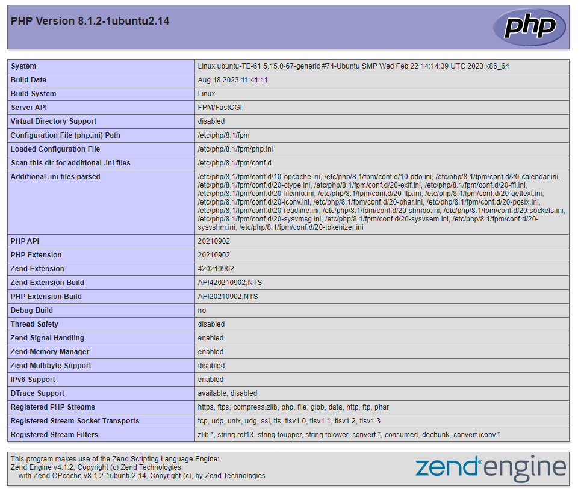
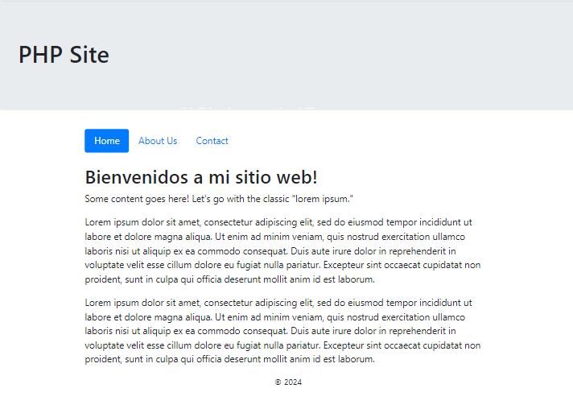

# UT6. Tarea Evaluable 6.1 - Desplegar aplicación PHP en Droplets de Digital Ocean

### Objetivos

- Conocer la plataforma Digital Ocean.
- Conocer los servicios que ofrece Digital Ocean.
- Crear un Droplet en Digital Ocean.
- Desplegar una aplicación PHP en un Droplet de Digital Ocean.
- Conocer y configurar los servicios de red implicados en el despliegue de una aplicación web.

### Alcance

Este ejercicio trata de 3 partes:

1. Crear y configurar un sevidor Ubuntu en Digital Ocean a través de un Droplet.
2. Configurar SSH, Firewall, Nginx y PHP en el servidor.
3. Desplegar la aplicación PHP en el servidor.
4. Desplegar una web estática bajo un dominio.

### Recursos

Para la realización de esta práctica vamos a utilizar los siguientes recursos:

- [PHP & DigitalOcean](https://youtu.be/QWSwuhQ1O6Y)
- [Configurar Dominio y SSL en Nginx](https://youtu.be/HBsCuZlDg60)
- [NoIP](https://www.noip.com/)


### Crear Proyecto

Antes de nada vamos a crear un proyecto en Digital Ocean, y agregar todos los recursos que vayamos creando en este tarea a este proyecto.

1. Acceder a [Digital Ocean](https://www.digitalocean.com/).
2. Crear un proyecto con el nombre `DAWeb-TE-6.1`.
3. Descríbelo como `2324 - Módulo DAWeb - Tarea Evaluable 6.1`.
4. Indica el propósito `Class project - Educational purposes`.
   

Una vez realizado esto, en DigitalOcean click sobre el nuevo proyecto creado, y comenzamos a crear. 


### Ejercicio 6.1.1 Crear Droplet en Digital Ocean

En este ejercicio vamos a crear un Droplet en Digital Ocean, dentro del proyecto creado.

Antes de nada, necesitamos tener una clave SSH.

#### Agregar clave SSH Digital Ocean

Para poder acceder a los servidores que creemos en Digital Ocean, necesitamos una clave SSH. Vamos a utilizar la misma clave SSH que hemos usado durante el curso. _Si para `casa` tienes otra clave SSH distinta, también puedes agregarla a Digital Ocean._

   1. Acceder al panel de control de Digital Ocean.
   2. En el menú de la izquierda, seleccionar `Settings` -> `Security` -> `SSH keys`.
   3. Agregar la clave SSH que tienes en tu equipo.
      - Acceder a la carpeta `~/.ssh` y copiar el contenido del fichero `*.pub`. _Sólo debes tener uno._
   4. Click en `Add SSH Key`.
   5. Añadir un nombre descriptivo para la clave SSH, por ejemplo `Instituto`, y para la de casa `Casa`.
   6. Y ya tienes tu clave SSH agregada a Digital Ocean.

#### Crear Droplet

1. Acceder a [Digital Ocean](https://www.digitalocean.com/), y al proyecto `DAWeb-TE-6.1`.
2. Crear un Droplet con las siguientes características:
   - **Elegir una imagen**: Ubuntu 22.04 (LTS) x64
   - **Elegir un plan**: Basic, $5/mo
   - **Elegir una región-datacenter**: Frankfurt
   - **Droplet Tipo**: (Shared-CPU) Basico
   - **CPU Options**: Regular (Disk-type: SSD), 6$/mo (1GB/1CPU, 25GB SSD, 1TB Transfer)
   - **Authentication**: SSH keys, Os debe indicar la clave SSH que has agregado anteriormente.
   - **Almacenamiento Adicional**: No es neceario agregar más almacenamiento.
   - **Opciones adicionales**: No es necesario añadir más opciones.
   - **Elegir a hostname**: `ubuntu-te61`
   - **Tags**: `daweb`,`te61`  (Para cada tag, pulsa TAB para que se añada)
   - **Finalizar**: Create Droplet

3. El Droplet se comenzará a crear y en unos minutos estará listo para su uso.
4. Una vez creado, tendremos una IP Pública a través de la cual podremos acceder al servidor. Vamos a necesitar esta IP para acceder al servidor.

   ```bash
   ssh root@<ip_droplet>
   ```

   y si todo está correcto, accederemos al servidor sin problemas.

> **NOTA**: Si no puedes acceder, revisa que la clave SSH que has agregado a Digital Ocean es la correcta.
  
#### Actualizar el sistema

En principio el sistema ya estará actualizado, por lo que no será necesario realizar esta tarea, simplemente actualizamos la lista de paquetes disponibles.

```bash
sudo apt update
```

Para comprobar la versión de Ubuntu que estamos utilizando, podemos utilizar el comando `lsb_release -a`:

```bash
lsb_release -a

No LSB modules are available.
Distributor ID: Ubuntu
Description:    Ubuntu 22.04.1 LTS
Release:        22.04
Codename:       jammy
```

### Ejercicio 6.1.2 Configurar SSH, Nginx y PHP

#### Activar el Firewall

El firewall es una herramienta de seguridad que nos permite controlar el tráfico de red que entra y sale de nuestro servidor. Vamos a activar el firewall y permitir el tráfico de red necesario para que nuestro servidor web funcione correctamente.

> 💡 **Firewall**<
> - UFw (Uncomplicated Firewall) es una herramienta de configuración del firewall que viene instalada por defecto en Ubuntu.
> - Este tema queda fuera del ámbito de este curso, por lo que no vamos a entrar en detalles sobre el funcionamiento del firewall.
> - En los VM (Droples) de Digital Ocean, el firewall viene desactivado por defecto.


#### SSH

En el proceso de configuración del Droples, hemos agregado una clave SSH, por lo que no será necesario realizar ninguna configuración adicional, para poder conectarnos al servidor a través de SSH.


#### Instalar Nginx

> 💡 **Importante**<br>
> La versión que viene con Nginx en los repositorios de Ubuntu es la versión estable, pero no es la última versión. Durante el curso hemos instalado las últimas versiones de Nginx, que han dejado de usar el concepto de `sites-available` y `sites-enabled`.

Como por defecto en los repositorios de Ubuntu viene la versión estable de Nginx, necesitamo una serie de pasos para instalar la última versión de Nginx.

1. Añadir el repositorio de Nginx a la lista de repositorios de Ubuntu.
2. Agregar la clave GPG del repositorio.
3. Actualizar la lista de paquetes.
4. Instalar Nginx.

> 🔔 En los scripts se utiliza `sudo`, pero no sería necesario si la instalación se realiza desde el usuario `root`

```bash
# Descargar la clave GPG del repositorio de Nginx
wget http://nginx.org/keys/nginx_signing.key
sudo apt-key add nginx_signing.key
# Añadir el repositorio de Nginx para nuestra versión de Ubuntu
sudo add-apt-repository "deb http://nginx.org/packages/mainline/ubuntu/ $(lsb_release -sc) nginx"
# Actualizar la lista de paquetes
sudo apt update
```
Ahora, podemos instalar Nginx, pero antes podemos revisar que versiones de Nginx tenemos disponibles.

```bash
apt list -a nginx
```
Pues para este caso, vamos a instalar la versión `1.23.4-1~jammy`, realmente da igual la versión específica, si es de las últimas versiones.

```bash
apt install nginx=1.23.4-1~jammy
```

Una vez terminado el proceso de instalación, compronbamos la versión instalada

```bash
nginx -v
service nginx status
```

Ahora solo queda iniciar el servicio de Nginx.

```bash
service nginx start
```

#### Instalar Módulo PHP-FPM

Como ya hemos comentado en los temas anteriores, para que Nginx pueda procesar las peticiones PHP, necesitamos instalar el módulo PHP-FPM.

Notas:

- En este caso, vamos a instalar PHP 8.0, que es la última versión estable de PHP.
- No se requiere agregar ningún repositorio adicional, ya que PHP 8.0 está en los repositorios de Ubuntu 22.04.

**Instalar**

Si comprobamos las versiones de PHP que tenemos disponibles, veremos que tenemos la versión `8.0` disponible.

```bash
~:$ apt list -a php8*-fpm

php8.1-fpm/jammy-updates,jammy-security 8.1.2-1ubuntu2.14 amd64
php8.1-fpm/jammy 8.1.2-1ubuntu2 amd64
```

Pues instalamos la versión `8.1` de PHP-FPM.

```bash
sudo apt install -y php8.1-fpm
```

Y una vez terminada la instalación comprobamos la versión y que el servicio de PHP-FPM está activo.

```bash
php --version  # PHP 8.1.2 (cli) (built: Feb  8 2022 19:13:00) ( NTS )
```

Con la orden `service --status-all` podemos comprobar que el servicio de PHP-FPM está activo.

```bash
# service --status-all obtiene una lista de todos los servicios y su estado en el sistema
service --status-all | grep php

[ + ]  php8.1-fpm  # El + indica que el servicio está activo
```


#### Configurar Nginx para PHP

En la configuración de Nginx, necesitamos indicar que las peticiones PHP las procese PHP-FPM, por lo que necesitamos modificar el fichero de configuración de Nginx.


Hay que cambiar 3 ficheros importantes:

1. `/etc/php/8.1/fpm/pool.d/www.conf`: Fichero de configuración de PHP-FPM.
   
   Hay que indicar el usuario y grupo que va a utilizar PHP-FPM. Por defecto, PHP-FPM utiliza el usuario `www-data` y el grupo `www-data`, pero en nuestro caso, vamos a utilizar el usuario `nginx` y el grupo `nginx`.

   Dentro de este fichero cambiar las siguientes líneas:

   ```s
   user = nginx
   group = nginx
   ...
   listen.owner = nginx
   listen.group = nginx
   ```

   Y una vez hecho esto, reiniciar el servicio de PHP-FPM, y comprobar que el servicio está activo y sin errores.

   ```bash
   service php8.1-fpm restart && service php8.1-fpm status
   ```

2. `/etc/nginx/nginx.conf`: Fichero de configuración principal de Nginx.

   En este fichero, comprobar que en la directiva `user` se indica el usuario `nginx`.

   
3. `/etc/nginx/conf.d/default.conf`: Fichero de configuración de Nginx para el sitio por defecto.


   Esta configuración se realiza en el fichero `/etc/nginx/conf.d/default.conf`.

   ```bash
   # Editar el fichero de configuración de Nginx
   nano /etc/nginx/conf.d/default.conf
   ```

   Dejamos todo igual en el fichero, y solo cambiamos el bloque `location ~ \.php$` según se indica a continuación.

   > 💡 **Muy importante**<br>
   > La versión de PHP-FPM que se indique, debe ser la que tenemos instalada en el servidor. En este caso, `8.1`.

   ```nginx
   server {
      ...

      location ~ \.php$ {
         root           /usr/share/nginx/html;
         fastcgi_pass   unix:/run/php/php8.1-fpm.sock;
         fastcgi_index  index.php;
         index          index.php;
         include        fastcgi_params;
         fastcgi_param  SCRIPT_FILENAME   $document_root$fastcgi_script_name;
      }
      ...
   }
   ```

   > 👁️ Mucho cuidado con los ; al final de cada línea, sin ellos la línea sería incorrecta.

   Una vez hecho esto, compronbamos que la configuración de Nginx es correcta `nginx -t`. Si todo está correcto, reiniciamos el servicio de Nginx y compronbamos que el servicio está activo y sin errores.

   ```bash
   nginx -t
   service nginx restart && service nginx status
   ```


#### Probar configuración de PHP

Para comprobar que la configuración de PHP y Nginx es correcta, vamos a crear un fichero `info.php` en el directorio `/usr/share/nginx/html/` con el siguiente contenido:

```php
echo "<?php phpinfo(); ?>" > /usr/share/nginx/html/info.php
```

Y ahora, si accedemos a la IP del servidor, seguido de `/info.php`, deberíamos ver la información de PHP.




### Ejercicio 6.1.3 Desplegar aplicación PHP

Para este ejercicio vamos a desplegar una aplicación PHP muy sencilla, básica, simplemente para comprobar que todo está funcionando correctamente.

#### Clonar Repositorio

Vamos a clonar el repositorio `[php-site](https://github.com/ZeshanWD/php-site.git)` en el servidor, dentro de la carpeta `/usr/share/nginx/html/`.

1. Nos situamos en el directorio `/usr/share/nginx/html/`.
2. Clonamos el repositorio en la misma carpeta. `git clone https://github.com/ZeshanWD/php-site.git .` (El . del final indica que se clone en el directorio actual) 

Y si accedemos a la IP del servidor, deberíamos ver la aplicación PHP.




####  Ejericio 6.1.4 Desplegar web estática bajo un dominio

Para este ejercicio vamos a desplegar una web estática bajo un dominio. Para este ejemplo vamos a utilizar la misma Web que ya utilizamos en el tema 4, la web de la tienda de mascotas [Mypetshop](../../../UT4/EC/res/mypetshop.website.zip).

Como registrar un dominio es un proceso que implica un coste de adquisición y de renovación en el tiempo, vamos a utilizar un servicio de DNS dinámico, que nos permita asociar un dominio a la IP pública de nuestro servidor.

Para este ejercicio vamos a utilizar el servicio de [NoIP](https://www.noip.com/), que nos permite asociar un dominio a la IP pública de nuestro servidor.

#### Crear cuenta en NoIP

1. Acceder a [NoIP](https://www.noip.com/).
2. Crear una cuenta.
3. Utilizar el servicio DNS dinámico gratuito.
4. Acceder a la cuenta y crear un nuevo host.
   - **Hostname**: `{iniciales-vuestro-nombre}-petshop.ddns.net`, en mi caso `jgr-petshop.ddns.net`.
   - **Tipo de Host**: DNS Host (A)
   - **Dirección IP**: IP pública del servidor.
  
Con esto ya tenemos un dominio asociado a la IP pública de nuestro servidor.

#### Configurar Nginx para el dominio

> 🔔 Cada uno que indique el nombre de su Dominio, con sus iniciales al principio. Para que sea más realista el ejemplo utilizaré el mio. Si está repetido porque otro compañero tiene las mismas iniciales que vosotros, coger otro dominio de los disponibles en NoIP como (webhop.me, ...)

Vamos a configurar Nginx para que sirva la web estática bajo el dominio `jgr-petshop.ddns.net`.

1. Crear un nuevo fichero de configuración en el directorio `/etc/nginx/conf.d/` con el nombre `{mypetshop.ddns.net.conf`.

   ```bash
   nano /etc/nginx/conf.d/jgr-petshop.conf
   ```

   > El nombre del fichero debe como buena práctica, debe coincidir con el nombre del dominio, pero en este caso como el dominio es dinmámico y no es el dominio real, solo vamos a utilizar en el nombre del dominio, el nombre real `jgr-petshop.conf`.

   Y añadir la siguiente configuración.

   ```nginx
   server {
      listen 80;

      server_name jgrpetshop.ddns.net www.jgrpetshop.ddns.net;
      root /var/www/html/jgr-petshop;
      index index.html index.htm;
   }
   ```

   Como se muestra en la configuración, debemos crear el directorio `/var/www/html/jgr-petshop` y copiar los ficheros de la web estática en este directorio.

   > 📄 Para copiar los archivos al servidor, podeis utilizar:
   > - `scp` desde el equipo local. `scp -r /path/to/local/folder root@<ip_droplet>:/var/www/html/jgr-petshop`
   > - O desde la utilidad de FTP de un software como Mobaxterm o Termius.


   

   
