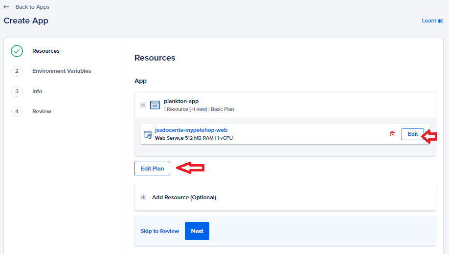

# UT6. Ejericio 6.2 - Desplegar con Docker a Digital Ocean

## 📚 Documentación

- [Desplegar imágenes de Docker en Digital Ocean](https://www.youtube.com/watch?v=oXEJMSVG2LA)
- [Alta en DigitalOcean](./doc/01.extra.digital-ocean-alta.md)


### Objetivos

- Conocer la plataforma Digital Ocean.
- Conocer los servicios que ofrece Digital Ocean.
- Crear un registro para imágenes en DigitalOcean.
- Subir una imagen a un repositorio privado de DigitalOcean.
- Desplegar un contenedor desde una imagen almacenada en DigitalOcean.

### Alcance

Este ejercicio trata de 4 partes:

1. Desplegar una página web estática en un contenedor con Nginx como un App en DigitalOcean.
2. Desplegar un a
3. Desplegar la aplicación PHP en el servidor.
4. Desplegar una web estática bajo un dominio.


### Crear Proyecto

Antes de nada vamos a crear un proyecto en Digital Ocean, y agregar todos los recursos que vayamos creando en este tarea a este proyecto.

1. Acceder a [Digital Ocean](https://www.digitalocean.com/).
2. Crear un proyecto con el nombre `DAWeb-TE-6.2`.
3. Descríbelo como `2324 - Módulo DAWeb - Tarea Evaluable 6.2`.
4. Indica el propósito `Class project - Educational purposes`.


### Crear usuario en Docker Hub vinculado con nuestra cuenta de GitHub

Para poder subir imágenes a Docker Hub es necesario tener una cuenta en Docker Hub.

1. Acceder a [Docker Hub](https://hub.docker.com/)
2. Registrate en DockerHub y usa para ello tu cuenta de GitHub.
3. Ahora desde Docker Desktop, accede a la configuración y vincula tu cuenta de Docker Desktop con tu cuenta de Docker Hub. (Si estás en Linux, implica realizar algún proceso extra, como se explica en el este [caso práctico: subir imágenes docker a DockerHub](../../../UT3/casopractico/docker-push-image/readme.md)).


### Repositorios de imágenes en Docker Hub

En Docker Hub, vamos a tener tantos repositorios públicos como queramos, y solo 1 repositorio privado.

Un **repositorio es un conjunto de imágenes** que comparten un nombre, y que se diferencian por su etiqueta. Es decir, que un repositorio solo va a contener un proyecto (como en Github), pero que puede tener varias versiones (imágenes) de ese proyecto.

Las propias imágenes de Docker, para poder subirlas a Docker Hub, deben tener un nombre que siga el siguiente patrón `nombreusuario/nombreimagen:etiqueta`.	A través del nombre es la forma que tiene Docker Hub de diferenciar las imágenes de los distintos usuarios.

> 🔥 **Creación de repositorios DockerHub** <br>
> No es necesario crear un repositorio de forma explícita, ya que se crea automáticamente al subir la primera imagen con el comando `docker push`.


### 6.2.1 Desplegar una página web estática en un contenedor con Nginx como un App en DigitalOcean.

En Digital Ocean, además de poder crear máquinas virtuales (Droplets), podemos crear aplicaciones que se ejecuten dentro de contenedores.

La *App Platform* de DigitalOcean es un servicio de alojamiento de aplicaciones que permite a los desarrolladores crear, implementar y escalar aplicaciones web y API de forma rápida y sencilla.

Este servicio obtiene el código de la App desde un repositorio de GitHub, GitLab o Bitbucket, o un registro de contenedores (Docker Hub, Container Registry de DigitalOcean, o un registro privado). Además hospeda la App en una URL personalizada, provista por DigitalOcean y puede automáticamente redesplegar la App cuando se detecta un cambio en el repositorio o registro.

🔥🔥 **En este ejercicio vamos a desplegar una página web estática en un contenedor con Nginx como un App en DigitalOcean.**

#### Pasos a seguir

Este parte del ejercicio es la misma que la realizada en el [ejercicio 6.1.4](../6.1/readme.md#ejericio-614-desplegar-web-estática-bajo-un-dominio), pero en lugar de hacerlo en un Droplet, lo vamos a hacer en un App de DigitalOcean.

Necesitamos crear un imagen de Docker con el contenido de la web estática y subirla a un repositorio de Docker Hub.

Siempre en este tipo de situaciones, donde necesitamos crear una imagen de docker, lo mejor es crear una estructura de carpetas adecuadas para el proyecto.

```plaintext
-- root
    |-- app
    |   |-- ... (ficheros de la página web)
    |   |-- index.html
    |
    |-- config
    |   |-- nginx
    |       |-- conf.d
    |           |-- default.conf
    |-- Dockerfile
```

Requisitos:

1. Escuchar por el puerto 8080 dentro del contenedor.
2. Nginx sirve el contenido desde `/usr/share/nginx/html`.
3. Sea el servidor por defecto, ya que solo se va a alojar un solo sitio web.
4. Directiva índice que sirva `index.html` y `index.htm` en ese orden.
5. Que intente los ficheros $uri, $uri/, /index.html, /index.htm en ese orden, y si no encuentra ninguno, devuelva un error 404.
6. Muestre la página de error para el error 404, 404.html y para el error 50x, 50x.html.


#### Dockerfile

Los pasos dentro del Dockerfile serán los siguientes:

1. Basado en la versión de nginx:1.25.3-alpine
2. Copiar el contenido de la carpeta `app` en `/usr/share/nginx/html`.
3. Exportar el puerto 8080.
4. Borrar el archivo de configuración por defecto ubicado en `/etc/nginx/conf.d/default.conf`.
5. Copiar el archivo de configuración personalizado `default.conf` en `/etc/nginx/conf.d`.
6. Por último, le decimos que cuando el contenedor se ejecute, ejecute el comando `CMD ["nginx", "-g", "daemon off;"]`.

#### Crear la imagen

Para crear la imagen, contruirla a partir del dockerfile que hemos creado, y subirla a Docker Hub, seguiremos los siguientes pasos:

1. Nombre de la imagen: `nombreusuario/mypetshop-web:EC6.2.1`, la parte `EC6.2.1` es la etiqueta de la imagen.
2. Una vez creada la imagen, probar que funciona correctamente en local.
3. Si todo funciona correctamente, subir la imagen a Docker Hub.

#### Subir la imagen a Docker Hub

> 💡 Para este paso es fundamental que en el nombre de la imagen se haya incluido el nombre de vuestro usuario como primera parte del nombre de la imagen.

1. Iniciar sesión en Docker Hub. `docker login`
2. Subir la imagen a Docker Hub. `docker push nombreusuario/mypetshop-web:EC6.2.1`


#### Crear la App en DigitalOcean

Desde el panel de control de Digital Ocean, vamos a crear una nueva App.

1. En el panel de control, seleccionar la opción `Apps` del menú lateral.	
2. Configurar la App:
   - Indicar nombre del repositorio de Docker Hub. `nombreusuario/mypetshop-web`
   - Indicar la versión de la imagen. `EC6.2.1`
   - Configurar el puerto de escucha. `8080`
   - Configurar el nombre de la App `nombreusuario-mypetshop-web`
   - Configurar el plan de precios. `Basic - 1 GB RAM,1vCPU,25GB SSD`
  
   -  Configuración de la App <br>
      <br>
   -  Edita los recursos <br>
      <br>
   -  Indicar escucha por puerto 8080 <br>
      <br>
  
   - Varriables de Entorno (No se usann). Siguiente
   - Cambiar al proyecto `DAWeb-TE-6.2`
   - Nombre de la App `mypetshop`
   - Región `London`
  
3. En el último paso revisar la configuración y crear la App. 
4. Automáticamente se desplegará la App y se podrá acceder a ella a través de la URL que proporciona DigitalOcean, si todo está correcto.

> 🔧 **Solución de problemas**<br>
> Si algo no funciona, se puede acceder a los logs de la App, y ver que está pasando. También DigitalOcean proporciona una serie de herramientas para solucionar problemas.


Una vez que la App está desplegada, se puede acceder a ella a través de la URL que proporciona DigitalOcean, si todo está correcto.

<br>


#### Referencias

- [Desplegar múltiples contenerizadas Apps a un DigitalOcean Droplet usando Docker Compose Contexts](https://danielwachtel.com/devops/deploying-multiple-dockerized-apps-digitalocean-docker-compose-contexts)
- [Cómo desplegar PHP App a producción con DockerCompose](https://matthewsetter.com/deploy-php-app-docker-compose/)
- [Desplegar imágenes de Docker en Digital Ocean](https://www.youtube.com/watch?v=oXEJMSVG2LA)
- [Desplegando y securizando una aplicación React con Docker, Nginx y CI/CD](https://medium.com/@takubonjesi/containerising-deploying-and-securing-your-react-app-on-a-digitalocean-droplet-with-docker-b4670cac030)