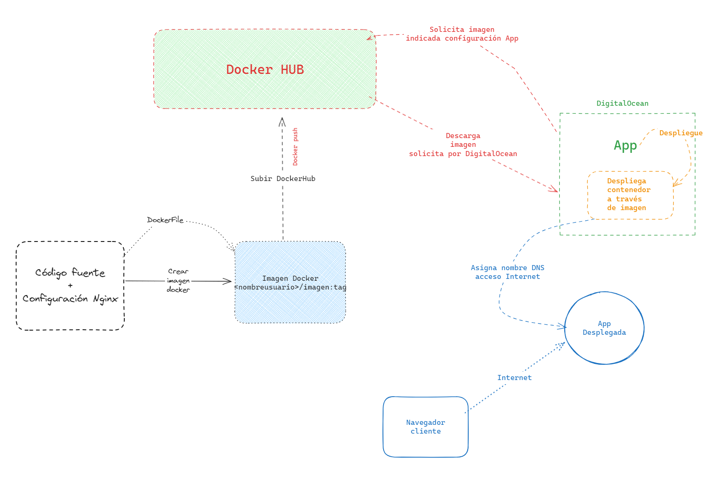
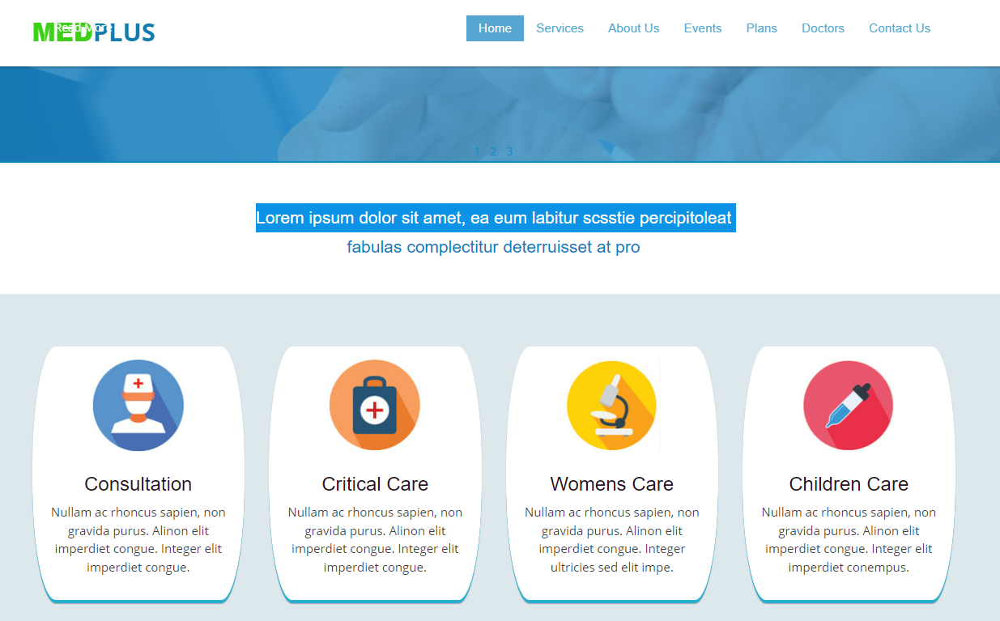
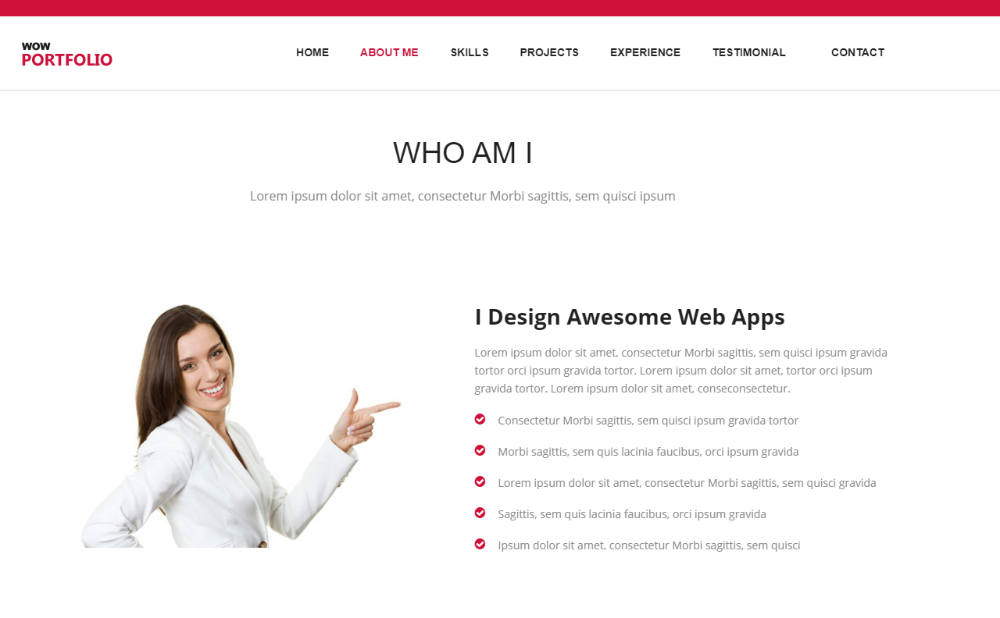

# UT6. Tarea Evaluable 6.2 - Crear imagen Docker para desplegar 2 aplicaciones estáticas

### 📝 Entregable

La documentación se entregará en un fichero `README.md` en el repositorio oficial del alumno, en la carpeta `UT6/TE6.2/`. 

Se entregará además un PDF (en moodle) con el siguiente formato:

- Titulo de la tarea, donde se indique el nombre de la tarea y el nombre de la asignatura
- Nombre del alumno
- Enlace en formato commit

#### Estructura de entrega

La estructura del documento será la siguiente:

- Titulo de la tarea, donde se indique el nombre de la tarea y el nombre de la asignatura
- Nombre del alumno
- Descripción breve de en qué consiste la tarea y el objetivo de la misma.
- Cada punto de la tarea, debe tener una explicación de porqué se hace eso, y explicación de los pasos realizados.

### 📋 Tarea

La tarea consiste en desplegar 2 aplicaciónes estáticas a través de una imagen de Docker, y subir a DockerHub.

Tenemos que desplegar 2 aplicaciones estáticas, sobre un mismo contenedor de Nginx.

#### Página de un Hospital

Codigo fuente: [medplus.website.zip](res/medplus.rar)

_Condiciones:_

- Dominio: medplus.local / www.medplus.local
- Escuchar por el puerto 80
- Alojar la web en la carpeta `/var/www/html/medplus`
- La página índice principal debe ser `index.html`
- Crear una página 404.hml personalizada
- La carpeta `images` se debe permitir listar su contenido.
- Crear una configuración personalizada para este dominio en Nginx.
- Utiliza la imagen de nginx:1.25.3-alpine

Imagen de Docker: `nombreusuario/medplus:1.0`

#### Página de un Porfolio

Codigo fuente: [porfolio.website.zip](res/portfolio.rar)

_Condiciones:_

- Dominio: {nombre-apellido1}.porfolio.tech / www.{nombre-apellido1}.porfolio.tech
- Escuchar por el puerto 80 (nginx)
- Alojar la web en la carpeta `/var/www/html/porfolio`
- La página índice principal debe ser `index.html`
- Crear una página 404.hml personalizada
- Crear una configuración personalizada para este dominio en Nginx.
- Utiliza la imagen de nginx:1.25.3-alpine

Imagen de Docker: `nombreusuario/miporfolio:1.0`

> 💡 Los 2 páginas van dentro del mismo servidor/imagen, por lo que los siguientes pasos que se indican se realizarán para ambas sitios-web.

#### 6.2.1 Explicación del proceso

> 📄 En este apartado debes explicar la práctica, qué pasos vas a realizar para para poder llevar a cabo la tarea.
> 🐋 Si vas a utilizar un DockerCompose, muestra el contenido, y explica las líneas principales con un comentario dentro del fichero docker-compose.yml.

#### 6.2.2 Estructura de carpeta para crear el DockerFile

> 📄 Explicar porqué la estrucutra de carpetas que has realizado, y para qué se utiliza cada fichero

> 🧲 Adjunta capturas de pantalla donde se visualize la estrucutra de carpetas

#### 6.2.3 DockerFile

> 📄 Explicar el contenido del DockerFile, indica con un comentario en cada línea del mismo para qué se utiliza

> 🧲 Adjunta un GIF con la construcción del mismo, donde se vicualize la orden y ejecución

#### 6.2.4 Subir a DockerHub

> 🧲 Adjunta un GIF con la construcción del mismo, donde se vicualize la orden y ejecución

#### 6.2.5 Construir y probar el contenedor

> 🧲 Adjunta una imagen GIF con la construcción del mismo, donde se vicualize la orden y ejecución

Construye un contenedor con la imagen que acabas de crear, mapeando el puerto adecuado para cada aplicación.

#### 6.2.6 Mapear DNS para los dominios

Utiliza el plugins Awesome Manager si usas Google Chrome o la opción de Firefox vista en clase, para redirigir los dominios `medplus.local` y `{nombre-apellido1}.porfolio.tech` a localhost.

> 📌 Recuerda redirigir también el puerto: Ejemplo localhost:8080 medplus.local

> 🧲 Adjunta una imagen con las redirecciones realizadas en Firefox o Google Chrome.

#### 6.2.7 Probar la aplicación

1. Accede a la web `medplus.local` y navega por la web. Realiza una acción para que se muestre la página de error 404.

> 🧲 Adjunta un GIF que demuestre que la página funciona.

2. Accede a la web `{nombre-apellido1}.porfolio.tech` y navega por la web. Realiza una acción para que se muestre la página de error 404.

> 🧲 Adjunta un GIF que demuestre que la página funciona.
