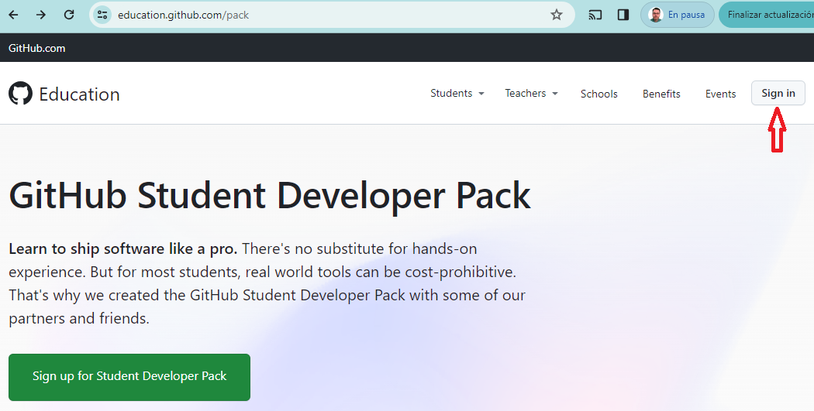
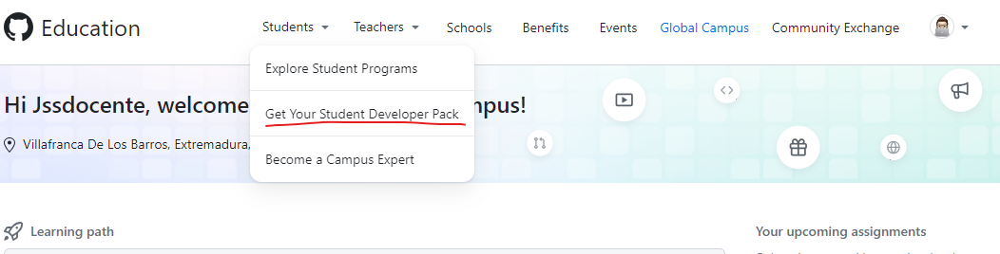
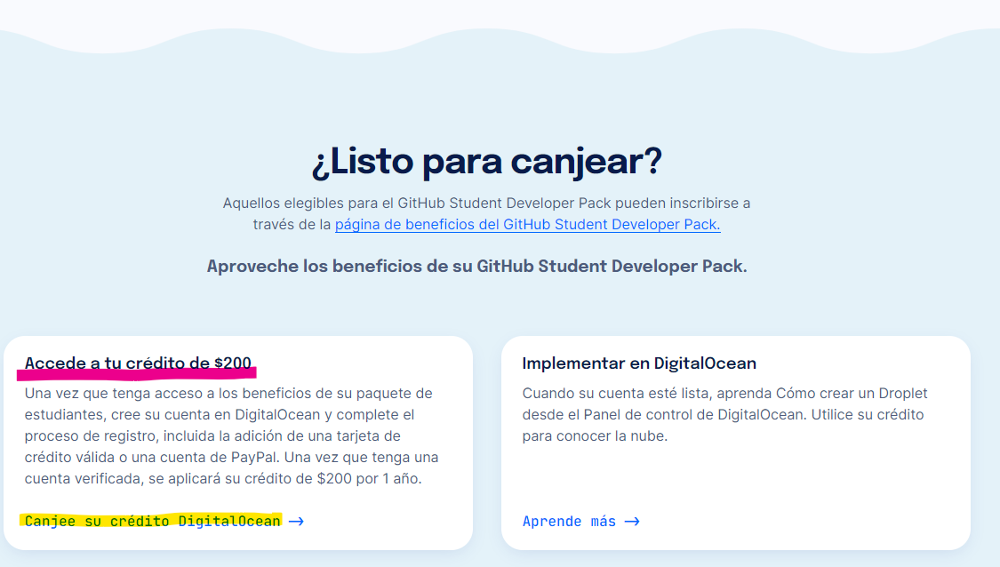
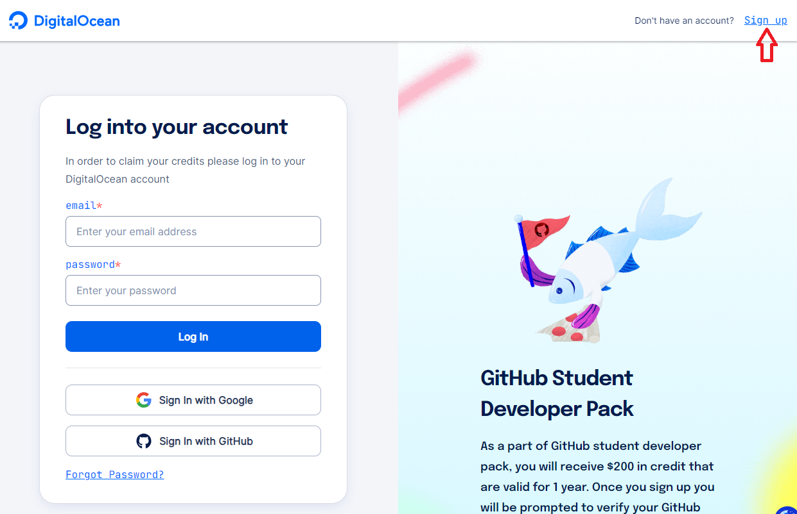
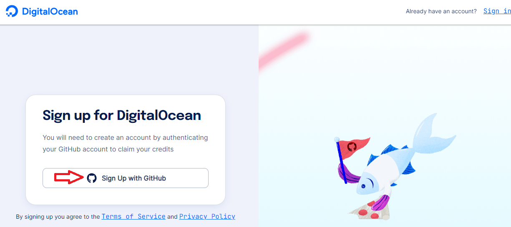
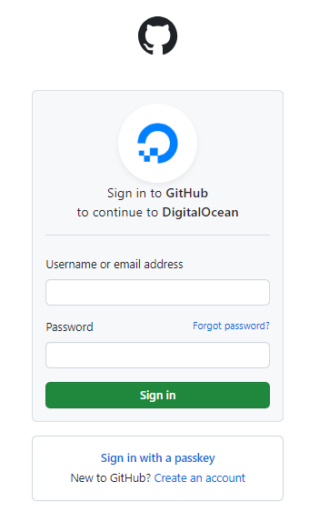
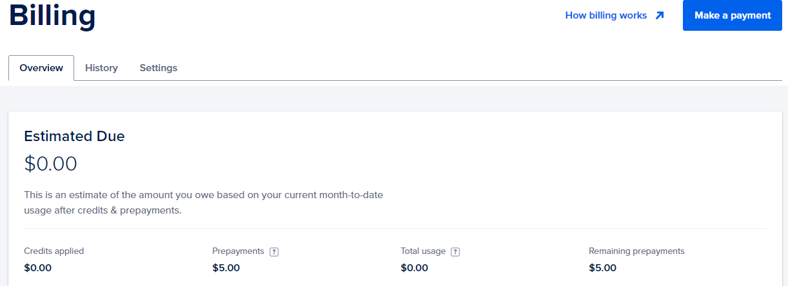
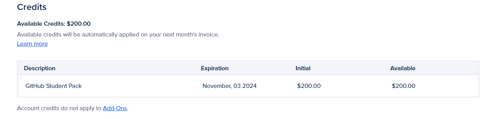
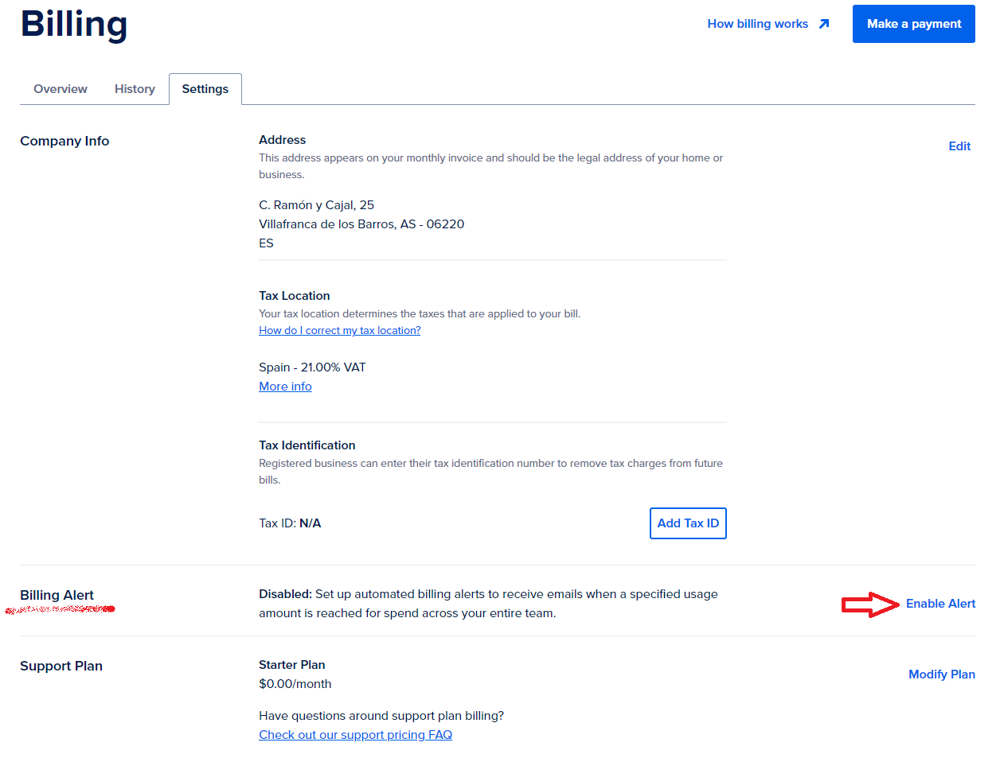
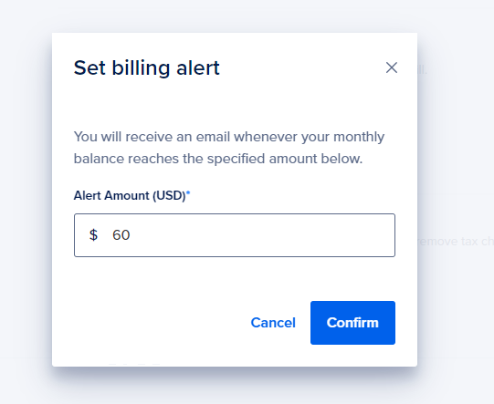

# Digital Ocean: Canjear créditos con el pack para desarrolladores de GitHub

## Introducción

Digital Ocean es una empresa que ofrece servicios de infraestructura en la nube para desarrolladores. Ofrece soluciones de infraestructura como servicio (IaaS) que permiten a los desarrolladores implementar y escalar aplicaciones que se ejecutan simultáneamente en múltiples computadoras.

## Características

- **Despliegue rápido**: Digital Ocean permite a los desarrolladores implementar aplicaciones en segundos.
- **Escalabilidad**: Los desarrolladores pueden escalar aplicaciones en tiempo real.
- **Facilidad de uso**: Digital Ocean ofrece una interfaz de usuario simple y fácil de usar.
- **Precio asequible**: Digital Ocean ofrece precios asequibles para desarrolladores.
- **Soporte técnico**: Digital Ocean ofrece soporte técnico las 24 horas del día, los 7 días de la semana.
- **Seguridad**: Digital Ocean ofrece seguridad de nivel empresarial.
- **Documentación**: Digital Ocean ofrece una amplia documentación para ayudar a los desarrolladores a implementar y escalar aplicaciones.

## Proceso Alta: Gihub Developer Pack

Para poder acceder a los servicios de Digital Ocean es necesario solicitar el pack para desarrolladores de GitHub. Este pack incluye créditos para Digital Ocean.

### Pasos

1. Vincular vuestra cuenta educativa de `educarex.es` a GitHub. 
   - Para ello, la mejor opción es vincular vuestro correo de `educarex.es` a una cuenta de GitHub existente, la que teneís ya creada el curso.
   - Acceder en Github a vuestro perfil, `Settings` -> `Emails` -> `Add email address` y añadir vuestro email de `educarex.es`. Os llegará un email para verificar la cuenta, y listo, ya tenéis vinculada vuestra cuenta de `educarex.es` a GitHub.
   - Como `educarex.es` es una cuenta de Google, es una cuenta educativa ya verificada por GitHub, por lo que no tendréis problemas para solicitar el pack para desarrolladores.

2. Acceder a [GitHub Education](https://education.github.com/pack) y solicitar el pack para desarrolladores.
   - Una vez logados con vuestra cuenta de Github, ya vinculada a `educarex.es`, solicitar el pack para desarrolladores.

   

   

3. Una vez aprobada la solicitud, acceder a [Digital Ocean - Github Students](https://www.digitalocean.com/github-students) y solicitar el pack para desarrolladores.
   
     

  
4. Si no tenéis cuenta en Digital Ocean, crear una cuenta en [Digital Ocean](https://www.digitalocean.com/).

   

   

  > Introduce tus credenciales de Github, para vincular tu cuenta de Github con Digital Ocean.

   

5. Una vez creada la cuenta, ya puedes "canjear tus créditos". Sigue los pasos en la Web de Digital Ocean.

> **IMPORTANTE**: 
> En este proceso te hará falta una tarjeta de debito (mejor utiliza prepago) o `Paypal` para comprobar que no eres un robot. Seguramente te cobrarán un pequeño importe que te devolverán en unos días. No te preocupes, es normal en estos procesos de verificación. 

6. Una vez realizado el proceso anterior, ya puedes entrar en tu cuenta de DigitalOcean con tus credenciales de Github, y estarás listo para aprender todo lo que ofrece esta gran plataforma.

7. Revisar Plan gratuito
   
   - Es importante comprobar, que tienes cargados los créditos en tu cuenta. `Billing`
  
    
     

   - También es importante configurar una alerta para que te avise cuando tus gastos en un mes superen los créditos que tienes. `Billing` -> `Settings` -> `Billing Alerts`

     

     

9. Pues ya estás listo para aprender todo lo que ofrece Digital Ocean. Aprovecha al máximo tus créditos.

## Proceso Alta: Sin opción educativa

Si por cualquier motivo no disponéis de la opción educativa, podéis utilizar una promoción de Digital Ocean diferente, y en lugar de obtener 1 año con 200$ de crédito, serán 60 días con el mismo crédito de 200$.

> 🧑‍🎓 **Impportate** 
> Para esta opción NO utilizar la cuenta de Github, ya que si en un futuro obtenéis la certificaciónn educativa de Github, podeís aprovechar esa promoción también. Las promociones se aplican sobre nuevas cuentas.

**Alta promoción 60 días**: Seguir este [link](https://www.digitalocean.com/try/free-trial-offer?utm_campaign=armx_brand_kw_en_cpc&utm_adgroup=digitalocean_exact_exact&_keyword=digital%20ocean&_device=c&_adposition=&utm_content=conversion&utm_medium=cpc&utm_source=google&gad_source=1&gclid=EAIaIQobChMIlc-lwdrJhAMVMKWDBx3MUAgBEAAYASACEgIYXvD_BwE)